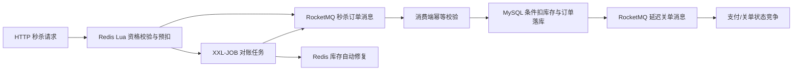

# 🏪 NearGo——同城生活服务平台

> 基于 Spring Boot、MySQL、Redis、Lua、RocketMQ 与 XXL-JOB 构建的本地生活服务项目，围绕热点缓存、优惠券秒杀、异步下单、延迟关单和最终一致性进行工程化改造。

[](https://www.oracle.com/java/)
[](https://spring.io/projects/spring-boot)
[](https://redis.io/)
[](https://rocketmq.apache.org/)

## 项目简介

NearGo 提供商铺查询、附近商铺、优惠券秒杀、订单支付回调和超时关单等功能。项目在黑马点评教学代码基础上进行二次开发，重点补充了 RocketMQ 异步链路、订单状态并发控制、XXL-JOB 对账补偿、接口限流、两级缓存和可复现的压测证据。

## 技术栈

`Spring Boot` · `MySQL` · `MyBatis-Plus` · `Redis` · `Lua` · `Redisson` · `Caffeine` · `RocketMQ` · `XXL-JOB` · `Spring AOP`

## 核心改进

- **库存一致性治理：** 基于 Redis + Lua 原子完成优惠券库存校验、库存预扣、用户去重和预扣元数据记录，避免库存扣减为负数和同一用户重复下单。
- **异步削峰与消息幂等：** 引入 RocketMQ 解耦秒杀接入与订单落库，通过订单 ID 幂等、用户与优惠券联合校验及数据库条件扣库存避免重复消费创建重复订单。
- **发送失败补偿：** RocketMQ 同步发送失败时执行 Lua 补偿脚本，幂等撤销本次 Redis 用户预占并恢复库存。
- **订单超时关闭：** 使用 RocketMQ 延迟消息触发未支付订单关单，并在数据库状态更新成功后释放 MySQL 和 Redis 库存。
- **订单状态并发控制：** 支付回调和超时关单均以待支付状态作为更新条件，确保并发竞争下只有一个状态迁移成功。
- **自动对账与修复：** 基于 XXL-JOB 扫描 Redis 预扣元数据；对未落库订单使用原订单 ID 重投 RocketMQ，对已取消订单幂等释放预扣，并将异常反馈给调度中心重试。
- **缓存可靠性治理：** 使用 Redis 逻辑过期与互斥锁处理热点店铺缓存击穿，使用缓存空值降低无效请求造成的缓存穿透。
- **两级热点缓存：** 为优惠券列表增加 Caffeine 本地缓存与 Redis 缓存，降低热点 Key 的远程访问压力。
- **附近商铺检索：** Redis GEO 负责附近店铺检索与距离排序，MySQL 根据店铺 ID 补充完整详情；针对 Redis 5 将 `GEOSEARCH` 替换为兼容的 `GEORADIUS`。
- **接口流量治理：** 基于 Redis ZSet + Lua + AOP + 自定义注解实现滑动窗口限流，支持 IP、用户和全局维度。

## 秒杀链路



更完整的代码流程见：[秒杀、关单与对账流程](docs/architecture/seckill-flow.md)。

## 本地压测摘要

测试环境：Java 21.0.11、Spring Boot 2.7.4、本机 MySQL、Redis 5.0.14.1、RocketMQ 4.9.4 单 Broker。

| 场景 | 结果 |
|---|---|
| Redis 5 GEO，1000 并发 | 业务成功率由 0% 恢复为 100%，成功请求 P95 33.08 ms，有效 QPS 4520.89 |
| 逻辑过期，100 并发 | 100% 返回业务成功，P95 9.28 ms，缓存 Key 全程保留 |
| 1000 用户抢 100 件 | 100 条进入 RocketMQ、900 条库存不足，最终数据库订单 100 条、重复用户券订单 0 |
| RocketMQ 积压恢复 | 消费者恢复后 100 条订单全部落库，消费组差值恢复为 0，追平约 13.5 秒 |
| 支付与关单竞争 | 100 个交错请求中只有一个状态更新成功，库存只释放一次 |

完整测试口径和数据边界见：[本地压测摘要](docs/benchmarks/README.md)。所有结果均来自本地单机短时测试，不代表生产集群容量。

## 项目结构

```text
src/main/java/com/hmdp
├── annotation      # 限流注解
├── aspect          # Redis 滑动窗口限流切面
├── config          # Redis、Redisson、MyBatis、XXL-JOB 配置
├── controller      # HTTP 接口
├── listener        # RocketMQ 消费者与 XXL-JOB 对账任务
├── service         # 商铺、优惠券、订单等业务逻辑
└── utils           # 缓存、ID、锁和 Redis Key 工具

src/main/resources
├── mapper
├── seckill.lua
├── seckill_compensate.lua
├── seckill_release.lua
└── sliding_window.lua
```

## 快速启动

### 1. 环境要求

- JDK 8 或更高版本
- Maven 3.6+
- MySQL 8
- Redis 5+
- RocketMQ 4.9.x
- XXL-JOB 2.4.1（仅对账调度需要）

### 2. 初始化数据库

创建 `hmdp` 数据库并导入：

```text
hmdp.sql
```

### 3. 配置环境变量

参考 `.env.example` 配置 MySQL、Redis、RocketMQ 和 XXL-JOB。项目不会在仓库中保存本机密码或访问凭证。

常用变量：

```text
MYSQL_URL
MYSQL_USERNAME
MYSQL_PASSWORD
REDIS_HOST
REDIS_PORT
REDIS_PASSWORD
ROCKETMQ_NAME_SERVER
XXL_JOB_ADMIN_ADDRESSES
XXL_JOB_ACCESS_TOKEN
```

### 4. 启动应用

```bash
mvn spring-boot:run
```

默认端口：`8081`。

### 5. 配置 XXL-JOB

创建执行器和任务：

```text
AppName: neargo-executor
JobHandler: seckillReconcileJob
Cron: 0 * * * * ?
```

详细说明见：[XXL-JOB 秒杀对账与自动补偿](docs/architecture/xxl-job-reconciliation.md)。

## 数据与安全说明

- 仓库不提交本机配置、密码、登录 Token、个人简历和压测逐请求原始文件。
- 秒杀“一人一单”主要由 Redis Lua、消费端业务幂等和用户级锁保证；当前数据库没有声明 `(user_id, voucher_id)` 唯一索引。
- XXL-JOB 的跨进程调度和失败重试需要部署 Admin 后进一步验证。
- 本项目用于学习、技术验证和求职展示，不建议未经容量评估直接用于生产环境。

## 项目来源

本项目基于 [黑马点评 Redis 实战项目](https://github.com/cs001020/hmdp) 进行二次开发。原教程提供商铺、博客、优惠券及 Redis 基础实践；NearGo 的 RocketMQ 异步下单、延迟关单、状态并发控制、XXL-JOB 对账补偿、注解限流、两级缓存、Redis 5 GEO 兼容和压测证据为后续扩展内容。
