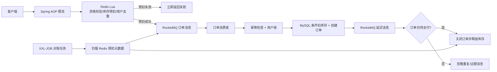

# 🏪 NearGo——同城生活服务平台

> 一个以本地生活业务为载体的高并发后端实践项目。

[](https://www.oracle.com/java/)
[](https://spring.io/projects/spring-boot)
[](https://redis.io/)
[](https://rocketmq.apache.org/)
[](https://www.xuxueli.com/xxl-job/)

## 项目定位

NearGo 提供商铺查询、附近商铺、优惠券秒杀、订单支付和超时关单等功能。项目在黑马点评教学代码基础上进行二次开发，重点改造以下问题：

- 高并发秒杀中，如何避免超卖和同一用户重复下单；
- 请求通过 Redis 预扣后，如何削减数据库瞬时写入压力；
- 消息重复、发送失败或消费延迟时，如何避免重复订单和数据永久不一致；
- 支付回调与超时关单并发到达时，如何保证订单只发生一次有效状态迁移；
- 热点店铺缓存失效时，如何避免大量请求同时回源数据库；
- 多实例部署下，如何实现统一的接口流量控制与定时对账；
- 如何用可复现的压测数据验证优化结果，而不是只给出主观结论。

技术栈：`Spring Boot` · `MySQL` · `MyBatis-Plus` · `Redis` · `Lua` · `Redisson` · `Caffeine` · `RocketMQ` · `XXL-JOB` · `Spring AOP`

## 目录

- [系统架构与秒杀主链路](#系统架构与秒杀主链路)
- [优化一：Redis + Lua 库存预扣与一人一单](#优化一redis--lua-库存预扣与一人一单)
- [优化二：RocketMQ 异步削峰、幂等消费与延迟关单](#优化二rocketmq-异步削峰幂等消费与延迟关单)
- [优化三：缓存击穿、穿透与两级缓存治理](#优化三缓存击穿穿透与两级缓存治理)
- [优化四：订单状态并发控制](#优化四订单状态并发控制)
- [优化五：XXL-JOB 对账、补偿与最终一致性](#优化五xxl-job-对账补偿与最终一致性)
- [优化六：Redis 滑动窗口限流](#优化六redis-滑动窗口限流)
- [优化七：Redis GEO 附近商铺检索](#优化七redis-geo-附近商铺检索)
- [故障场景与一致性闭环](#故障场景与一致性闭环)
- [压测结果与数据口径](#压测结果与数据口径)
- [快速启动](#快速启动)
- [实现边界](#实现边界)

## 系统架构与秒杀主链路



一次秒杀请求的实际含义是：接口返回订单 ID，表示 Redis 资格校验已通过且订单消息已被 Broker 确认接收；数据库订单由消费者异步创建，并不等于响应返回时已经落库。

核心代码入口：

- 接入与 Redis 预扣：[VoucherOrderServiceImpl.java](src/main/java/com/hmdp/service/impl/VoucherOrderServiceImpl.java)
- 原子校验脚本：[seckill.lua](src/main/resources/seckill.lua)
- 订单消息消费：[SeckillOrderListener.java](src/main/java/com/hmdp/listener/SeckillOrderListener.java)
- 超时关单消费：[OrderTimeoutListener.java](src/main/java/com/hmdp/listener/OrderTimeoutListener.java)
- 对账补偿任务：[SeckillReconciliationTask.java](src/main/java/com/hmdp/listener/SeckillReconciliationTask.java)

## 优化总览

| 问题 | 当前方案 | 关键收益 | 主要代价或边界 |
|---|---|---|---|
| 秒杀超卖、重复下单 | Redis + Lua 原子预扣与用户去重，MySQL 条件扣库存 | 在进入数据库前拦截绝大多数无效请求 | Redis 与数据库形成跨存储一致性问题，需要补偿 |
| 数据库瞬时写入压力 | RocketMQ 异步下单 | 接入线程快速返回，数据库按消费能力处理订单 | 引入消息重复、延迟、积压和发送失败问题 |
| 消息重复消费 | 订单 ID、用户与券联合校验、数据库条件更新 | 重复消息不会重复创建有效订单 | 当前数据库缺少用户券唯一索引，仍应补强 |
| 未支付订单占库存 | RocketMQ 延迟消息关单 | 无需高频扫描全部订单 | RocketMQ 4.x 使用固定延迟等级，时间粒度有限 |
| 支付与关单并发 | 基于订单当前状态的条件更新 | 只有一个竞争操作能完成状态迁移 | 属于 CAS/乐观并发控制思想，不是版本号字段方案 |
| Redis 预扣未落库 | XXL-JOB 周期对账并自动重投/释放 | 为实时链路增加最终一致性兜底 | 补偿有时间窗口，需要控制重复重投频率 |
| 热点 Key 失效 | 逻辑过期 + 互斥重建 | 过期瞬间仍可返回旧值，避免并发回源 | 允许短时间旧数据，且缓存必须提前预热 |
| 缓存穿透 | 缓存空值 | 减少不存在 ID 反复访问数据库 | 空值有短暂不一致窗口 |
| 热点读压力 | Caffeine + Redis 两级缓存 | 先命中进程内内存，降低 Redis 访问 | 多实例本地缓存存在短暂不一致 |
| 恶意刷接口 | Redis ZSet + Lua + AOP 滑动窗口 | 多实例共享计数，可按 IP/用户限流 | ZSet 比固定窗口占用更多内存和计算 |
| 附近商铺查询 | Redis GEO 检索排序 + MySQL 补详情 | 避免数据库直接做大范围距离排序 | GEO 数据需要单独初始化和维护 |

---

## 优化一：Redis + Lua 库存预扣与一人一单

### 1. 要解决什么问题

如果所有秒杀请求都直接访问 MySQL，会同时产生库存热点行竞争、重复下单查询和大量失败事务。单纯在 Java 中执行“查询库存 → 判断 → 扣减”也不是原子操作，多实例下无法依靠 `synchronized` 保证安全。

本项目先在 Redis 中完成资格判断，只让少量成功请求进入消息队列：

1. 校验 `seckill:stock:{voucherId}` 是否存在且大于 0；
2. 检查用户是否已存在于 `seckill:order:{voucherId}`；
3. 扣减 Redis 库存；
4. 记录已下单用户；
5. 写入预扣元数据，供 XXL-JOB 对账补偿；
6. 上述操作在一个 Lua 脚本中一次执行。

代码：[seckill.lua](src/main/resources/seckill.lua)

### 2. 为什么选择 Redis Lua

| 方案 | 优点 | 不足 | 本项目结论 |
|---|---|---|---|
| Java `synchronized` | 实现简单 | 只保护单个 JVM，集群部署失效 | 不采用 |
| 数据库悲观锁 | 一致性直观 | 热点行串行化，连接和事务压力大 | 只保留数据库条件扣减兜底，不作为第一道防线 |
| 数据库乐观锁 | 不长时间持锁 | 高冲突时大量更新失败与重试仍会打到数据库 | 适合数据库兜底，不适合承接全部秒杀流量 |
| Redisson 分布式锁 | API 友好，可跨实例 | 每个请求需要加锁/解锁，吞吐受热点锁限制 | 消费端用于同一用户并发保护，不用于入口库存串行化 |
| Redis 事务 | 可批量执行命令 | 条件判断和回滚表达不如 Lua 直接 | 不采用 |
| **Redis Lua** | 判断、扣减、去重和元数据写入原子执行 | 脚本过长会阻塞 Redis；集群多 Key 要考虑同槽 | **用于接入层原子预扣** |

选择 Lua 的核心原因不是“Redis 快”这一句话，而是库存判断、用户去重和扣减必须作为一个不可分割的操作执行。若拆成多个 Redis 命令，即使每条命令本身原子，命令之间仍可能被其他请求插入。

### 3. 数据库为什么还要再次扣库存

Redis 预扣负责流量入口和快速失败，MySQL 扣库存负责持久化事实。消费者使用：

```sql
UPDATE tb_seckill_voucher
SET stock = stock - 1
WHERE voucher_id = ? AND stock > 0;
```

只有受影响行数为 1 才继续创建订单。这样即使 Redis 数据被误改，数据库库存也不会扣成负数。

代码：`VoucherOrderServiceImpl#createVoucherOrder`

### 4. 一人一单如何分层保证

- 接入层：Lua 使用 Redis Set 判断用户是否已预扣；
- 消费层：按订单 ID 查询，过滤同一消息的重复消费；
- 业务层：再次查询 `user_id + voucher_id`，过滤不同消息造成的重复业务订单；
- 并发层：使用用户维度 Redisson 锁，避免同一用户消息并发穿过查询；
- 数据库层：当前代码没有 `(user_id, voucher_id)` 唯一索引，这是仍需补强的最后一道约束。

### 5. 发送 RocketMQ 失败怎么办

Lua 预扣成功后，Java 使用 `syncSend` 等待 Broker 确认。若发送明确失败，则执行 [seckill_compensate.lua](src/main/resources/seckill_compensate.lua)：

- 从已下单用户集合移除当前用户；
- Redis 库存加一；
- 删除本次预扣元数据；
- 脚本先判断预扣资格是否仍存在，避免重复补偿造成库存多加。

### 6. 高频面试追问

**问：Lua 能保证 Redis 和 MySQL 一起原子吗？**

不能。Lua 只保证 Redis 内部多条命令原子执行。Redis 与 MySQL 跨存储的一致性由消息消费、幂等处理和 XXL-JOB 对账补偿共同保证，目标是最终一致性。

**问：为什么不用分布式锁直接锁库存？**

热点券会形成单锁竞争，请求需要频繁加锁和释放。Lua 可以在 Redis 单线程执行模型中一次完成判断和修改，减少网络往返，也不需要维护锁生命周期。

**问：为什么还保留 Redisson？**

它不锁全局券库存，而是在消费端按用户 ID 加锁，缩小锁粒度，防止同一用户的多条消息并发通过业务幂等查询。

**问：当前方案最重要的数据库改进是什么？**

增加 `(user_id, voucher_id)` 唯一索引。业务判断和分布式锁都不应替代数据库最终唯一约束。

**问：Redis Cluster 下脚本要注意什么？**

同一个 Lua 脚本访问的多个 Key 应通过 `KEYS` 传入，并使用 Hash Tag 保证落在同一 Slot。当前脚本按前缀直接拼接 Key，更适合本地单节点 Redis，集群化前需要改造。

---

## 优化二：RocketMQ 异步削峰、幂等消费与延迟关单

### 1. RocketMQ 优化了什么

同步下单链路需要在 HTTP 请求内完成数据库扣库存和插入订单，流量峰值会直接传递到 MySQL。改造后：

```text
HTTP 请求
  → Redis Lua 快速判断资格
  → RocketMQ Broker 确认接收
  → 接口返回订单 ID
  → 消费者按自身处理能力异步落库
```

消息队列承担缓冲区作用，使请求峰值与数据库写入速度解耦。代价是系统从“同步事务”变成“异步最终一致性”，必须处理消息重复、发送失败、消费失败和积压。

### 2. 为什么选择 RocketMQ，而不是 Kafka、RabbitMQ 或 Redis Stream

| 选项 | 更擅长的场景 | 与本项目的关系 | 选择结论 |
|---|---|---|---|
| **RocketMQ** | 业务消息、消费重试、死信、延迟消息、顺序消息等 | 秒杀下单与超时关单都属于业务消息；当前 4.9.4 可直接使用延迟等级 | **采用** |
| Kafka | 超高吞吐日志、事件流、数据管道、长时间事件留存 | 吞吐能力很强，也支持幂等生产和事务；但订单超时触发需要额外延迟调度设计，当前项目规模下优势不明显 | 未采用 |
| RabbitMQ | 复杂路由、中小规模业务消息、TTL + 死信交换延迟方案 | 可以完成异步下单与延迟关单，但延迟通常依赖 TTL/DLX 或插件 | 未采用 |
| Redis Stream | 轻量消息流，部署成本低 | 原教学项目已有类似思路，但会与缓存/库存共用 Redis 资源，业务重试、死信和运维能力需要自行补齐 | 从核心订单链路迁出 |

选择 RocketMQ 的主要原因：

- 一个中间件同时覆盖普通订单消息和延迟关单消息；
- 消费组、失败重试和死信机制适合订单类业务消息；
- Java/Spring 项目接入成本低；
- 与 Kafka 相比，本项目关注的是业务消息可靠处理和延迟关单，而不是日志流平台或海量事件分析。

这里不是说 Kafka “做不到订单消息”或“没有事务”，而是根据当前业务目标、消息类型和维护成本选择更匹配的工具。

### 3. 当前发送与消费流程

1. `VoucherOrderServiceImpl#seckillVoucher` 生成全局订单 ID；
2. 执行 Lua 完成 Redis 预扣；
3. 使用 `RocketMQTemplate#syncSend` 发送订单消息并等待 Broker 确认；
4. `SeckillOrderListener` 收到消息；
5. `createVoucherOrder` 完成订单 ID 幂等、用户券幂等和 MySQL 条件扣库存；
6. 数据库事务成功后，发送一条延迟关单消息；
7. `OrderTimeoutListener` 到期后尝试关闭仍处于待支付状态的订单。

### 4. 为什么选择同步发送，而不是异步发送或 OneWay

| 发送方式 | 特点 | 当前结论 |
|---|---|---|
| 同步发送 | 调用方等待 Broker 返回，可明确判断本次发送是否成功 | 秒杀预扣后需要决定是否立即补偿，因此采用 |
| 异步发送 | 线程不阻塞，吞吐更高，但需要在回调中处理补偿和上下文 | 可作为后续吞吐优化，但补偿链路更复杂 |
| OneWay | 不等待结果，性能高 | 无法确认订单消息是否被 Broker 接收，不适合当前订单入口 |

### 5. 消息幂等如何实现

RocketMQ 提供的是可靠投递基础，不应把普通消费理解为业务 Exactly Once。当前项目假设消息可能重复，因此消费者必须幂等：

- 相同订单消息重复：通过订单 ID 查询直接返回；
- 不同订单 ID 但同一用户与优惠券：通过业务联合条件再次校验；
- 同一用户消息并发：用户粒度 Redisson 锁；
- 数据库库存：`stock > 0` 条件更新防止负数；
- 处理异常：抛出异常，由 RocketMQ 重试，而不是吞掉异常后错误 ACK。

### 6. 延迟关单为什么选择 RocketMQ 延迟消息

备选方案：

| 方案 | 优点 | 不足 | 当前结论 |
|---|---|---|---|
| `@Scheduled` 扫描订单表 | 实现最简单 | 周期扫描数据库，时效受 Cron 粒度影响，多实例需防重 | 不作为实时关单方案 |
| Redis ZSet 延迟队列 | 时间精度灵活 | 需要自行实现轮询、抢占、重试、故障恢复 | 未采用 |
| 时间轮 | 单机性能高 | 多实例协调和进程重启恢复复杂 | 未采用 |
| **RocketMQ 延迟消息** | 与下单消息共用基础设施，到期后由消费者处理 | RocketMQ 4.x 使用预设延迟等级，不能任意精确到期 | **采用** |

当前代码使用 RocketMQ 4.9.4 的延迟等级，默认 `timeout-delay-level=5`。若生产业务要求订单精确在任意时间点关闭，可以升级支持更灵活定时消息的版本，或采用专门的时间轮/延迟任务服务。

### 7. 高频面试追问

**问：为什么不用 RocketMQ 事务消息？**

当前实现不是事务消息，而是“Redis Lua 预扣 → 普通同步消息 → 发送失败 Lua 补偿 → 定时对账兜底”。事务消息更适合本地数据库事务与消息发送的一致性，而当前入口首先修改的是 Redis，仍需设计可查询的本地事务状态或事务日志，不能只换一个 API 就自动解决。

**问：怎样保证消息不丢？**

发送端等待 Broker 确认，明确失败时补偿 Redis；消费端异常抛出以触发重试；Redis 保存预扣元数据，XXL-JOB 会发现“已预扣但未落库”并使用原订单 ID 重投。严格生产场景还应配置 Broker 主从/复制、告警、死信处理和消息轨迹。

**问：消息积压怎么办？**

先判断生产速率和消费速率差值，再检查消费者异常、数据库慢 SQL 和下游资源。可以临时增加消费者实例和队列并行度，但必须保证幂等，并确认数据库承载能力，不能只扩消费者把压力重新打爆数据库。

**问：RocketMQ 和 Kafka 最核心的选型区别是什么？**

不是简单比较“谁吞吐更高”，而是看消息模型。Kafka 更偏事件流、日志和数据管道；RocketMQ 更偏订单、交易等业务消息，当前项目还直接使用了延迟消息完成超时关单，因此选 RocketMQ 更自然。

---

## 优化三：缓存击穿、穿透与两级缓存治理

### 1. 热点店铺缓存击穿：逻辑过期 + 互斥重建

热点 Key 物理过期时，大量并发请求可能同时发现缓存不存在并回源 MySQL。当前热点店铺采用逻辑过期：

1. Redis Key 本身不设置业务物理过期；
2. Value 中保存数据和 `expireTime`；
3. 未逻辑过期时直接返回；
4. 已逻辑过期时先返回旧值；
5. 只有抢到 `lock:shop:{id}` 的线程进入线程池异步查询 MySQL 并重建缓存；
6. 其他线程继续返回旧值，不阻塞等待重建。

代码：[CacheClient.java](src/main/java/com/hmdp/utils/CacheClient.java)、[ShopServiceImpl.java](src/main/java/com/hmdp/service/impl/ShopServiceImpl.java)

### 2. 为什么选逻辑过期，而不是只用互斥锁

| 方案 | 可用性 | 一致性 | 适用场景 |
|---|---|---|---|
| 物理 TTL + 无保护回源 | 差，容易击穿 | 过期后能读新数据 | 非热点或可承受回源场景 |
| 物理 TTL + 互斥锁 | 未抢到锁的请求需要等待/重试 | 相对更新 | 对一致性更敏感、能容忍短暂等待 |
| **逻辑过期 + 互斥重建** | 高，过期时仍返回旧值 | 短时间最终一致 | 热点商铺、读多写少、优先保证可用性 |

该方案用“允许短时间旧数据”换取热点接口的稳定响应。因此它不适合余额、库存等强一致性数据。

重要边界：当前 `/shop/{id}` 使用逻辑过期查询，缓存 Key 不存在时会直接返回空，不会自动回源数据库。因此压测前必须预热 `cache:shop:{id}`；测试击穿时应只修改 Value 内的 `expireTime`，不能直接删除 Key。

### 3. 缓存穿透：为什么使用缓存空值

`CacheClient#queryWithPassThrough` 对数据库不存在的数据写入短 TTL 空字符串，避免恶意请求反复查询不存在的 ID。

| 方案 | 优点 | 不足 | 适用判断 |
|---|---|---|---|
| **缓存空值** | 实现简单，可精确表示某个 ID 不存在 | 无效 ID 很多时会占内存；新建数据存在短暂不一致 | 当前数据量和项目复杂度下采用 |
| 布隆过滤器 | 内存效率高，可在缓存前拦截大量非法 ID | 有误判，删除和数据同步更复杂 | 海量固定集合更合适 |

注意：空值能力已经封装在 `CacheClient`，当前店铺详情主路径使用的是逻辑过期模式，两种策略没有在同一方法中自动组合。

### 4. 两级缓存：为什么增加 Caffeine

商铺优惠券列表采用：

```text
Caffeine 本地缓存（5 秒）
  → Redis 分布式缓存（30 秒）
    → MySQL
```

选择 Caffeine 的原因：

- 进程内读取不经过网络，适合极热点、读多写少数据；
- 只设置 5 秒短 TTL，将多实例不一致窗口限制在较短时间；
- 更新秒杀券后主动失效本地缓存和 Redis 缓存。

未选择只用本地缓存，是因为多实例之间无法共享；未选择只用 Redis，是因为极热点请求仍会集中访问同一个远程 Key。

代码：[VoucherServiceImpl.java](src/main/java/com/hmdp/service/impl/VoucherServiceImpl.java)

### 5. 缓存更新为什么采用 Cache Aside

店铺更新时先修改数据库，成功后删除缓存。相比“直接更新缓存”，删除缓存可以避免维护复杂缓存结构，并让下一次读取按照统一加载逻辑重建。

当前方案仍存在数据库更新成功、缓存删除失败的不一致窗口。生产化方案可根据业务容忍度增加重试、延迟双删、订阅数据库变更日志或使用 MQ 通知其他实例失效本地缓存。

### 6. 高频面试追问

**问：缓存击穿、穿透、雪崩有什么区别？**

- 击穿：某个热点 Key 失效，大量请求集中回源；
- 穿透：持续请求数据库和缓存都不存在的数据；
- 雪崩：大量 Key 同时失效或 Redis 整体不可用，数据库压力骤增。

**问：逻辑过期为什么要返回旧值？**

目的是让用户请求不等待缓存重建，将数据库回源限制到抢锁成功的单个线程。它优先保证可用性，不保证过期瞬间读到最新值。

**问：本地缓存如何处理多实例一致性？**

当前用短 TTL 限制不一致时间，并在本实例写操作后主动失效。更严格的多实例场景可以通过 MQ、Redis Pub/Sub 或 CDC 广播失效事件。

---

## 优化四：订单状态并发控制

### 1. 并发场景

支付回调和延迟关单可能几乎同时到达：

- 支付回调希望把订单从待支付改为已支付；
- 超时关单希望把订单从待支付改为已关闭，并释放库存。

若双方都先查询状态、再无条件更新，就可能出现已支付订单被关闭，或已关闭订单又被支付。

### 2. 当前处理方式

支付和关单都使用“订单仍是待支付”作为更新条件：

```text
支付：status 1 → 2
关单：status 1 → 4
```

两个并发操作只有一个能够匹配 `status = 1` 并更新成功。失败的一方根据受影响行数结束处理，不再继续改变库存。

这属于基于状态条件更新的 CAS/乐观并发控制思想：比较当前值是否仍等于预期值，满足才更新。它不是通过单独 `version` 字段实现的传统乐观锁，但解决问题的核心思想一致。

代码：`VoucherOrderServiceImpl#payCallback`、`VoucherOrderServiceImpl#closeTimeoutOrder`

### 3. 为什么不使用数据库悲观锁或全局分布式锁

| 方案 | 优点 | 不足 | 当前结论 |
|---|---|---|---|
| 数据库悲观锁 `SELECT ... FOR UPDATE` | 语义直观 | 持有行锁期间占用事务连接，并发高时等待明显 | 不采用 |
| 分布式锁 | 可跨实例串行化 | 需要维护锁超时、续期和异常释放；订单状态本身已能作为竞争条件 | 不采用 |
| **状态条件更新** | 单条 SQL 决定胜负，无额外锁服务 | 调用方必须检查受影响行数 | **采用** |

### 4. 为什么库存只释放一次

只有订单 `status=1 → 4` 更新成功后才回补 MySQL 库存；Redis 释放脚本再次检查用户是否仍在预扣集合，只有存在时才执行 `SREM + INCR`。因此重复延迟消息或重复调用关单不会反复增加库存。

### 5. 高频面试追问

**问：这算乐观锁吗？**

算乐观并发控制思想。它没有先加排他锁，而是假设冲突较少，更新时通过旧状态作为条件检测冲突。若面试官严格区分实现形式，应说明“使用状态条件更新实现 CAS 式控制，没有额外 version 字段”。

**问：为什么必须检查 update 返回值？**

返回 0 表示订单状态已经被其他线程改变。本线程如果继续释放库存或修改其他数据，就会产生重复补偿或错误状态。

---

## 优化五：XXL-JOB 对账、补偿与最终一致性

### 1. 为什么实时链路之外还需要对账任务

发送失败补偿只能处理“调用方明确知道发送失败”的情况。还存在进程在关键时刻宕机、消息长时间积压、消费者持续失败、人工误操作等异常。仅依赖实时链路无法证明每一笔 Redis 预扣最终都形成了订单或得到释放。

因此 Lua 在预扣时额外保存：

```text
seckill:reservation:{voucherId}:{userId}
  orderId
  userId
  voucherId
  reservedAt
  retryCount
  lastRetryAt
```

XXL-JOB 周期执行 `seckillReconcileJob`，扫描这些预扣元数据并与 MySQL 订单状态比对。

### 2. 为什么选择 XXL-JOB，而不是 `@Scheduled`、Quartz 或 Redisson 锁

| 方案 | 优点 | 不足 | 本项目结论 |
|---|---|---|---|
| Spring `@Scheduled` | 零额外依赖，适合单机简单任务 | 缺少统一控制台、执行日志、失败重试和多实例路由 | 不作为最终方案 |
| `@Scheduled` + Redisson 锁 | 可避免多实例重复执行 | 只解决“谁执行”，仍需自己实现日志、重试、告警和任务管理 | 不采用 |
| Quartz | 调度能力成熟，支持持久化与集群 | 需要维护调度表和集群配置，业务项目与调度器耦合更深 | 当前场景偏重 |
| **XXL-JOB** | 调度中心与执行器分离，支持日志、失败重试、路由和运维操作 | 需要单独部署 Admin，增加一个基础设施组件 | **用于对账补偿任务** |

选择 XXL-JOB 的原因不是 Redisson “不好”，而是两者解决的问题不同：Redisson 锁只能做互斥；XXL-JOB 负责何时调度、选择哪个执行器、记录执行结果并按策略重试，更适合作为可运维的补偿任务平台。

### 3. XXL-JOB 在本项目中的运行流程

```text
XXL-JOB Admin 根据 Cron 触发任务
  → 从 neargo-executor 中选择在线执行器
  → 调用 @XxlJob("seckillReconcileJob")
  → SCAN Redis 预扣元数据
  → 查询 MySQL 订单
  → 按状态执行重投、清理或库存释放
  → 成功返回执行结果；异常抛给调度中心
```

任务分支：

1. **Redis 有预扣，MySQL 无订单，且超过正常消费等待时间**：使用原订单 ID 重投 RocketMQ，避免重试产生新的业务订单；
2. **订单已正常落库**：保留或清理已完成的预扣辅助状态；
3. **订单已关闭**：执行幂等释放脚本，恢复 Redis 库存与用户资格；
4. **任务执行异常**：抛出异常，使 XXL-JOB Admin 记录失败，并由配置的失败重试策略再次调度；
5. **同一记录刚重投过**：通过 `lastRetryAt` 和重试间隔避免每轮任务都重复发送。

代码：[SeckillReconciliationTask.java](src/main/java/com/hmdp/listener/SeckillReconciliationTask.java)、[XXL-JOB 对账说明](docs/architecture/xxl-job-reconciliation.md)

### 4. 为什么重投必须复用原订单 ID

如果每次补偿都创建新订单 ID，消费端的订单 ID 幂等将失效，可能把一次预扣修复成多笔订单。复用原订单 ID 后，多次重投仍指向同一个业务实体，消费者可以安全地重复执行。

### 5. 对账为什么不是分布式事务

分布式事务强调一个跨系统操作的提交协议；当前方案允许 Redis 与 MySQL 在短时间内不一致，再通过消息、幂等和对账补偿逐步收敛，属于最终一致性方案。

### 6. 高频面试追问

**问：XXL-JOB 多实例会不会重复执行？**

应由 Admin 的路由策略决定执行器实例；即使任务因重试或故障转移重复触发，补偿动作也必须幂等。调度层防重不能替代业务幂等。

**问：为什么不用 Quartz？**

Quartz 适合应用内复杂调度，也支持集群；本项目更看重独立控制台、执行器管理、日志和失败重试，且不希望在业务库中维护 Quartz 调度表，因此选择 XXL-JOB。

**问：SCAN 会不会阻塞 Redis？**

`SCAN` 是渐进式遍历，风险低于 `KEYS`，但数据量很大时仍会产生持续 I/O 和网络开销。生产化应建立按时间或券 ID 分片的待对账索引，而不是无限扫描全部预扣 Key。

**问：补偿任务可以无限重试吗？**

不可以。需要最大重试次数、指数退避、失败告警和人工处理入口。当前代码记录了重试次数和最近重试时间，但生产化仍应增加死信/异常表及告警闭环。

### 7. 当前验证边界

执行器注册、JobHandler 和补偿代码已经接入并通过项目编译；完整的跨进程调度、Admin 失败重试和故障转移仍需要在部署 XXL-JOB Admin 后做端到端验证。因此 README 不把这些未完成验证的能力写成已有压测结论。

---

## 优化六：Redis 滑动窗口限流

### 1. 实现方式

项目通过 `@RateLimiter` 注解声明限流规则，由 AOP 切面在接口执行前生成限流 Key，并运行 Lua：

1. `ZREMRANGEBYSCORE` 删除窗口外请求；
2. `ZCARD` 统计窗口内请求数；
3. 达到阈值则拒绝；
4. 未达到阈值则写入本次请求时间戳；
5. 设置 Key 过期时间，避免长期占用内存；
6. 删除、判断和写入在一个 Lua 脚本中原子执行。

当前示例：

- 店铺详情：按 IP 限流；
- 秒杀接口：按用户限流；
- 注解也支持不拼接 IP/用户的全局维度。

代码：[RateLimiter.java](src/main/java/com/hmdp/annotation/RateLimiter.java)、[RateLimitAspect.java](src/main/java/com/hmdp/aspect/RateLimitAspect.java)、[sliding_window.lua](src/main/resources/sliding_window.lua)

### 2. 为什么选择滑动窗口

| 算法 | 特点 | 适用场景 | 当前结论 |
|---|---|---|---|
| 固定窗口 | 实现和存储成本最低 | 对边界突发不敏感的简单限流 | 窗口交界处可能瞬间通过双倍流量 |
| **滑动窗口日志** | 统计精确，可查看窗口内请求分布 | 用户/IP 维度、阈值不高的接口 | **采用 Redis ZSet 实现** |
| 滑动窗口计数 | 比日志法省内存 | 可接受近似值的高流量接口 | 可作为后续优化 |
| 令牌桶 | 允许一定突发，平均速率稳定 | 网关和开放 API | 当前未采用 |
| 漏桶 | 输出速率平滑 | 需要保护稳定下游的排队场景 | 当前未采用 |

项目选择滑动窗口日志法，是因为需要按 IP/用户精确限制短时间请求，规则数量和阈值都较小，优先考虑可解释性与多实例一致计数。

### 3. 为什么使用 AOP + 注解

- 控制器只声明业务规则，不重复编写 Redis 判断；
- 限流 Key、窗口和阈值可按接口配置；
- 增加新接口时只需添加注解；
- 限流逻辑与业务服务解耦，便于统一修改。

### 4. 高频面试追问

**问：为什么不用 Sentinel 或网关限流？**

当前项目规模较小，自定义注解便于展示算法和多实例 Redis 计数。生产系统通常更适合在网关或 Sentinel 等治理层做统一限流，并在业务层保留针对用户和资源的精细规则。

**问：ZSet 方案有什么缺点？**

每个窗口内请求都保存一个成员，高 QPS 或大量维度会带来内存和 `O(logN)` 操作成本。生产高流量场景可使用令牌桶、分桶计数或网关本地限流。

**问：按 IP 限流要注意什么？**

不能无条件相信客户端传入的 `X-Forwarded-For`。生产环境应只信任受控反向代理写入的头，并在网关清洗伪造请求头；NAT 还可能导致多个用户共享同一公网 IP。

---

## 优化七：Redis GEO 附近商铺检索

### 1. 查询职责如何拆分

带坐标查询附近商铺时：

1. Redis GEO 按店铺类型检索指定半径内的 shopId；
2. Redis 计算距离并按距离升序排列；
3. 应用层完成分页截取；
4. MySQL 根据 shopId 批量查询完整商铺详情；
5. 使用 `ORDER BY FIELD` 恢复 Redis 返回顺序；
6. 将距离写回结果。

因此准确表述是：Redis GEO 负责附近商铺检索和距离排序，MySQL 负责补充完整商铺信息。Redis 没有完全替代 MySQL。

代码：`ShopServiceImpl#queryShopByType`

### 2. 为什么不直接在 MySQL 中计算距离

普通 MySQL 表直接对大量行计算经纬度距离并排序，数据量增长后成本较高；Redis GEO 基于有序集合的地理位置能力，更适合半径检索和距离排序。MySQL 仍作为商铺详情的事实存储。

如果需要复杂地理多边形、空间索引和复杂 GIS 分析，可考虑 MySQL Spatial、PostGIS 或 Elasticsearch geo 查询，而不是继续扩大 Redis GEO 的职责。

### 3. Redis 5 兼容处理

项目本地 Redis 为 5.0.14.1，不支持 Redis 6.2 才提供的 `GEOSEARCH`。因此代码使用 Spring Data Redis 的 `radius`，对应 `GEORADIUS` 能力，修复了因客户端 API 默认生成新命令导致的查询失败。

### 4. 高频面试追问

**问：GEO 底层是什么结构？**

Redis GEO 数据存储在 Sorted Set 中，经纬度会被编码为分值，查询时根据地理范围筛选成员并计算距离。

**问：为什么查询后还访问 MySQL？**

GEO 集合只保存位置检索所需的成员和坐标，不适合复制全部店铺字段。分工后既利用 Redis 的地理检索能力，也由 MySQL 维护完整详情和事务数据。

**问：GEO 数据从哪里来？**

应从 `tb_shop.x`、`tb_shop.y` 初始化到 `shop:geo:{typeId}`。坐标必须来自真实店铺数据，不能为压测随意构造，否则距离和排序结论没有意义。

---

## 故障场景与一致性闭环

| 故障点 | 可能后果 | 当前处理 | 是否完全闭环 |
|---|---|---|---|
| Lua 执行失败 | 请求未取得资格 | 接口直接失败，不发送消息 | 是 |
| Redis 预扣成功，消息明确发送失败 | Redis 少库存但无订单消息 | 同步发送捕获异常，Lua 幂等回滚预扣 | 是 |
| Broker 已收消息但客户端因超时认为失败 | 可能既有消息又执行补偿 | 消费端幂等能防重复订单，但预扣补偿与已在途消息仍是复杂边界 | 需要消息轨迹和更严格状态机增强 |
| 消息重复投递 | 重复扣库、重复订单 | 订单 ID、用户券校验、用户锁、条件库存 | 业务层已处理，建议再加数据库唯一索引 |
| 消费者停机 | 消息积压、订单延迟落库 | Broker 保留消息，消费者恢复后继续处理 | 需配套积压监控和容量评估 |
| 预扣长期未落库 | Redis 与 MySQL 不一致 | XXL-JOB 超时后按原订单 ID 重投 | 已实现代码，需部署 Admin 做完整验证 |
| 支付与关单同时发生 | 错关已支付订单或重复释放库存 | `status=1` 条件更新决定唯一胜者 | 是 |
| 关单消息重复 | 重复增加库存 | 订单状态条件更新 + Redis Lua 幂等释放 | 是 |
| 数据库更新成功但缓存删除失败 | 短时间读旧值 | TTL/逻辑过期最终收敛 | 生产化应补删除重试或变更通知 |

## 压测结果与数据口径

测试环境：本地单机，Java 21.0.11、Spring Boot 2.7.4、MySQL、Redis 5.0.14.1、RocketMQ 4.9.4 单 Broker。以下数据仅用于同环境下验证逻辑正确性和优化前后趋势，不等价于生产容量承诺。

| 场景 | 并发/数据规模 | 实测结果 | 证明了什么 |
|---|---:|---|---|
| Redis 5 GEO 兼容修复 | 1000 并发 | 业务成功率由 0% 恢复为 100%；成功请求 P95 33.08 ms；有效 QPS 4520.89 | Redis 5 环境下附近商铺接口恢复可用 |
| 热点店铺逻辑过期 | 100 并发 | 业务成功率 100%；P95 9.28 ms；缓存 Key 全程保留 | 过期时仍可快速返回旧值，未把删除 Key 当作击穿测试 |
| 1000 用户抢 100 张券 | 1000 用户、库存 100 | 100 条进入 RocketMQ，900 条库存不足；最终数据库 100 条订单；重复用户券订单 0 | 库存上限和一人一单在该轮测试中成立 |
| RocketMQ 积压恢复 | 暂停消费者后产生 100 条订单 | 恢复后 100 条全部落库，消费组差值恢复为 0，追平约 13.5 秒 | 消费暂停与恢复场景下订单可继续落库 |
| 支付/关单并发竞争 | 100 个交错请求 | 只有一个状态更新成功，库存只释放一次 | 状态条件更新和幂等释放有效 |

压测关注的不只是平均响应时间，还包括：

- QPS、P50、P95、P99、最大响应时间和错误率；
- Redis 库存、用户集合数量和预扣元数据；
- MySQL 剩余库存、订单数和重复用户券订单；
- RocketMQ 生产/消费差值、消费失败和恢复追平时间；
- JVM CPU、堆内存、GC、线程数；
- MySQL 活跃连接、慢查询和锁等待；
- Redis CPU、内存、命令耗时和连接数。

详细过程、原始口径和限制：[本地压测记录](docs/benchmarks/README.md)

## 面试快速索引

| 主题 | 一句话回答 | 继续追问方向 |
|---|---|---|
| Redis Lua | 把库存校验、扣减、用户去重和预扣记录放进一个原子脚本 | 脚本原子边界、Cluster Slot、长脚本阻塞 |
| 超卖治理 | Redis 入口预扣 + MySQL `stock > 0` 条件扣减双层保护 | Redis 被误改、补偿、数据库唯一约束 |
| RocketMQ 削峰 | HTTP 只完成资格判断和可靠入队，数据库按消费能力异步落库 | 发送失败、重复消费、消息积压、死信 |
| RocketMQ vs Kafka | 当前是订单业务消息并需要延迟关单，RocketMQ 的业务消息模型更匹配 | Kafka 事务、吞吐、事件流与运维差异 |
| 消息幂等 | 订单 ID + 用户券业务键 + 用户锁 + 条件更新 | 为什么不能依赖 MQ Exactly Once |
| 延迟关单 | 订单落库后发送延迟消息，到期只关闭仍待支付订单 | 延迟等级、时间精度、重复消息 |
| CAS/乐观锁 | 以旧状态为更新条件，支付和关单只有一方能从待支付迁移成功 | update 影响行数、version 字段区别 |
| 逻辑过期 | 过期时返回旧值，单线程异步重建，避免热点请求同时回源 | 可用性与一致性取舍、缓存预热 |
| 两级缓存 | Caffeine 承接进程内极热点，Redis 提供跨实例共享缓存 | 本地缓存一致性和失效广播 |
| XXL-JOB | 独立调度 Redis/MySQL 对账，按原订单 ID 重投或幂等释放 | 与 Quartz/@Scheduled/Redisson 锁比较 |
| 最终一致性 | 实时补偿处理已知失败，定时对账处理未知或长期异常 | 补偿幂等、重试上限、告警与人工处理 |
| 滑动窗口 | Redis ZSet 保存窗口内请求，Lua 原子清理、统计和写入 | 固定窗口、令牌桶、内存成本 |
| Redis GEO | Redis 做地理检索和排序，MySQL 批量补详情 | Redis 版本、GEO 初始化和空间数据库选择 |

## 项目结构

```text
src/main/java/com/hmdp
├── annotation      # 限流注解
├── aspect          # Redis 滑动窗口限流切面
├── config          # Redis、Redisson、MyBatis、XXL-JOB 配置
├── controller      # HTTP 接口
├── listener        # RocketMQ 消费者与 XXL-JOB 对账任务
├── service         # 商铺、优惠券、订单业务
└── utils           # 缓存、ID、锁和 Redis Key 工具

src/main/resources
├── mapper
├── seckill.lua                # 秒杀预扣
├── seckill_compensate.lua     # 发送失败补偿
├── seckill_release.lua        # 关单/对账释放
└── sliding_window.lua         # 滑动窗口限流

docs
├── architecture
│   ├── seckill-flow.md
│   └── xxl-job-reconciliation.md
└── benchmarks
    └── README.md
```

## 快速启动

### 1. 环境要求

- JDK 8 或更高版本；
- Maven 3.6+；
- MySQL 8；
- Redis 5+；
- RocketMQ 4.9.x；
- XXL-JOB 2.4.1（启用定时对账时需要）。

### 2. 初始化数据库

创建 `hmdp` 数据库并导入 [hmdp.sql](hmdp.sql)。

### 3. 配置环境变量

参考 [.env.example](.env.example) 配置：

```text
MYSQL_URL
MYSQL_USERNAME
MYSQL_PASSWORD
REDIS_HOST
REDIS_PORT
REDIS_PASSWORD
ROCKETMQ_NAME_SERVER
XXL_JOB_ADMIN_ADDRESSES
XXL_JOB_ACCESS_TOKEN
```

仓库不保存本机密码、登录 Token 或个人压测账号。

### 4. 启动应用

```bash
mvn spring-boot:run
```

默认端口：`8081`。

### 5. 配置 XXL-JOB

在 XXL-JOB Admin 创建执行器和任务：

```text
AppName: neargo-executor
JobHandler: seckillReconcileJob
Cron: 0 * * * * ?
```

详细配置：[XXL-JOB 秒杀对账与自动补偿](docs/architecture/xxl-job-reconciliation.md)

## 实现边界

为了保证项目描述与源码一致，以下内容不做夸大：

- 当前使用普通 RocketMQ 同步发送，不是 RocketMQ 事务消息；
- 消费语义按“消息可能重复”设计，通过业务幂等处理，不宣称端到端 Exactly Once；
- 当前数据库没有声明 `(user_id, voucher_id)` 唯一索引，一人一单主要依赖 Lua、业务校验和用户锁；
- `/shop/{id}` 当前是预热型逻辑过期模式，缓存 Key 不存在时不会自动查询 MySQL；
- Redis 空值缓存能力已封装，但没有与店铺逻辑过期路径自动合并；
- Caffeine 本地缓存通过短 TTL 控制不一致窗口，尚未实现跨实例失效广播；
- XXL-JOB 补偿代码已经接入，Admin 端故障转移和失败重试仍需部署后端到端验证；
- 压测数据来自本地单机短时实验，只用于证明逻辑和对比趋势，不代表生产集群容量。

## 参考资料

- [Apache RocketMQ 官方文档](https://rocketmq.apache.org/docs/)
- [Apache Kafka 官方文档](https://kafka.apache.org/documentation/)
- [XXL-JOB 官方文档](https://www.xuxueli.com/xxl-job/)
- [Redis Lua 脚本文档](https://redis.io/docs/latest/develop/programmability/eval-intro/)
- [Redis GEO 文档](https://redis.io/docs/latest/develop/data-types/geospatial/)
- [Caffeine 官方仓库](https://github.com/ben-manes/caffeine)

## 项目来源

本项目基于 [黑马点评 Redis 实战项目](https://github.com/cs001020/hmdp) 进行二次开发。原教程提供商铺、博客、关注、签到、优惠券及 Redis 基础实践；NearGo 的 RocketMQ 异步下单与延迟关单、订单状态并发控制、XXL-JOB 对账补偿、注解式滑动窗口限流、Caffeine 两级缓存、Redis 5 GEO 兼容改造和压测证据为后续扩展内容。

## 开发时间说明

项目于 **2025.08—2026.01** 期间完成开发与持续优化，并于 **2026.09** 完成代码整理、文档补充及 GitHub 仓库迁移。
