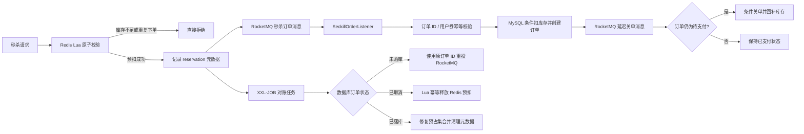

# 秒杀、关单与对账流程

NearGo 将请求接入、库存资格判断、订单落库和故障补偿拆成多个阶段，避免秒杀请求直接冲击 MySQL。

## 关键代码

| 能力 | 实现位置 |
|---|---|
| Redis 库存校验、扣减、用户去重与预扣记录 | `src/main/resources/seckill.lua` |
| RocketMQ 消息发送及发送失败补偿 | `VoucherOrderServiceImpl#seckillVoucher` |
| 消费端幂等与数据库条件扣库存 | `VoucherOrderServiceImpl#createVoucherOrder` |
| 秒杀订单消费 | `SeckillOrderListener` |
| 延迟关单 | `OrderTimeoutListener` |
| 支付与关单状态竞争 | `VoucherOrderServiceImpl#payCallback`、`closeTimeoutOrder` |
| Redis 预扣幂等释放 | `src/main/resources/seckill_release.lua` |
| 定时对账和消息重投 | `SeckillReconciliationTask` |

## 一致性边界

- Lua 脚本保证 Redis 内库存、用户集合和预扣元数据原子变更。
- RocketMQ 发送失败时执行补偿脚本，回滚本次 Redis 预扣。
- 消费端同时使用订单 ID 和“用户 + 优惠券”进行幂等校验。
- 支付和超时关单均以待支付状态为更新条件，只允许一个状态迁移成功。
- 对账任务使用原订单 ID 重投，避免补偿时生成新的业务订单。

