# NearGo 七大问题复盘

> 严格按简历的 7 条优化逐条展开，不增加额外问题。
> 每条固定结构：**简历原文 → 这条在说什么 → 完整执行步骤（带具体数据）→ 返回值/行为说明 → 核心代码 → 为什么这么选 → 边界**。
> 代码位置用 `文件:行号` 标注，与当前源码一致。

**简历 7 条**

1. 库存一致性治理：基于 Redis + Lua 原子完成优惠券库存校验、库存预扣和用户去重，再结合 MySQL 条件扣库存，避免并发场景下库存扣减为负数和同一用户重复下单。
2. 异步削峰与消息幂等：引入 RocketMQ 将秒杀请求与订单落库流程解耦，通过订单 ID 幂等、用户与优惠券联合校验以及数据库事务保证重复消费不重复创建订单。
3. 缓存可靠性治理：使用 Redis 逻辑过期解决热点店铺缓存击穿，并通过缓存空值降低缓存穿透风险。
4. 订单状态并发控制：使用 RocketMQ 延迟消息实现超时关单，基于乐观锁思想控制订单状态流转，解决支付回调与超时关单之间的并发竞争，并在关单后回补库存，保证订单与库存状态一致性。
5. 故障补偿与最终一致性：基于 XXL-JOB 定时扫描 Redis 预扣元数据与 MySQL 订单状态，对未落库订单使用原订单 ID 重投 RocketMQ，对已取消订单幂等释放 Redis 预扣，并对异常任务进行失败重试。
6. 访问流量治理：基于 Redis + Lua + AOP + 自定义注解实现滑动窗口限流，支持 IP 和用户维度，降低秒杀接口被恶意刷取和突发流量冲击的风险。
7. 两级缓存治理：使用 Caffeine 为店铺优惠券列表构建本地一级缓存，结合 Redis 二级缓存与 MySQL 回源，减少热点查询对 Redis 和数据库的访问压力。

---

## 总览：七大问题不是孤立的，是三条链路

七个问题围绕三个入口串成三条链路：**秒杀主链路**、**店铺查询链路**、**优惠券查询链路**；其中秒杀主链路又分「正常流程」和「异常兜底」两段。

### 共享物视角总图（七问为什么不是七个孤立题）

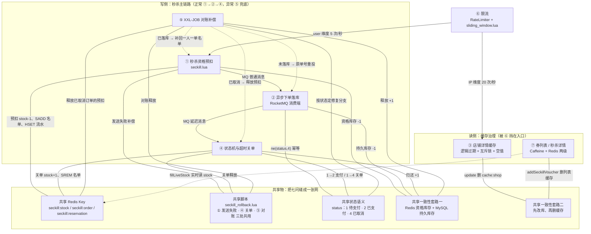

> 读法：实线＝主流程调用，虚线＝兜底 / 跨链路读取；中间一栏是共享物。
> 容易猜错的点：`cache:voucher:list:{shopId}`、`cache:seckill:voucher:{id}` **只属于 ⑦**，其他问题里不出现；真正跨问题复用的是 `seckill:stock / seckill:order / seckill:reservation` 三件套。另外目前 `@RateLimiter` 只挂在 `VoucherOrderController#seckillVoucher`（秒杀）和 `ShopController#queryShopById`（店铺详情），优惠券接口没有挂。

### 链路一：秒杀主链路（6 → 1 → 2 → 4 → 5）

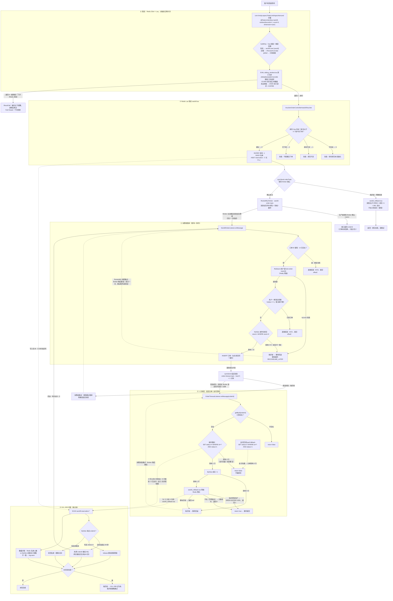

**6 → 1：先限流，再进秒杀**

超限请求在切面就被拒绝（`com.hmdp.aspect.RateLimitAspect#around` + `sliding_window.lua`），根本到不了库存逻辑。机制四步：

1. **规则来自注解**：秒杀接口 `@RateLimiter(key="seckill", windowSeconds=1, count=5, dimension="user")`（同一用户 1 秒最多 5 次）；店铺查询用 `dimension="ip"`（同一 IP 1 秒最多 20 次）；
2. **按维度拼 Key**：注解的 key 是前缀、维度拼后缀——秒杀 `key="seckill"` → `seckill:user:{userId}`；店铺 `key="shop:query"` → `shop:query:ip:{ip}`；global 只用前缀；
3. **Lua 原子四步**：`ZREMRANGEBYSCORE` 删窗口外请求 → `ZCARD` 统计窗口内数量 → 达到阈值返回 0；未达到则 `ZADD` 记录本次请求（score=时间戳）并 `EXPIRE` → 返回 1；
4. **返回值判定**：1 = 放行（`joinPoint.proceed()`）；0 或 Redis 异常（null）都拒绝（Fail Closed），前端收到“操作过于频繁，请稍后再试”。

为什么必须用 Lua：`ZCARD` 和 `ZADD` 拆开执行会被并发穿插——窗口内 99 条时两个实例同时判断通过就变成 101 条；Lua 保证「删除 + 统计 + 判断 + 写入」不可分割，同时减少网络往返。

通过后才进入 `VoucherOrderController#seckillVoucher → VoucherOrderServiceImpl#seckillVoucher()`。

**1 → 2：预扣成功才发消息**
`seckill.lua` 原子完成库存校验、用户去重、Redis 库存 -1、`SADD` 名单、`HSET` reservation 流水；只有 Lua 返回 0，Java 才会 `syncSend(orderTopic)`。

**2 → 4：落库成功才发延迟关单消息**
消费者按「订单 ID 幂等 → 用户锁 → user+券校验 → MySQL 条件扣库存 → 保存订单」落库，然后才发 timeout-topic 延迟消息；没落库就不会有关单消息。
（其中「MySQL 条件扣库存」那段代码**属于问题二**：`com.hmdp.service.impl.VoucherOrderServiceImpl#createVoucherOrder`，`VoucherOrderServiceImpl.java:147-152`；问题一 4.3 只是从“MySQL 兜底”的设计角度引用它。）

**4 → 5：订单状态是对账的判断依据**
④ 把订单改成 `status=2`（已支付）或 `status=4`（已取消）；⑤ 按状态决定修复方式：查不到订单 → 原 orderId 重投；`status=4` → release 脚本释放；其他 → 补名单 + 删流水。

**5 → 2：还有一条回边**
重投不是终点：⑤ 用原 orderId 重投 MQ 后会**再次进入 ② 的消费者**。这条回边安全的前提是「② 消费端幂等」+「⑤ 复用原 orderId」。

### 链路二：店铺查询链路（3）

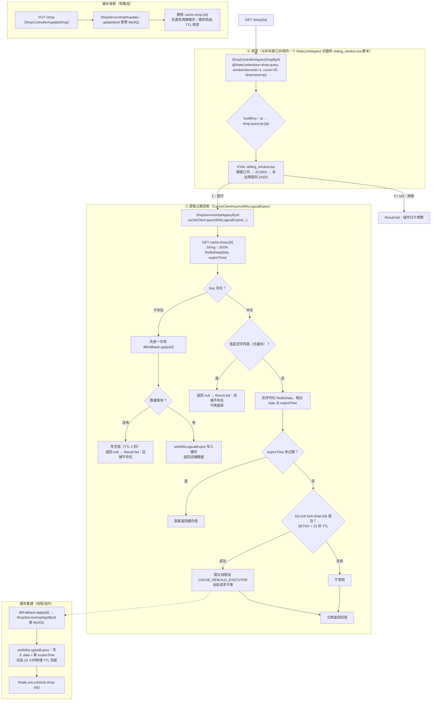

关键点：

- 店铺查询与秒杀**接口**共用同一个 `RateLimitAspect` 切面和 `sliding_window.lua` 脚本，只是注解参数不同：`dimension` 从 user 换成 **ip**（同一 IP 1 秒 20 次），Key 是 `shop:query:ip:{ip}`；两条规则的计数 ZSet 互相独立；
- 逻辑过期不删 Key：`expireTime` 到了也先返回旧值，只有抢到 `lock:shop:{id}` 的线程去线程池重建；Key 另带 **24 小时物理 TTL 兜底**，防止长期无人访问的 Key 永不过期、无界占用内存（物理过期后走“未命中回填”，有回填 + 负缓存不会打挂数据库）；
- **空值缓存已接入这条链路**：Key 不存在（未预热 / 负缓存过期）→ 查一次库；查不到就写空值（TTL 2 秒）并返回“店铺不存在”，同一个不存在的 ID 在 2 秒内不再打库；查到就按逻辑过期格式写入并返回；
- 写路径是「先更新数据库、再删缓存」，删除失败没有重试，靠下一次读或 TTL 收敛（边界）。

### 链路三：优惠券查询链路（7）

```mermaid
flowchart TD
    subgraph L7A["券列表：GET /voucher/list/{shopId}"]
        A1["VoucherController#queryVoucherOfShop"] --> A2{"① Caffeine（localVoucherCache）命中？<br/>shopId → List<Voucher> · 5 秒"}
        A2 -->|"是"| A3["直接返回（不走网络）"]
        A2 -->|"否"| A4{"② GET cache:voucher:list:{shopId}<br/>Redis · 30 秒"}
        A4 -->|"命中"| A5["反序列化 List<Voucher><br/>回填 Caffeine → 返回"]
        A4 -->|"未命中"| A6["③ VoucherMapper#queryVoucherOfShop 查 MySQL"]
        A6 --> A7["写 Redis（JSON 数组，TTL 30 秒）<br/>空结果也写 []（天然负缓存）"]
        A7 --> A8["回填 Caffeine → 返回"]
    end

    subgraph L7B["秒杀详情：GET /voucher/seckill/{id}"]
        B1["VoucherController#querySeckillVoucherDetail"] --> B2{"① Caffeine（localSeckillDetailCache）命中？<br/>voucherId → SeckillVoucherDetailDTO · 5 秒"}
        B2 -->|"是"| B3["fillLiveStock 实时读 seckill:stock:{id} → 返回"]
        B2 -->|"否"| B4{"② GET cache:seckill:voucher:{id}<br/>Redis · 30 秒"}
        B4 -->|"命中空值：负缓存"| B5["返回：优惠券不存在<br/>不再穿透到数据库"]
        B4 -->|"命中正常 JSON"| B6["回填 Caffeine<br/>fillLiveStock → 返回"]
        B4 -->|"未命中"| B7["③ 查 tb_voucher + tb_seckill_voucher 组装 DTO"]
        B7 --> B8{"voucher 存在？"}
        B8 -->|"不存在"| B9["写空值（TTL 2 秒）<br/>返回：优惠券不存在"]
        B8 -->|"存在"| B8B{"seckillVoucher 存在？"}
        B8B -->|"不存在"| B8C["返回：该优惠券不是秒杀券"]
        B8B -->|"存在"| B10["写 Redis（TTL 30 秒）<br/>回填 Caffeine → fillLiveStock → 返回"]
    end

    subgraph WR7["写路径缓存失效"]
        C1["POST /voucher/seckill<br/>VoucherServiceImpl#addSeckillVoucher"] --> C2["写 tb_voucher + tb_seckill_voucher<br/>初始化 seckill:stock:{id}"]
        C2 --> C3["localVoucherCache.invalidate(shopId)<br/>删除 cache:voucher:list:{shopId}"]
    end
```

图里两个 Caffeine 是**两个独立对象**（都定义在 `com.hmdp.service.impl.VoucherServiceImpl`），一条线路用一个：

| 线路   | Caffeine 对象               | Key → Value                           | 对应 Redis Key                        |
| ---- | ------------------------- | ------------------------------------- | ----------------------------------- |
| 券列表  | `localVoucherCache`       | `shopId → List<Voucher>`              | `cache:voucher:list:{shopId}`（30 秒） |
| 秒杀详情 | `localSeckillDetailCache` | `voucherId → SeckillVoucherDetailDTO` | `cache:seckill:voucher:{id}`（30 秒）  |

两者都是 `expireAfterWrite = 5 秒`、`maximumSize = 1000`，互不干扰：查券列表不会碰详情缓存，反之亦然。

关键点：

- **两级缓存的失效方式**：本地 Caffeine 只有 **5 秒 TTL**（不做跨实例广播）；Redis 30 秒；
- **空值缓存在这条链路上真正生效**：秒杀详情查库为空 → 写 `""`（`CACHE_NULL_TTL = 2 秒`）；再查同一个不存在的 ID → 命中空值直接返回，不再打数据库——这就是简历里“缓存空值降低穿透风险”的落点；
- **券列表的空结果也会被缓存**：查库是空列表也会把 `[]` 写进 Redis（30 秒），同 shopId 的重复查询不会回源；
- **库存字段不进缓存**：秒杀详情的 `stock` 每次用 `fillLiveStock` 实时读 `seckill:stock:{id}`（与 ① 的 Lua 扣减联动）；
- 写路径：新增秒杀券时失效本地 + Redis 的券列表缓存（详情缓存靠 TTL 收敛）。

③ 是「店铺详情」单 Key 的击穿治理；⑦ 是「券列表 / 秒杀详情」的多级缓存抗压 + 不存在 ID 的空值防穿透，两者合起来构成读侧缓存治理。

### 隐藏联系（面试串问的关键）

1. **① 写 reservation ←→ ⑤ 扫 reservation**：问题一在 Lua 里多写的这条流水，就是问题五的凭据；⑤ 的「重投 / 释放 / 补名单」三个分支全靠它；
2. **④ 的 status ←→ ⑤ 的修复方向**：④ 更新订单状态，⑤ 按状态决定「重投还是释放」；
3. **④ 与 ⑤ 共用释放脚本**：关单 `closeTimeoutOrder` 和对账分支二执行的是同一个 `seckill_rollback.lua`（幂等、先判 SISMEMBER）；
4. **库存是闭环**：① Redis 预扣 -1 → ② MySQL 条件扣 -1 → ④ / ⑤ 归还 +1（Redis +1、MySQL +1）；
5. **⑦ 与 ① 的库存联动**：秒杀详情页的 `stock` 字段不进缓存，`fillLiveStock` 每次实时读的 `seckill:stock:{id}` 正是 ① 写入并扣减的 Key；
6. **⑥ 是入口保护**：秒杀按 user 限流、店铺按 IP 限流，保护 ① ③ ⑦ 三个入口；它只解决「流量多少」，不解决「业务对不对」（防超卖靠 ①、防重复靠 ②）。

### 总图

```text
请求 ── 6. 限流（秒杀按 user / 店铺按 IP）
          │
          ├─► 3. 店铺详情：逻辑过期（防击穿）+ 空值（防穿透）
          │
          ├─► 7. 券列表 / 秒杀详情：Caffeine → Redis → MySQL
          │        └── 查不到的 ID 写空值（防穿透）；库存不缓存，fillLiveStock 实时读 seckill:stock ←─┐
          │                                                              │
          └─► 1. Redis Lua 预扣（写 seckill:stock / 名单 / reservation）─┘
                    │
                    ▼
              2. RocketMQ 异步落库（消费端幂等）
                    │
                    ▼
              4. 延迟关单 + 状态条件更新（库存归还，与 ⑤ 共用 release 脚本）
                    │
                    ▼
              5. XXL-JOB 对账（三分支 + 数量对账）
                    │
                    └── 原 orderId 重投 ──► 回到 ②（依赖 ② 的幂等）
```

**一句话背下来**：⑥ 是入口保护；① ② ④ 组成秒杀主流程；⑤ 是主流程的异常兜底；③ ⑦ 是两条查询缓存链路。

---

## 一、库存一致性治理

> **简历原文**：基于 Redis + Lua 原子完成优惠券库存校验、库存预扣和用户去重，再结合 MySQL 条件扣库存，避免并发场景下库存扣减为负数和同一用户重复下单。

### 面试话术（四段式：背景 → 剖析 → 构思 → 复盘，可直接背）

**① 背景阐述**：是这样的，我先说一下背景。这个平台是本地生活服务类的，商家可以发布优惠券，其中秒杀券是限量、定点开抢的，比如某天某个时刻上架 200 张。因为折扣力度大，开抢瞬间会有大量流量涌入，这就是典型的秒杀场景。这个场景有两个硬性要求：第一，200 张券只能卖出 200 张，库存绝对不能超卖；第二，这种券限制每个用户只能买一次，也就是一人一单。

**② 问题剖析**：要满足这两个要求，本质上是做好"下单资格校验"——库存够、且用户没买过，才有资格下单。我一开始想到的方案很直接：

- 针对一人一单：去数据库查这个用户在这张券上有没有订单，有就拒绝；为了防止同一个用户并发发起多个请求，还要加分布式锁；
- 针对库存不超卖：扣库存的 update 语句带上 `where stock > 0`，库存扣到 0 就不会再减，自然不会超卖。

这个方案在低并发下完全能用，但秒杀峰值下问题很明显：所有校验、扣减全压在 MySQL 上，大量线程去查库、抢锁、竞争同一条热门库存记录，数据库响应时间被越拖越长，很容易成为整个链路的瓶颈。一句话，资格判断这种高频操作，不应该让 MySQL 来扛。

**③ 方案构思**：所以我的优化思路是——把下单资格的判断整体从 MySQL 挪到 Redis：

- 第一，判断资格只需要"库存"和"这个人买没买过"两个信息，那就把它们放进 Redis：库存用 String 保存（key 是业务前缀加券 ID，value 是剩余库存），已经买过的用户用 Set 保存（value 是所有抢到过的用户 ID）；
- 第二，光放进 Redis 还不够，因为"查库存、查名单、扣库存、记名单"是四步操作，分开执行还是有并发问题。这时候我想到 Lua—Redis 执行 Lua 脚本是原子的，把四步合成一次原子操作，直接从根上解决并发安全，连分布式锁都省掉了；
- 抢券脚本的完整逻辑：先检查库存 Key 是否存在，不存在说明券还没初始化，返回 3；库存小于等于 0 返回 1（库存不足）；用 SISMEMBER 查一人一单，已经买过返回 2；都通过的话，库存预减、把这个用户 SADD 进名单，然后写一条预扣流水（记录订单 ID、用户、券、时间，设置 7 天过期），最后返回 0 表示抢购成功；
- Java 侧拿到 0 之后发 MQ 异步落库（这是下一个优化点），如果发送失败，就执行回滚脚本把库存和资格补偿回去；
- 另一手兜底：消费端真正落库时，数据库扣减仍然保留 `where stock > 0` 条件更新。Redis 是"资格库存"，负责扛高并发；MySQL 是"事实库存"，负责最终一致，两层都扣才安全。

**④ 复盘总结**：这点的核心就是一句话——把高频的资格判断从 MySQL 移到 Redis，并且用 Lua 把"校验 + 预扣"做成一个原子操作，MySQL 只保留最终的持久化和条件兜底。这样既解决了超卖和一人一单的正确性问题，也把接口性能抬上来了。另外我在预扣成功时写了一条流水，这是给后面"预扣了但没落库"的异常场景留的凭据，属于一致性的伏笔。

### 1. 这条在说什么

秒杀的核心是「抢资格」。资格判断要同时满足两件事：

- 库存还有（不能超卖）；
- 这个人还没抢过（一人一单）。

这两件事如果拆成多条 Redis 命令执行，中间会被其他请求插入：两个请求可能同时读到「库存还有、用户没买过」，然后都往下一步走。所以把「查库存 → 查重复 → 扣库存 → 记名单 → 写流水」整套动作交给**一段 Lua**，在 Redis 里原子执行；抢到资格的请求再进入 MQ/MySQL。MySQL 那边再做一次带条件的扣减，作为最后一道防线。

**这条优化的意义**

- **业务正确性**：秒杀的两个硬约束——库存不能超卖、一人只能一单——在进入数据库之前就被原子判定，不依赖应用锁，也不让数据库承接全部流量；
- **扛住并发**：判断和扣减放在 Redis（内存、单线程执行 Lua），比「MySQL 热点行 + 事务」高一个量级；真正进入 MySQL 的只有预扣成功的那一小批请求；
- **没有它会怎样**：
  - 所有请求直接打 MySQL：热点行竞争、大量失败事务堆积，秒杀接口整体被拖垮；
  - 用 Java「查 → 判 → 扣」：多实例下 `synchronized` 失效，两个请求同时读到「有库存」→ 超卖；
  - 只防超卖不防重复：同一用户脚本连点，一人刷走多张券；
- **本质**：Redis 是「资格库存」（快速拦截、决定谁能进），MySQL 是「持久化库存」（最终事实、兜底不扣成负数），两层职责分离。

### 2. 完整执行步骤（示例：券 1001，初始库存 100，用户 2）

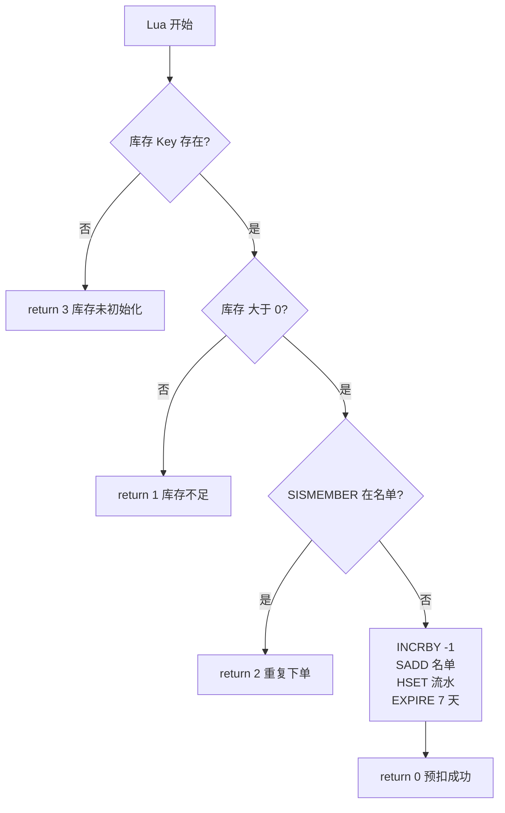

1. Lua 读取 `seckill:stock:1001` → 值 `"100"`；
2. 判断库存是否大于 0 → 是，继续；
3. `SISMEMBER seckill:order:1001 2` → 用户 2 不在名单，继续；
4. 库存减 1：`INCRBY seckill:stock:1001 -1`，100 变成 99；
5. `SADD seckill:order:1001 2` → 用户 2 加入名单；
6. `HSET seckill:reservation:1001:2 ...` → 写预扣流水（orderId / userId / voucherId / reservedAt / retryCount / lastRetryAt 六个字段）；
7. `EXPIRE seckill:reservation:1001:2 604800` → 流水 7 天有效；
8. 返回 **0**，表示 Redis 预扣成功，Java 侧继续发 MQ 消息；
9. 返回 **非 0** 时：**不发送 MQ**，接口直接返回对应错误（见第 3 节返回值表）。

其中第 3~7 步在同一个 Lua 脚本内连续执行，Redis 单线程执行脚本期间不会插入其他请求的命令。

执行前后 Redis 数据对比（可以用 `GET` / `SMEMBERS` / `HGETALL` 验证）：

| Key                          | 执行前     | 执行后                   |
| ---------------------------- | ------- | --------------------- |
| `seckill:stock:1001`         | `"100"` | `"99"`                |
| `seckill:order:1001`         | 空集合     | `{2}`                 |
| `seckill:reservation:1001:2` | 不存在     | 存在，含 6 个字段，TTL 604800 |

### 3. 返回值全表（0 / 1 / 2 / 3）

Lua 脚本的返回值就是业务语义，**必须在这里全部说清**：

| 返回值   | Lua 什么时候返回                     | 有没有写 Redis | Java 侧处理（`VoucherOrderServiceImpl.java:87-96`） | 接口返回给用户       |
| ----- | ------------------------------ | ---------- | ---------------------------------------------- | ------------- |
| **0** | 库存扣减、名单、流水全部写完后                | 写了         | 继续 `syncSend` 发订单消息                            | 成功，返回 orderId |
| **1** | 读到库存 ≤ 0 时，扣减之前就返回             | 什么都没写      | `Result.fail("库存不足")`                          | 库存不足          |
| **2** | `SISMEMBER` 命中（用户已在名单），扣减之前就返回 | 什么都没写      | `Result.fail("不能重复下单")`                        | 不能重复下单        |
| **3** | 库存 Key 不存在时（未初始化）              | 什么都没写      | 走默认分支 `Result.fail("秒杀库存未初始化")`                | 秒杀库存未初始化      |
| null  | 脚本执行异常，Java 兜底                 | ——         | code 置为 -1，走默认分支                               | 秒杀库存未初始化      |

两个关键细节：

- **1 / 2 / 3 都在写操作之前返回**，所以失败的请求不会改变任何数据（库存不会被扣、名单不会被加）；
- 返回 3 的原因：库存 Key 是建券时单独初始化的（见下面核心代码 4），不存在的券调用秒杀会得到这个错误。

### 4. 核心代码

**4.1 Lua 脚本全文（带逐行注释）**（`seckill.lua`）

```lua
---秒杀券id
local voucherId = ARGV[1]        -- Java 传进来的第 1 个参数：券 ID，如 "1001"
--用户id
local userId = ARGV[2]           -- 第 2 个参数：用户 ID，如 "2"
--订单id
local id = ARGV[3]               -- 第 3 个参数：Java 生成的订单 ID（RedisIdWorker）

--库存key（.. 是 Lua 的字符串拼接）
local stockKey = 'seckill:stock:' .. voucherId                       -- seckill:stock:1001
--订单key（一人一单名单）
local orderKey = 'seckill:order:' .. voucherId                       -- seckill:order:1001
--预扣流水key：保存订单与 Redis 预扣之间的绑定关系，供对账任务补偿重投
local reservationKey = 'seckill:reservation:' .. voucherId .. ':' .. userId   -- seckill:reservation:1001:2

--库存是否充足
local stock = redis.call('get', stockKey)
-- GET 返回字符串如 "100"；Key 不存在时返回 false
if (not stock) then
    return 3                     -- 3 = 库存未初始化
end
if (tonumber(stock) <= 0) then
-- tonumber：GET 返回的是字符串，要转成数字才能比大小
    return 1                     -- 1 = 库存不足
end

--判断用户是否下单（一人一单）
if (tonumber(redis.call('sismember', orderKey, userId)) == 1) then
-- SISMEMBER 查名单里有没有这个用户，返回 0 或 1
    return 2                     -- 2 = 重复下单
end

--扣减库存
redis.call('incrby', stockKey, -1)              -- 库存减 1："100" → "99"
--下单（保存用户）
redis.call('sadd', orderKey, userId)            -- 用户加入名单
--记录预扣元数据。Redis Lua 保证库存、用户集合和预扣记录一起提交。
local now = redis.call('time')[1]               -- Redis 服务器时间（秒）
redis.call('hset', reservationKey,              -- 写预扣流水 Hash
        'orderId', id,                          -- 订单 ID（消费者用它做幂等）
        'userId', userId,
        'voucherId', voucherId,
        'reservedAt', now,                      -- 预扣时间
        'retryCount', '0',                      -- 重投次数，初始 0
        'lastRetryAt', '0')                     -- 最近重投时间，初始 0
redis.call('expire', reservationKey, 604800)    -- 7 天后过期
return 0                     -- 0 = 预扣成功
```

**4.2 Java 调用与返回值分支**（`VoucherOrderServiceImpl.java:73-96`）

```java
public Result seckillVoucher(Long voucherId) {
    UserDTO user = UserHolder.getUser();          // 从 ThreadLocal 拿当前登录用户
    if (user == null) {
        return Result.fail("请先登录");            // 没登录直接拒绝
    }

    long orderId = redisIdWorker.nextId("order"); // 先生成全局唯一订单 ID：后面写进流水、发 MQ、当数据库主键
    Long result = stringRedisTemplate.execute(
            SECKILL_SCRIPT,                       // 要执行的 Lua 脚本（seckill.lua）
            Collections.emptyList(),              // KEYS 列表为空：脚本内部自己拼 Key
            voucherId.toString(),                 // ARGV[1] = 券 ID
            user.getId().toString(),              // ARGV[2] = 用户 ID
            String.valueOf(orderId)               // ARGV[3] = 订单 ID
    );
    int code = result == null ? -1 : result.intValue();   // 脚本异常返回 null 时兜底为 -1
    if (code != 0) {                              // 非 0 全部是失败，且脚本没写任何数据
        if (code == 1) {
            return Result.fail("库存不足");        // Lua 返回 1
        }
        if (code == 2) {
            return Result.fail("不能重复下单");    // Lua 返回 2
        }
        return Result.fail("秒杀库存未初始化");   // Lua 返回 3 或 null 兜底
    }
    // code == 0：预扣成功，继续发 MQ（见问题二）
    ...
}
```

**4.3 MySQL 条件扣库存兜底**——**代码属于问题二（消费端），不在秒杀入口**

> 归属说明：这段代码的第一执行现场是 `com.hmdp.service.impl.VoucherOrderServiceImpl#createVoucherOrder`（`VoucherOrderServiceImpl.java:147-152`），由 RocketMQ 消费者 `com.hmdp.listener.SeckillOrderListener#onMessage`（`SeckillOrderListener.java:42`）调用。问题一只讲它的**设计目的**（Redis 之外再加一层 MySQL 兜底）；它的**执行时机**写在问题二。

```java
boolean stockUpdated = seckillVoucherService.update(
        new LambdaUpdateWrapper<SeckillVoucher>()     // 操作的表：tb_seckill_voucher（秒杀券表）
                .eq(SeckillVoucher::getVoucherId, voucherOrder.getVoucherId())  // WHERE voucher_id = ?
                .gt(SeckillVoucher::getStock, 0)      // AND stock > 0：关键条件，不是裸扣
                .setSql("stock = stock - 1")          // SET stock = stock - 1
);
// 等价 SQL：UPDATE tb_seckill_voucher SET stock = stock - 1 WHERE voucher_id = ? AND stock > 0
if (!stockUpdated) {                              // 影响 0 行：数据库没库存可扣，和 Redis 对不上
    throw new IllegalStateException("数据库库存与 Redis 预扣状态不一致");  // 抛异常 → 事务回滚 + MQ 重试
}
```

等价 SQL：

```sql
UPDATE tb_seckill_voucher
SET stock = stock - 1
WHERE voucher_id = 1001 AND stock > 0;
```

没有 `stock > 0` 就是裸扣，库存会扣成负数；加上条件后，并发更新由 MySQL 行锁串行化，第二个请求影响 0 行 → 抛异常回滚 → 交给 MQ 重试。Redis 是「资格库存」（快速拦截），MySQL 是「持久化库存」（最终事实），两边都扣是职责分离。

**4.4 库存 Key 的初始化**（`VoucherServiceImpl.java:154`）

```java
//保存秒杀库存到redis
stringRedisTemplate.opsForValue().set(SECKILL_STOCK_KEY + voucher.getId(), voucher.getStock().toString());
// 新增券时写初始库存；例：券 1001、库存 100 → Key = seckill:stock:1001，值 = "100"
// 后续所有秒杀判断读的都是这个 Key；没初始化过就会返回 3（库存未初始化）
```

建券时写入初始库存，后续所有秒杀判断都读这个 Key。这也解释了返回 3 的场景。

### 5. 三个 Key 的数据结构

| Key                                        | 类型     | 存什么                 | 谁写                    | TTL |
| ------------------------------------------ | ------ | ------------------- | --------------------- | --- |
| `seckill:stock:{voucherId}`                | String | 剩余库存，如 `"99"`       | 建券写初始值；预扣 -1；补偿/释放 +1 | 无   |
| `seckill:order:{voucherId}`                | Set    | 已抢到的 userId，如 `{2}` | 预扣 `SADD`；释放 `SREM`   | 无   |
| `seckill:reservation:{voucherId}:{userId}` | Hash   | 一次预扣的流水             | 预扣时 `HSET`；对账更新重投信息   | 7 天 |

`{}` 是占位符，不是 Redis 语法：券 1001、用户 2 时，真实 Key 是 `seckill:reservation:1001:2`。

reservation 的 6 个字段（问题五会用到）：

| 字段            | 含义               | 示例                    |
| ------------- | ---------------- | --------------------- |
| `orderId`     | 本次预扣生成的订单 ID     | `1758000000000000001` |
| `userId`      | 用户 ID            | `2`                   |
| `voucherId`   | 券 ID             | `1001`                |
| `reservedAt`  | 预扣时间（秒级时间戳）      | `1789916936`          |
| `retryCount`  | 对账重投次数           | `0`                   |
| `lastRetryAt` | 最近重投时间，`0` = 未重投 | `0`                   |

### 6. 为什么用 Lua（选型对比）

| 方案              | 决定性因素              | 判定        |
| --------------- | ------------------ | --------- |
| JVM 锁           | 只保护单个 JVM，多实例失效    | 淘汰        |
| 数据库悲观锁          | 热点行串行，持锁占用连接       | 淘汰        |
| 数据库条件扣减         | 无锁竞争，但请求仍要打数据库     | 留作兜底      |
| Redisson 分布式锁   | 每个请求加锁解锁，热点重新串行    | 只用于消费端用户锁 |
| Redis 事务        | 无法按读取结果做条件分支       | 淘汰        |
| **Redis + Lua** | 判断、扣减、去重、写流水一次原子完成 | 采用        |

### 7. 边界（面试追问）

| 追问                           | 回答                                                                  |
| ---------------------------- | ------------------------------------------------------------------- |
| Lua 能保证 Redis 和 MySQL 一起原子吗？ | 不能。Lua 只覆盖 Redis；跨存储由消息幂等 + 失败补偿 + 对账收敛                             |
| 为什么不用分布式锁锁库存？                | 热点券会退化成单锁竞争；Lua 不需要锁的续期和释放                                          |
| 一人一单的缺口在哪？                   | 当前没有 `(user_id, voucher_id)` 唯一索引，应用层保证，生产要补                        |
| 入口 `SISMEMBER` 就够了吗？         | 不够。它只拦入口的重复请求；消息重复 / 落库重复由问题二的「订单 ID 幂等 + 用户券查重 + 用户锁」处理（见问题二第 3 节） |
| Redis Cluster 下脚本要注意什么？      | 多 Key 要用 `KEYS` 传入 + Hash Tag 保证同槽；当前是单机写法                          |

---

## 二、异步削峰与消息幂等

> **简历原文**：引入 RocketMQ 将秒杀请求与订单落库流程解耦，通过订单 ID 幂等、用户与优惠券联合校验以及数据库事务保证重复消费不重复创建订单。

### 面试话术（四段式：背景 → 剖析 → 构思 → 复盘，可直接背）

**① 背景阐述**：上一个优化点解决了"怎么快速判断用户有没有下单资格"，但抢到资格之后，还需要真正生成订单、扣减数据库库存。如果这些操作还放在接口里同步做，接口响应时间会被数据库写操作拖长，秒杀高并发场景下吞吐上不去。

**② 问题剖析**：所以核心思路是把"下单请求"和"订单落库"解耦，用消息队列把请求先接下来，异步慢慢落库。但引入异步之后，新问题就来了：

- 消息队列的投递语义通常是"至少一次"，消息可能因为重试、网络抖动被重复投递；
- 消费端如果直接落库、不做任何判断，同一笔抢购就可能被消费成两笔订单，库存也会重复扣；
- 所以异步方案能不能用，关键在于消费端能不能做到幂等——同一条消息投递多少次，最终结果都必须一样。

**③ 方案构思**：我用 RocketMQ 来做这条异步链路，具体设计：

- 生产端：Lua 返回 0 之后，用 `syncSend` 同步发一条普通消息，显式设置 3 秒超时，确保消息确实被 Broker 接收；发送失败进 catch，执行回滚脚本把 Redis 的预扣补偿回去；
- 消费端落库做三层防重，顺序和代码一致：先用订单 ID 快筛——拿消息里的订单 ID 查库，已存在说明这条消息重投过，直接返回；再拿用户维度的 Redisson 锁；然后在锁内做"用户 + 优惠券"联合校验——查这个用户在这张券上有没有有效订单（`status != 4`，已取消的不算），有就说明同一人重复抢单，直接返回。三层分别防"同一条消息重投、同一个人重复下单、两条消息并发穿过检查"，缺一层都会漏一种场景；
- 通过校验后，先做数据库条件扣减 `update ... set stock = stock - 1 where stock > 0`，影响行数为 0 说明 Redis 和数据库状态对不上，抛异常让消息重试；然后写入订单，整个过程包在一个事务里；
- 订单落库成功后，再发一条延迟消息用于超时关单——这个动作属于下一个优化点，但它是接在这条消费链路后面的；
- 中间件选型上我对比过 Kafka 和 RabbitMQ：Kafka 强在日志/流式大数据吞吐，延迟消息不是原生能力、关单要外挂实现，集群运维也重；RabbitMQ 的延迟消息要装插件；而 RocketMQ 原生支持延迟消息、同步发送能拿到明确确认、部署轻量，Java 生态和中文资料也最匹配，所以选它。

**④ 复盘总结**：异步削峰的本质是"用最终一致性换吞吐"，能不能落地的关键是消费端幂等。我的幂等设计按"代价从低到高"排：订单 ID 查重最便宜；再查用户和券的联合校验；最后用锁兜并发、事务保证原子。再加上生产端的发送失败补偿和后面要讲的定时对账，整条异步链路就是可发现、可修复的。

### 1. 这条在说什么

秒杀请求被拆成两个线程接力：

- **请求线程**：只做「Redis 预扣 + 把消息交给 RocketMQ」，然后立刻返回 orderId，不等数据库；
- **消费者线程**：收到消息后才真正扣 MySQL 库存、插入订单。

类比：前台接单发号（请求线程），后厨做菜（消费者线程）。前台不等菜做好，人再多号照发；后厨按自己的速度出菜，忙不过来时单子堆在 MQ 里。

「重复消费不重复创建订单」靠消费者里的四层保障实现，见下面第 3 节。

**这条优化的意义**

- **削峰**：秒杀流量是「尖刺」——几千 QPS 集中在几秒内；MQ 把请求线程和落库线程解耦，接口只做「Redis 预扣 + 发消息」就返回，数据库按自己的消费速度处理；
- **解耦**：下单之后还要发券、通知、统计时，不必全部塞进请求线程，下游可以独立扩缩容；
- **没有它会怎样**：
  - 同步落库：峰值直接把数据库连接池打满、接口大面积超时，用户重试又把压力放大；
  - 只异步不幂等：RocketMQ 是「至少一次」语义，重投/重试会导致同一用户多笔订单；
- **本质**：用「订单最终会创建」换「接入层高吞吐」；代价是消息可能重复、延迟、积压，所以必须配幂等（本节）和兜底（第五节）。

### 2. 完整执行步骤

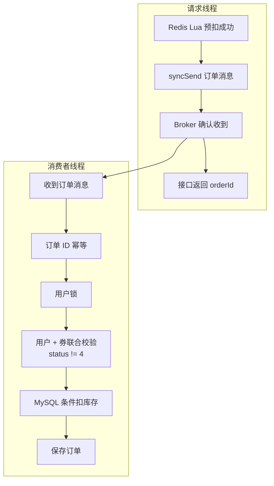

**请求线程**（`VoucherOrderServiceImpl#seckillVoucher`）：

1. Redis Lua 预扣成功（返回 0）；
2. `syncSend` 把订单消息发给 RocketMQ，等 Broker 确认（超时 3000ms）；
3. Broker 确认收到；
4. 接口返回 `orderId`——此时数据库里还没有订单。

发送**明确失败**（`syncSend` 抛异常）时执行补偿，见核心代码 4.2。

**消费者线程**（`SeckillOrderListener#onMessage` → `createVoucherOrder`）：

1. 收到订单消息（JSON，含 orderId/userId/voucherId）；
2. 订单 ID 幂等：`getById(orderId)` 已有 → 重复消息，直接结束；
3. 用户锁：`tryLock lock:order:{userId}`，同一用户的消息串行执行；
4. 用户 + 券联合校验：查 `user_id + voucher_id` 且 `status != 4` 已有订单 → 直接结束；
5. MySQL 条件扣库存：`stock > 0` 才扣，影响 0 行就抛异常；
6. 保存订单：和扣库存在同一个事务里，要么都成功要么都回滚；
7. 落库成功后发延迟关单消息（见问题四）。

### 3. 为什么重复消费不会重复创建订单（对应简历原话）

| 简历里的词        | 实现                                                | 防的是哪种重复                      |
| ------------ | ------------------------------------------------- | ---------------------------- |
| 订单 ID 幂等     | `getById(orderId) != null` 直接返回                   | 同一条消息被投递多次                   |
| 用户 + 优惠券联合校验 | `count(userId + voucherId，status != 4)` 大于 0 直接返回 | 不同订单 ID、但同一用户同一张券（已取消订单不算重复） |
| 数据库事务        | `@Transactional` 包住「扣库存 + 插订单」                    | 写一半失败导致的库存/订单不一致             |
| 用户锁（配套）      | Redisson `lock:order:{userId}`                    | 同一用户的消息并发穿过上面两个检查            |

流程演示（券 1001，用户 2，消息被投递两次）：

- 第 1 次：订单 ID 不存在 → 扣库存 → 插订单 → 提交；
- 第 2 次：订单 ID 已存在 → 直接返回，不会插第二笔。

**问题一已经用 `SISMEMBER` 查过重了，为什么这里还要再查？**

因为两者**查的对象、阶段、判据都不同**，不能互相替代：

|       | 问题一：入口查重                                                                           | 问题二：落库查重                                                                                                                         |
| ----- | ---------------------------------------------------------------------------------- | -------------------------------------------------------------------------------------------------------------------------------- |
| 位置    | `src/main/resources/seckill.lua`（请求线程，`VoucherOrderServiceImpl#seckillVoucher` 执行） | `com.hmdp.service.impl.VoucherOrderServiceImpl#createVoucherOrder`（消费线程，由 `com.hmdp.listener.SeckillOrderListener#onMessage` 调用） |
| 判据    | Redis `seckill:order:{voucherId}` 这个 Set                                           | MySQL：主键 `id` + 业务键 `user_id + voucher_id`                                                                                       |
| 拦住什么  | 还没下单的重复请求（用户重复点击 / 脚本重放）                                                           | 已经变成事实的重复落库（消息重复、业务重复）                                                                                                           |
| 去掉会怎样 | 重复请求都能拿到 orderId，Redis 库存被扣多次，可能超卖                                                 | 重复 INSERT 主键冲突导致无限重试，或产生第二笔订单                                                                                                    |

为什么入口查过了还不信？因为**消息入队之后，Redis 状态随时可能被改变**：

```text
补偿 / 释放（同一个 seckill_rollback.lua）：把用户从名单移除
Redis 重启 / 人工操作：名单和流水可能丢失
MQ：同一条消息可能重复投递
```

所以消费端只能信「消息内容 + 数据库事实」。

消费端这三道防守各自的职责（完整类#方法 + 行号）：

| 消费端检查                                     | 位置                                                                                                     | 防的是哪种重复                           | 去掉的后果                   |
| ----------------------------------------- | ------------------------------------------------------------------------------------------------------ | --------------------------------- | ----------------------- |
| `getById(orderId)`                        | `com.hmdp.service.impl.VoucherOrderServiceImpl#createVoucherOrder`（`VoucherOrderServiceImpl.java:125`） | 同一条消息被投递多次                        | 重复 INSERT 主键冲突 → 消息无限重试 |
| `count(userId + voucherId + status != 4)` | 同上（`VoucherOrderServiceImpl.java:137-140`）                                                             | 不同订单 ID、同一用户同一券（假失败重抢、对账误用新 ID 等） | 可能产生第二笔订单               |
| Redisson 用户锁（配套）                          | 同上（`VoucherOrderServiceImpl.java:131`）                                                                 | 上面两个“先查再插”之间的并发窗口                 | 两个线程都查不到订单 → 都插入 → 双单   |

**这三层各防什么？先看“密码本”，再看三个故事**

| 层       | 查的东西   | 拦的“重复”               |
| ------- | ------ | -------------------- |
| ① 订单 ID | “这条消息” | 同一条消息被 MQ 投了第二次      |
| ② 用户+券  | “这个人”  | 同一个人换了一条消息又来下第二单     |
| ③ 用户锁   | “同一瞬间” | 两条消息同时到，抢在彼此前面都通过了检查 |

关键常识：**一条消息 = 一个订单号**。同一个人两次下单，订单号一定不一样（订单号是每笔下单时新生成的）。

**故事一：为什么需要 ①（订单 ID）？——老订单可能已经“已取消”**

MQ 是“至少一次”投递，同一条消息可能被投两次。假设消息 A：

```text
1. 第一次消费：成功插入订单 A
2. 消费端还没来得及回执（ack），程序重启了
3. MQ 没收到回执 → 过一会儿把消息 A 重新投一遍
4. 而这段时间里，订单 A 因超时被自动关单了（status=4，库存已退回）
```

现在重投的消息 A 进来了：

- ② 查“用户2 + 券1001 有没有**有效**订单”——没有（A 已取消，被 `ne(status,4)` 排除）→ **② 放行！**
- 如果没有 ①：流程继续 → 又扣一次库存 → 又插订单 A → **主键冲突**（A 的 ID 已存在）→ 报错 → MQ 再重试 → 死循环；
- 有 ①：`getById(A)` 一看“这笔订单存在过” → 直接 return，干净利落。

所以 ① 防的是**消息级**重复，特别是“订单已取消、消息还在重投”这种 ② 看不见的情况。

**故事二：为什么需要 ②（用户+券）？——两条消息的订单号不一样**

```text
1. 用户 2 抢到订单 A（待支付）
2. 超时关单：A 变 status=4，库存和抢购资格都释放了
3. 用户 2 重新抢 —— 这是合法的！产生新订单 B（新订单号）
4. 但假设 Redis 的“已抢名单”被误删（或修复数据时多插了一条消息）
   → 用户 2 又抢了一次，产生订单 C
```

现在同时存在 B、C 两笔有效订单：

- ① 按订单 ID 查：B、C 订单号本来就不同，① 什么都查不出来 → 放行；
- ② 查“用户2+券1001 有没有有效订单”：查到 B 还在（status≠4）→ 直接 return，C 不落库。

**这也是为什么 ② 必须写 `status != 4`**：不排除已取消订单的话，用户“取消后合法重抢”会被 ② 误杀，新订单永远生不出来。所以 ② 防的是**业务级**重复：同一个人、同一张券，只能有一笔有效订单。

**故事三：为什么需要 ③（锁）？——“先查后写”中间有时间差**

假设没有锁，两条不同订单号的消息 B、C 同时被两个消费线程处理：

```text
时刻1   T1：查用户2的有效订单 → 没有
时刻2   T2：查用户2的有效订单 → 没有     ← T1 还没来得及插入
时刻3   T1：插入订单 B，提交
时刻4   T2：插入订单 C，提交
结果： B、C 都是有效订单 → 一人两单
```

问题出在：**“查”的时候都还没有东西，“写”却都发生在查之后**。①② 本身没错，但它们防不住“同时”。

③ 锁的 key 是 `lock:order:{userId}`：同一个用户的消息必须排队——T1 拿锁 → 查+写+提交 → 释放 → T2 才拿锁 → 这时再查 → 查到 B 了 → return。

> 注意：③ 不是在“再查一遍”，而是把“查 + 写”变成一个**不可插队**的整体。这就是代码里 ② 必须写在锁里面的原因——锁外查等于白查。

**一串口诀带走**

- ① 看**票根编号**：这条消息是不是已经用过了？
- ② 看**领奖的人**：这个人手上是不是已经有一张有效券了？
- ③ 让**窗口一次只服务一个人**：同一个人的消息排队处理，别同时办。

**正确执行顺序（与代码一一对应，注意 ② 在锁里面）**

```java
if (getById(voucherOrder.getId()) != null) return;    // ① :125  无锁快筛（PK 查询最便宜）
RLock lock = redissonClient.getLock("lock:order:" + userId);   // ③ :131
lock.tryLock();
try {
    count(userId + voucherId + status != 4);          // ② :137-140  必须在锁内查，锁外查等于没查
    update stock = stock - 1 where stock > 0;         // ④ :147-152
    save(order);                                      // ⑤ :156
} finally { lock.unlock(); }
```

**为什么不用数据库唯一索引一步到位？**

因为业务允许“取消后重新抢”：同一对 `(user_id, voucher_id)` 会先后合法存在多条记录（status=4 的旧单 + 新单），普通唯一索引会被历史取消单卡死；MySQL 又没有“部分唯一索引”（只约束 status != 4 的行）。所以要么用生成列做条件唯一键，要么就用现在的“锁 + 条件查重”，项目选了后者。

一句话总结：**入口 `SISMEMBER` 查 Redis，拦“还没下单的重复请求”（保护库存）；消费端两处查重查 MySQL，拦“已经变成事实的重复落库”（保护订单）。**

边界：`count(userId + voucherId)` 目前是应用层查重，数据库还没有 `(user_id, voucher_id)` 唯一索引；被追问“能不能绝对保证不重复”时，答案是补唯一索引作为最后一道防线。

**为什么 count 必须排除已取消订单（status != 4）**：关单时会执行 release 脚本，把用户从 Redis 名单移除、库存还回去——用户**允许重新抢**。如果 count 把已取消订单也算重复，就会出现这样的僵尸状态：

```text
T1 用户2 抢券 → 订单A（待支付）
T2 超时关单 → 订单A 变 status=4，MySQL/Redis 库存都还回去，名单移除用户2
T3 用户2 重新抢 → 入口 Lua 放行，生成新订单号 B，发消息
T4 消费者处理 B：getById(B)=null；count(用户2+券1001)=1（查到已取消的订单A）
   → 直接 return，订单 B 永远不落库
T5 对账任务每 60 秒重投 B → 消费者每次都 return → 重投不报错、永不收敛
```

所以 `count` 加上 `.ne(VoucherOrder::getStatus, 4)`，与关单释放的语义保持一致（对账的数量校验 `reconcileActiveOrderCounts` 本来也是排除 status=4 的写法）。

### 4. 核心代码

**4.1 生产者：预扣成功后发消息**（`VoucherOrderServiceImpl.java:102-119`）

```java
VoucherOrder order = new VoucherOrder()
        .setId(orderId)                    // 用预生成的订单 ID（消费者幂等就靠它）
        .setUserId(user.getId())
        .setVoucherId(voucherId);
try {
    // 同步发送：等 Broker 确认；超时 3000ms。确认失败会抛异常，进入 catch 补偿
    rocketMQTemplate.syncSend(orderTopic, JSONUtil.toJsonStr(order), 3000);
} catch (Exception e) {
    // 补偿：回滚 Redis 预扣（这段就是问题二 4.2 讲的补偿，直接写全）
    Long compensated = stringRedisTemplate.execute(
            ROLLBACK_SCRIPT,                                       // seckill_rollback.lua
            Arrays.asList(
                    RedisConstants.SECKILL_STOCK_KEY + voucherId,   // KEYS[1] 库存 Key
                    RedisConstants.SECKILL_ORDER_KEY + voucherId,   // KEYS[2] 名单 Key
                    reservationKey(voucherId, user.getId())         // KEYS[3] 流水 Key
            ),
            user.getId().toString()                                 // ARGV[1] 用户 ID
    );
    log.error("RocketMQ 发送失败，Redis 预扣补偿 orderId={}, compensated={}", orderId, compensated, e);
    return Result.fail("排队失败，请重试");                           // 消息没进 Broker，接口返回失败
}
return Result.ok(orderId);                 // 返回订单 ID；此时数据库还没有订单
```

**4.1 补充：syncSend 是什么，还有其他发送方式吗**

`syncSend` = 同步发送：把消息发给 Broker 后，当前线程**阻塞等 Broker 返回确认**，确认成功才继续；超时或失败抛异常。本项目用它就是为了明确知道「消息到底进没进 Broker」，从而决定是继续返回成功，还是回滚 Redis 走补偿。

RocketMQTemplate 的其他发送方法：

| 方法                         | 是否等 Broker 确认 | 能否感知失败                 | 适合场景                     |
| -------------------------- | ------------- | ---------------------- | ------------------------ |
| `syncSend`                 | 等（阻塞线程）       | 能，失败抛异常                | 本项目：预扣后必须知道消息有没有进 Broker |
| `asyncSend`                | 不等，回调通知       | 能，在 `SendCallback` 里处理 | 高吞吐场景；但补偿逻辑要搬进回调，代码复杂    |
| `sendOneWay`               | 完全不等          | 不能                     | 日志等丢了无所谓的消息              |
| `sendMessageInTransaction` | ——            | 支持 Broker 回查本地事务       | 本地数据库事务与消息的一致性（本项目没用）    |

另外还有 `syncSendOrderly` / `asyncSendOrderly` / `sendOneWayOrderly` 顺序消息版本：按同一个 hashKey 把消息发到同一个队列保证顺序，本项目不需要。

项目里用到的两个重载：

```java
// ① 普通消息：topic、消息体、超时时间(ms)
rocketMQTemplate.syncSend(orderTopic, JSONUtil.toJsonStr(order), 3000);

// ② 延迟消息：多一个延迟等级参数（level 5 = 1 分钟）
rocketMQTemplate.syncSend(timeoutTopic, message, 3000, timeoutDelayLevel);
```

**4.2 发送失败的补偿**（= 问题二 4.1 的 catch 块，单独拆出来讲）（`VoucherOrderServiceImpl.java:105-117` + `seckill_rollback.lua`）

```java
} catch (Exception e) {
    Long compensated = stringRedisTemplate.execute(
            ROLLBACK_SCRIPT,                                       // seckill_rollback.lua
            Arrays.asList(
                    RedisConstants.SECKILL_STOCK_KEY + voucherId,   // KEYS[1] 库存 Key
                    RedisConstants.SECKILL_ORDER_KEY + voucherId,   // KEYS[2] 名单 Key
                    reservationKey(voucherId, user.getId())         // KEYS[3] 流水 Key
            ),
            user.getId().toString()                                 // ARGV[1] 用户 ID
    );
    log.error("RocketMQ 发送失败，Redis 预扣补偿 orderId={}, compensated={}", orderId, compensated, e);
    return Result.fail("排队失败，请重试");                           // 消息没进 Broker，接口返回失败
}
```

```lua
-- seckill_rollback.lua：回滚预扣
-- KEYS[1]=库存  KEYS[2]=名单  KEYS[3]=流水  ARGV[1]=用户 ID
if redis.call('sismember', KEYS[2], ARGV[1]) == 1 then   -- 先判断：用户还在名单里吗？
    redis.call('srem', KEYS[2], ARGV[1])     -- 移出名单（允许重新抢）
    redis.call('incrby', KEYS[1], 1)         -- 库存 +1（还回去）
    redis.call('del', KEYS[3])               -- 删流水
    return 1                                 -- 1 = 本次真的回滚了
end
redis.call('del', KEYS[3])                   -- 已被其他流程释放过：只清流水
return 0                                     -- 0 = 没做任何回滚，防止库存多加
```

补偿脚本返回值：**1 = 本次真的回滚了；0 = 资格已不在，没做任何回滚**。先判断再回滚是为了重复执行不会导致库存多加。

**4.3 消费者：订单消息监听**（`SeckillOrderListener.java:23-52`）

```java
@RocketMQMessageListener(                     // 声明这是 RocketMQ 消费者，框架自动启动消费线程
        topic = "${seckill.rocketmq.order-topic:seckill-order-topic}",                  // 监听下单消息
        consumerGroup = "${seckill.rocketmq.order-consumer-group:seckill-order-consumer}", // 消费组
        consumeMode = ConsumeMode.CONCURRENTLY,   // 并发消费（多线程处理消息）
        messageModel = MessageModel.CLUSTERING    // 集群模式：同组内一条消息只被一个实例消费
)
public class SeckillOrderListener implements RocketMQListener<String> {
    @Resource
    private IVoucherOrderService voucherOrderService;

    @Override
    public void onMessage(String message) {                      // MQ 收到消息后回调这里
        VoucherOrder order = JSONUtil.toBean(message, VoucherOrder.class);   // JSON 反序列化成订单对象
        voucherOrderService.createVoucherOrder(order);           // 事务落库；抛异常 → MQ 自动重试
        // 落库成功后发延迟关单消息（见问题四）
    }
}
```

**4.3 补充：onMessage 为什么会被“自动”调用**

靠的是「注解 + 接口回调（多态）」两件事配合：

- `@RocketMQMessageListener`：负责“接线”。Spring 启动时扫描到这个注解，为类创建 `DefaultMQPushConsumer`，订阅 topic、绑定消费组，并把监听器对象注册为消息回调；
- `implements RocketMQListener<String>`：负责“被调用时执行什么”。接口只约定一个方法：

```java
public interface RocketMQListener<T> {
    void onMessage(T message);
}
```

你的类实现这个接口，相当于告诉框架：

> 我是一个消息处理器。你收到消息后，可以调用我的 `onMessage()`。

这里用的是 Java 的多态和接口回调。

框架内部持有的是**接口类型**的引用：

```java
private RocketMQListener<?> rocketMQListener;   // 框架只认识接口，不认识你的类
// 消费线程池收到消息后（简化）：
rocketMQListener.onMessage(payload);            // 多态：运行期绑定到 SeckillOrderListener.onMessage
```

完整的启动与回调链路：

```text
Spring Boot 启动
  → RocketMQAutoConfiguration 自动装配（读 rocketmq.name-server）
  → ListenerContainerConfiguration 扫描 @RocketMQMessageListener 的 Bean
  → 为每个监听器创建 DefaultRocketMQListenerContainer
  → 容器创建并启动 DefaultMQPushConsumer（subscribe topic + registerMessageListener）
  → 客户端后台线程工作：PullMessageService 拉消息 / ConsumeMessageService 线程池消费
  → 适配器把消息转成 String，调用 rocketMQListener.onMessage(message)
  → 正常返回 = ACK；抛异常 = 失败重试
```

一句话：**注解负责“被发现和注册”，接口 + 多态负责“消息到来时执行哪段代码”**。这也和 `@KafkaListener`、Servlet 的 `doGet`、线程的 `run()` 是同一个思想：你实现接口，框架在合适的时机回调你。

**4.4 消费者：四层幂等 + 事务落库**（`VoucherOrderServiceImpl.java:124-160`，全文）

MQ 至少一次投递，必须去重

```java
/** RocketMQ 消费端事务：订单 ID 幂等 + 用户/券幂等 + 数据库条件扣库存。 */
@Override
@Transactional(rollbackFor = Exception.class)                // 整个方法一个事务
public void createVoucherOrder(VoucherOrder voucherOrder) {

    // ① 订单 ID 幂等：同一条消息重复投递
    if (getById(voucherOrder.getId()) != null) {     // 等价 SQL：SELECT * FROM tb_voucher_order WHERE id = orderId
        log.info("重复消费订单消息，按订单 ID 幂等返回 orderId={}", voucherOrder.getId());
        return;
    }

    Long userId = voucherOrder.getUserId();

    // ② 用户锁：同一用户的多条消息并发时串行
    // 没传 leaseTime，watchdog（看门狗）是默认开启的。
    // 把「同一个用户」的多条消息串行化，堵住两次查重之间的并发窗口
    // 
    RLock lock = redissonClient.getLock("lock:order:" + userId);   // Key：lock:order:1001
    boolean locked = lock.tryLock();                 // 拿不到锁不等待，直接失败
    if (!locked) {
        throw new IllegalStateException("用户订单并发锁获取失败");      // 抛异常 → MQ 重试
    }
    try {
        // ③ 用户 + 券联合校验：不同订单 ID、同一用户同一张券（查订单表 tb_voucher_order）
        long duplicated = count(new LambdaQueryWrapper<VoucherOrder>()
                .eq(VoucherOrder::getUserId, userId)                       // WHERE user_id = ?
                .eq(VoucherOrder::getVoucherId, voucherOrder.getVoucherId())  // AND voucher_id = ?
                .ne(VoucherOrder::getStatus, 4));                          // AND status != 4：已取消订单不算重复
        // 等价 SQL：SELECT COUNT(*) FROM tb_voucher_order
        //           WHERE user_id = ? AND voucher_id = ? AND status != 4
        if (duplicated > 0) {
            log.info("重复消费用户券消息，按用户和券幂等返回 userId={}, voucherId={}",
                    userId, voucherOrder.getVoucherId());
            return;                                   // 已有订单，不再插入
        }

        // ④ 条件扣库存（设计说明在问题一 4.3，实际执行就是问题二这里）——操作的是秒杀券表 tb_seckill_voucher
        boolean stockUpdated = seckillVoucherService.update(
                new LambdaUpdateWrapper<SeckillVoucher>()
                        .eq(SeckillVoucher::getVoucherId, voucherOrder.getVoucherId())
                        .gt(SeckillVoucher::getStock, 0)
                        .setSql("stock = stock - 1")
        );
        // 等价 SQL：UPDATE tb_seckill_voucher SET stock = stock - 1 WHERE voucher_id = ? AND stock > 0
        if (!stockUpdated) {
            throw new IllegalStateException("数据库库存与 Redis 预扣状态不一致");   // 回滚 + 重试
        }

        // ⑤ 插入订单：和扣库存在同一个事务
        save(voucherOrder);                           // 等价 SQL：INSERT INTO tb_voucher_order (id, user_id, voucher_id, status, ...) VALUES (...)
    } finally {
        lock.unlock();                                // 无论成功失败都释放锁
    }
}
```

**4.4 补充：①③④⑤ 分别操作哪张表（看不懂表名看这里）**

MyBatis-Plus 靠实体类上的 `@TableName` 注解做表映射，所以代码里看不到表名：

```text
VoucherOrder   → @TableName("tb_voucher_order")      订单表
SeckillVoucher → @TableName("tb_seckill_voucher")    秒杀券库存表
```

| 步骤  | 代码方法                                | 操作的表               | 等价 SQL                                                                               | 目的               |
| --- | ----------------------------------- | ------------------ | ------------------------------------------------------------------------------------ | ---------------- |
| ①   | `getById(orderId)`                  | tb_voucher_order   | `SELECT * FROM tb_voucher_order WHERE id = ?`                                        | 这条消息的订单是否已存在     |
| ③   | `count(...)`                        | tb_voucher_order   | `SELECT COUNT(*) FROM tb_voucher_order WHERE user_id = ? AND voucher_id = ?`         | 该用户对该券是否已有订单     |
| ④   | `seckillVoucherService.update(...)` | tb_seckill_voucher | `UPDATE tb_seckill_voucher SET stock = stock - 1 WHERE voucher_id = ? AND stock > 0` | 扣 MySQL 库存（最终事实） |
| ⑤   | `save(order)`                       | tb_voucher_order   | `INSERT INTO tb_voucher_order (id, user_id, voucher_id, ...) VALUES (...)`           | 插入订单             |

两个“库存”不要搞混：

- Redis 的 `seckill:stock:1001`：Lua 预扣时已经扣过（问题一）；
- MySQL 的 `tb_seckill_voucher.stock`：到 ④ 这里才扣，是持久化事实和兜底。

### 5. 消息说明（普通 / 延迟 / 事务）

| 消息   | 类型                       | 发送方式              | 位置                                   |
| ---- | ------------------------ | ----------------- | ------------------------------------ |
| 下单消息 | 普通消息                     | `syncSend`（等确认）   | `VoucherOrderServiceImpl.java:104`   |
| 关单消息 | **延迟消息**（level 5 = 1 分钟） | `syncSend` + 延迟等级 | `SeckillOrderListener.java:45`       |
| 对账重投 | 普通消息                     | `syncSend`        | `SeckillReconciliationTask.java:130` |

**没有使用事务消息**：事务消息需要可查询的本地事务状态来支持 Broker 回查，而秒杀入口首先改的是 Redis，换 API 解决不了 Redis 与消息的一致性；这里用「同步确认 + 失败补偿 + 对账重投」替代。

### 6. 为什么选 RocketMQ（Kafka / RabbitMQ 对比）

先列清楚这个项目对消息中间件的硬需求，再对比：

| 需求         | 说明                                          |
| ---------- | ------------------------------------------- |
| 异步削峰       | 秒杀尖刺流量，MQ 要稳定承接、按自己的速度消费                    |
| 同步发送确认     | 必须能 `syncSend` 等 Broker 明确回执，发送失败才能立刻执行回滚补偿 |
| 延迟消息       | 超时关单依赖「下单后 1 分钟触发」，最好原生支持                   |
| 至少一次 + 可重试 | 消费失败要能重试，配合消费端幂等保证不重复下单                     |
| 部署轻量       | 本地/单机就能跑（namesrv + broker 两个进程），不引入过重运维     |

三个候选的对比：

| 维度     | **RocketMQ（选）**                              | Kafka                           | RabbitMQ                                               |
| ------ | -------------------------------------------- | ------------------------------- | ------------------------------------------------------ |
| 延迟消息   | **原生支持**：固定延迟等级（1s ~ 2h，本项目用 level 5 = 1 分钟） | 不支持，需外挂自研时间轮 / Kafka Streams 变通 | 需插件 `rabbitmq_delayed_message_exchange`，或 DLX + TTL 变通 |
| 发送结果确认 | `syncSend` 同步等 ACK，失败可立即补偿                   | 有 acks 和回调，但模型偏批量/异步            | publisher confirm 支持                                   |
| 吞吐定位   | 十万级，电商/交易场景为典型                               | 百万级，日志/流式大数据                    | 万级，业务解耦                                                |
| 消息特性   | 延迟、重试、死信、事务消息、消息回溯齐全                         | 分区 / offset / 顺序 / 回溯强          | 路由模型灵活、生态成熟                                            |
| 运维复杂度  | 中：namesrv + broker，纯 Java 系                  | 高：集群 + ZK/KRaft，参数多             | 中：Erlang 运行时 + 插件管理                                    |
| 资料/生态  | 阿里出品，中文资料多，国内团队熟                             | 社区大但偏大数据方向                      | 社区大，国内业务向资料相对少                                         |

**结论：不是 Kafka / RabbitMQ "不行"，是场景不匹配：**

- **Kafka**：强项是日志采集/流处理这种超高吞吐场景，本项目的消息量级远没到那个规模；延迟消息不是原生能力，关单要额外实现；集群运维成本高——属于大炮打蚊子；
- **RabbitMQ**：消息可靠性和路由能力很好，但延迟消息要靠插件，用法和精度不如 RocketMQ 顺；Erlang 技术栈的运维成本也偏高；
- **RocketMQ**：上面五个硬需求全部命中——原生延迟消息正好做超时关单、`syncSend` 让"发送失败补偿"链路最顺、单机两个进程就能跑、Java 生态和中文资料最匹配；它在电商/秒杀场景是事实标准，稳定性和吞吐足够支撑这条链路。

**追问：延迟等级不够精确怎么办？** RocketMQ 4.x 的延迟消息是 18 个固定等级（1s 到 2h），不支持任意秒数；5.x 才支持任意定时。我们这个项目只需要"下单后 1 分钟关单"这种粗粒度场景，等级完全够用；如果未来要任意精度，可以换 Redisson 的 RDelayedQueue 或自建时间轮调度。

### 7. 边界（面试追问）

| 追问                                  | 回答                                                                                                                                                   |
| ----------------------------------- | ---------------------------------------------------------------------------------------------------------------------------------------------------- |
| 接口返回成功 = 订单已生成？                     | 不是。只代表预扣成功 + 消息进了 Broker，订单由消费者异步落库                                                                                                                  |
| 消息怎么不丢？                             | 同步等确认 + 明确失败补偿 + 消费异常重试 + 对账重投                                                                                                                       |
| 消息积压怎么办？                            | 消息停在 Broker，接口照常返回；恢复后消费者追平。处理积压先查消费者异常/慢 SQL/连接池，再考虑扩消费者                                                                                            |
| 重复消费怎么保证不重复下单？                      | 订单 ID + 用户锁 + 用户/券校验 + 事务，见第 3 节表格                                                                                                                   |
| 为什么用 RocketMQ，Kafka / RabbitMQ 不行吗？ | 见第 6 节。一句话：本项目要的是「延迟消息 + 同步发送确认 + 轻量部署」，RocketMQ 原生全有；Kafka 延迟消息要外挂、偏日志大数据场景，RabbitMQ 延迟要装插件                                                         |
| Redisson 锁在事务提交前就释放，算不算漏洞？          | 严格说存在毫秒级窗口：`finally` 解锁发生在 Spring 事务提交之前，下一个线程理论上可能查不到未提交的订单。更严密的做法：解锁挪到 `TransactionSynchronization#afterCommit`，或补 `(user_id, voucher_id)` 条件唯一键兜底 |

---

## 三、缓存可靠性治理

> **简历原文**：使用 Redis 逻辑过期解决热点店铺缓存击穿，并通过缓存空值降低缓存穿透风险。

### 面试话术（四段式：背景 → 剖析 → 构思 → 复盘，可直接背）

**① 背景阐述**：店铺详情页是典型的读多写少接口，访问频次很高，基本都要靠缓存来抗。但缓存本身也有几个经典问题：缓存穿透、缓存击穿和缓存雪崩，这个优化点主要解决前两个。

**② 问题剖析**：先把两个问题说清楚，再讲方案：

- 缓存击穿：某个热点 Key 到期的瞬间，大量请求同时发现缓存失效，于是同时查数据库、同时回写缓存，形成"缓存重建风暴"，数据库可能瞬间被打满。它的特点是发生在"热点数据过期"的一瞬间；
- 缓存穿透：请求一条根本不存在的数据，比如一个不存在的店铺 ID，缓存永远不命中，每次请求都直接打到数据库。如果是恶意攻击，持续换不存在的 ID 请求，数据库压力会非常大；
- 针对击穿，常见做法有互斥锁和逻辑过期两种：互斥锁只让一个线程去重建、其他线程等待重试，一致性好，但其他请求要等、有锁竞争；逻辑过期永远返回数据、过期后只用一个线程异步重建，可用性最好，代价是可能短暂返回旧数据；
- 针对穿透，常见做法有布隆过滤器和缓存空值两种：布隆过滤器能提前挡掉，但有误判、删除麻烦，还要维护全量数据；缓存空值简单直接，查不到就写一个短过期的空值，代价是短暂的额外内存和弱一致性。

**③ 方案构思**：结合项目特点，我最终选的是"逻辑过期 + 空值缓存"：

- 逻辑过期怎么实现：缓存 Key 不设置短 TTL 去删除，而是把真正的过期时间写到 value 里，value 是一个包装对象，包含数据和 expireTime。请求进来先读缓存：没命中说明是冷数据，直接查库回填；命中就判断 expireTime，没过期直接返回；过期了也不是删除重建，而是先抢互斥锁（SETNX，带过期时间防死锁），抢到的线程把重建任务提交到线程池异步执行，其他线程直接返回旧值，谁都不用等；
- 空值缓存怎么实现：查库结果为空，就往 Redis 写一个空字符串，TTL 设 2 秒。之后的请求在缓存层命中空值，直接返回"店铺不存在"，不会穿透到数据库；2 秒很短，万一数据后来补上了也能快速恢复；
- 额外兜底：逻辑过期的 Key 我加了 24 小时物理 TTL，防止长期没人访问的 Key 永不过期、无界占用内存；更新数据时走"先更新数据库、再删除缓存"，把不一致窗口交给 TTL 收敛。

**④ 复盘总结**：这块记住两组对应关系就行——击穿对应"逻辑过期 + 互斥锁重建"，用一点旧数据换高可用；穿透对应"空值缓存"，用很小的成本挡住无效请求。再补上物理 TTL 和正确的更新策略，缓存的可用性和一致性就都能兜住了。

### 1. 这条在说什么

两个不同的问题：

- **缓存击穿**：某个热点 Key（如店铺详情）过期瞬间，大量并发请求同时发现「缓存没了」，一起冲去查 MySQL。解法是逻辑过期：Key 不物理删除，过期后先返回旧值，只让一个线程后台重建。
- **缓存穿透**：请求的 ID 在缓存和数据库里都不存在，每次都穿到数据库。解法是缓存空值：数据库查不到就写一个短 TTL 的空值进 Redis，下次同样的请求直接命中空值返回。

**这条优化的意义**

- **保护数据库**：缓存层存在的意义就是替数据库挡读流量；击穿和穿透会让这层「漏」，流量绕过缓存直接打 MySQL；
- **没有它会怎样**：
  - 击穿：热点店铺 Key 过期的瞬间，成百上千并发同时回源，数据库瞬间被打爆，甚至连锁拖垮其他接口；
  - 穿透：恶意的随机 ID 每次都不命中缓存也不命中数据库，长期空转打库；
- **本质**：缓存不仅要「能命中」，还要在「命中不了」的时候可控——逻辑过期让过期瞬间仍返回旧值、只放一个线程重建；空值缓存让「不存在」也变成可命中结果。

### 2. 逻辑过期完整执行步骤（示例：`cache:shop:1`）

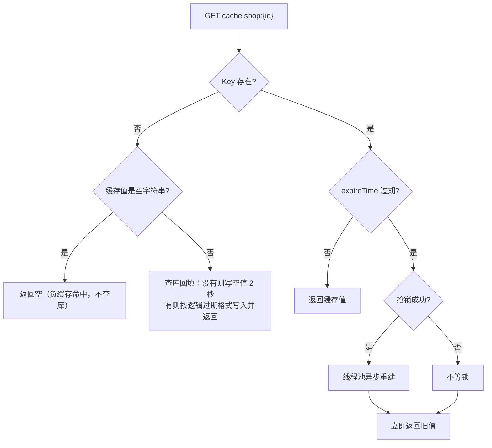

1. 请求进来，`GET cache:shop:1`；

2. Key **不存在** → 查一次数据库：查不到就写空值（`""`，TTL 2 秒）并返回“店铺不存在”（防穿透）；查到就按逻辑过期格式写入缓存并返回；如果 Key 存在但值是空字符串，说明命中的是负缓存，直接返回 null、不查库；

3. Key 存在 → 反序列化出 `RedisData`，里面有两部分：`data`（店铺数据）和 `expireTime`（逻辑过期时间）；

4. `expireTime` 还没到 → 直接返回缓存值，结束；

5. `expireTime` 已到 → 尝试抢锁 `lock:shop:1`：
   
   - 抢到锁：提交线程池异步查 MySQL、重建缓存；
   
   - 没抢到锁：不等、不重试；

6. 无论有没有抢到锁，**当前请求立即返回旧值**。

和「物理过期 + 互斥锁」的区别：物理过期一旦 Key 被删，晚到的请求没有旧值可返回，只能等锁或回源；逻辑过期永远有旧值兜底，过期瞬间的响应时间稳定。

### 3. 这里的互斥锁是什么锁

不是 Redisson，是手写的 SETNX 锁（`CacheClient.java:191-203`）：

```java
private boolean tryLock(String key) {
    Boolean flag = stringRedisTemplate.opsForValue()
            .setIfAbsent(key, "1", LOCK_SHOP_TTL, TimeUnit.SECONDS);
            // 等价命令：SET lock:shop:1 1 NX EX 10
            // NX：Key 不存在才能设置成功（成功 = 抢到锁）；EX 10：10 秒后自动过期
    return BooleanUtil.isTrue(flag);   // true = 抢到；false / null = 没抢到
}

private void unLock(String key) {
    stringRedisTemplate.delete(key);   // 等价命令：DEL lock:shop:1
}
```

SET   lock:shop:1   1   NX   EX 10
 │        │        │    │     │
 │        │        │    │     └─ EX 10 = 10 秒后自动过期
 │        │        │    └─────── NX = 只有当 key「不存在」时才设置成功
 │        │        └──────────── value = 1（随便写个占位值）
 │        └───────────────────── key = 锁的名字（lock:shop: + 店铺 ID）
 └────────────────────────────── Redis 命令：设置一个 key-value


- 用在哪：只用于「过期后谁来重建缓存」，`LOCK_SHOP_TTL = 10` 秒；
- 为什么不用 Redisson：抢不到锁就直接返回旧值，不等待、不重试，任务很短（查一次库 + 写缓存），不需要看门狗续期和可重入；
- 项目里 Redisson 用在另一处：消费端订单防重锁 `lock:order:{userId}`（问题二 4.4）。

### 4. 缓存空值完整执行步骤（`CacheClient#queryWithPassThrough`）

1. `GET cache:shop:{id}`；

2. 命中正常值 → 返回；

3. 命中空字符串 `""` → 返回 null（避免再次查库）；

4. 都没命中 → 查数据库：
   
   - 数据库有 → 写入缓存，正常 TTL；
   
   - 数据库没有 → 写入空值 `""`，TTL 2 秒（`CACHE_NULL_TTL`）；

5. 下次请求同一个不存在的 ID，第 3 步直接命中空值，不再访问数据库。

**当前状态说明**：空值缓存现在有三个落点（前两个已生效）：

- **店铺详情（链路二）**：已接在 `CacheClient#queryWithLogicalExpire` 的“Key 不存在”分支里——查库为空 → 写 `""`（`CACHE_NULL_TTL = 2 秒`）→ 下次同 ID 命中空值直接返回，不再打库；
- **秒杀券详情（链路三）**：`VoucherServiceImpl#querySeckillVoucherDetail` 查库为空时写 `""`（2 秒），读命中空值直接返回“优惠券不存在”；
- **通用方法未接主链路**：`CacheClient#queryWithPassThrough`（`CacheClient.java`）仍然没有生效中的调用，它的逻辑与上面两处相同（第 4 节讲的四步就是它）。

### 5. 核心代码

**5.1 逻辑过期**（`CacheClient.java:120-178`）

```java
public <R, ID> R queryWithLogicalExpire(String keyPrefix, ID id, Class<R> type,
                                        Function<ID, R> dbFallback, Long time, TimeUnit unit) {
    String key = keyPrefix + id;                          // 例：cache:shop:1
    String json = stringRedisTemplate.opsForValue().get(key);   // 读 Redis
    // 命中空值缓存：数据库确认过这个 ID 不存在，直接返回（防穿透）
    if (json != null && json.isEmpty()) {
        return null;
    }
    // Key 完全不存在：缓存未预热（或负缓存已过期），查一次库并回填
    if (json == null) {
        R dbResult = dbFallback.apply(id);
        if (dbResult == null) {
            this.set(key, "", CACHE_NULL_TTL, TimeUnit.SECONDS);   // 负缓存，TTL 2 秒
            return null;
        }
        this.setWithLogicalExpire(key, dbResult, time, unit);      // 查到：写入并返回
        return dbResult;
    }
    // 命中，反序列化：JSON 里是 { data: 店铺数据, expireTime: 逻辑过期时间 }
    RedisData redisData = JSONUtil.toBean(json, RedisData.class);
    JSONObject jsonObject = (JSONObject) redisData.getData();
    R r = BeanUtil.toBean(jsonObject, type);              // 还原成 Shop 对象
    LocalDateTime expireTime = redisData.getExpireTime();
    if (expireTime.isAfter(LocalDateTime.now())) {
        return r;                        // 未过期：直接返回
    }
    // 已过期：抢锁，只让一个线程去重建
    String lockKey = LOCK_SHOP_KEY + id;                  // lock:shop:1
    boolean flag = tryLock(lockKey);
    if (flag) {                                           // 抢到锁
        CACHE_REBUILD_EXECUTOR.submit(() -> {             // 丢给线程池，当前线程不等待
            try {
                R newR = dbFallback.apply(id);            // 回调查数据库（this::getById）
                this.setWithLogicalExpire(key, newR, time, unit);   // 重建缓存
            } catch (Exception e) {
                throw new RuntimeException(e);
            } finally {
                unLock(lockKey);                          // 重建完释放锁
            }
        });
    }
    return r;                            // 抢没抢到锁都先返回旧值
}
```

**5.2 写入逻辑过期数据**（`CacheClient.java:58-68`）

```java
public void setWithLogicalExpire(String key, Object value, Long time, TimeUnit unit) {
    RedisData redisData = new RedisData();                 // 包装对象：data + expireTime
    redisData.setData(value);                              // 真正的店铺数据
    redisData.setExpireTime(LocalDateTime.now().plusSeconds(unit.toSeconds(time)));
    // 逻辑过期时间 = 当前时间 + 业务时长（如 30 分钟）
    // 逻辑过期判断仍靠 value 里的 expireTime；这里再给 Key 一个物理 TTL 兜底，
    // 防止长期无人访问的 Key 永不过期、无界占用内存（物理过期后走"未命中回填"路径）
    stringRedisTemplate.opsForValue().set(key, JSONUtil.toJsonStr(redisData),
            LOGICAL_EXPIRE_FALLBACK_TTL, TimeUnit.HOURS);   // 24 小时兜底
}
```

**5.3 空值缓存**（`CacheClient.java:97-107`）

```java
if ("".equals(json)) {
    return null;                                        // 命中的是空值缓存：直接返回，不查库
}
R r = dbFallback.apply(id);                             // 缓存未命中，查数据库
if (r == null) {
    this.set(key, "", CACHE_NULL_TTL, TimeUnit.SECONDS);
    // 数据库也没有 → 写一个空字符串，TTL 2 秒；下次同样的 ID 在 2 秒内不再查库
    return null;
}
```

**5.4 启用位置**（`ShopServiceImpl.java:47-60`）

```java
@Override
public Result queryById(Long id) {
    Shop shop = cacheClient.queryWithLogicalExpire(
            CACHE_SHOP_KEY,        // Key 前缀：cache:shop:
            id,
            Shop.class,
            this::getById,         // 回源回调：缓存未命中时用它查数据库（组件不直接依赖 Mapper）
            CACHE_SHOP_TTL,        // 逻辑过期时长：30 分钟
            TimeUnit.MINUTES);
    if (shop == null) {
        return Result.fail("店铺不存在");
    }
    return Result.ok(shop);
}
```

### 6. 为什么逻辑过期而不是互斥锁方案

| 方案              | 决定性因素                    | 判定        |
| --------------- | ------------------------ | --------- |
| 物理 TTL 裸回源      | 过期瞬间并发全打 MySQL           | 淘汰        |
| 物理 TTL + 互斥锁    | 未抢到锁的请求要等待或重试，响应时间抖动     | 一致性敏感场景可用 |
| **逻辑过期 + 互斥重建** | 过期后先返回旧值，单线程后台重建，热点请求不等待 | 店铺详情采用    |

**如果条件变了**：余额、库存等强一致数据不能用逻辑过期（允许旧值）；需要读最新值的场景用物理 TTL + 互斥锁。

### 7. 边界（面试追问）

| 追问               | 回答                                                                                                              |
| ---------------- | --------------------------------------------------------------------------------------------------------------- |
| 击穿 / 穿透 / 雪崩的区别？ | 击穿是单个热点 Key 失效；穿透是查不存在的数据；雪崩是大量 Key 同时失效                                                                        |
| 逻辑过期还需要预热吗？      | 不需要：Key 不存在会自动查库回填（查不到写空值负缓存）。但测试逻辑过期时要改 Value 里的 `expireTime`，不能删 Key——删 Key 走的是“未命中回填”，测不到“过期返回旧值 + 异步重建”这条路径 |
| 空值和逻辑过期在同一路径生效吗？ | 是，店铺详情上两者已组合：Key 不存在 / 值为空 → 空值负缓存防穿透；Key 存在且 `expireTime` 过期 → 逻辑过期防击穿。秒杀券详情（链路三）也接了空值负缓存                      |
| 缓存更新怎么保证一致？      | `ShopServiceImpl#update` 先更新数据库、再删除缓存（`ShopServiceImpl.java:199-201`）；删除失败的窗口由 TTL 收敛                           |

**内存兜底：逻辑过期 Key“永不过期”会不会撑爆内存？**

不会因“请求多”而增长——每个 `cache:shop:{id}` 只对应一个 Key，重建就是覆盖，Key 数量上限 = 被访问过的店铺数（不是访问次数）。但“Key 无 TTL + Redis 无 maxmemory + noeviction”三者叠加确实危险，用四层兜底：

| 手段                 | 做法                                                                                                                                         | 代价                               |
| ------------------ | ------------------------------------------------------------------------------------------------------------------------------------------ | -------------------------------- |
| **物理 TTL 兜底（已实现）** | `setWithLogicalExpire` 写入时额外 `EXPIRE 24 小时`（`LOGICAL_EXPIRE_FALLBACK_TTL`）：24 小时内靠 `expireTime` 逻辑过期；超过 24 小时无人访问由 Redis 物理删除，下次请求走“未命中回填” | 物理过期瞬间没有旧值可返回（有回填 + 负缓存，不会打挂数据库） |
| LRU/LFU 淘汰（生产建议）   | `maxmemory 1gb` + `maxmemory-policy allkeys-lru`（或 `allkeys-lfu`）                                                                          | 冷 Key 被淘汰后同样走未命中回填               |
| 主动清理               | 店铺下架/删除时同步删 `cache:shop:{id}`（当前 `ShopServiceImpl#update` 会删，删除店铺没有实现）                                                                     | 每个写操作都要记得清缓存                     |
| 监控告警               | `used_memory`、`DBSIZE`、大 Key（`redis-cli --bigkeys`）阈值告警                                                                                    | 只发现，不解决                          |

本机 Redis 现状（提醒）：`maxmemory = 0`、`maxmemory-policy = noeviction`——本地演示没问题，生产必须配淘汰策略。

---

## 四、订单状态并发控制

> **简历原文**：使用 RocketMQ 延迟消息实现超时关单，基于乐观锁思想控制订单状态流转，解决支付回调与超时关单之间的并发竞争，并在关单后回补库存，保证订单与库存状态一致性。

### 面试话术（四段式：背景 → 剖析 → 构思 → 复盘，可直接背）

**① 背景阐述**：用户抢到券之后会生成订单，订单有完整的状态流转：1 是待支付，2 是已支付，4 是已取消。业务上要求：用户超时没支付，订单要自动关闭，并且把之前扣掉的库存补回去。

**② 问题剖析**：这个场景里有两个容易被忽略的并发问题：

- 第一个是"支付回调"和"超时关单"可能同时发生。比如用户恰好在关单程序执行的那一瞬间完成支付，如果两边都是先查状态再改状态，就可能两个线程都查到"待支付"，然后一个改成已支付、一个改成已取消——订单状态就错了，库存也可能被重复回补；
- 第二个是关单动作本身必须只生效一次。关单要回补库存，如果重复执行库存就会多出来；而且关单的触发源不止一个（延迟消息、用户主动取消、对账补偿），天然会重复触达；
- 再想一步，超时关单怎么触发？如果用定时任务每分钟扫全表"查超时未支付订单"，数据量大时性能差，关单精度最高也就一分钟。更好的是事件驱动——下单时就知道什么时候该关它。

**③ 方案构思**：我的解法分三块：

- 第一块，状态流转全部用"条件更新"的乐观锁思路仲裁并发。这里我对比过两种方案：悲观思路的"一锁二判三更新"是先拿分布式锁锁住订单、再判断状态、再更新；乐观思路是让两条 UPDATE 各自带上 `and status = 1` 条件——支付回调执行 `update ... set status = 2 where id = ? and status = 1`，超时关单执行 `set status = 4 where id = ? and status = 1`，只有"待支付"能被改成目标状态，谁先成功谁生效，后到的影响行数为 0、直接放弃。我选乐观锁有两个原因：一是支付和关单撞车本来是小概率事件，乐观锁正适合冲突少的场景；二是关单是批量任务，一次可能处理大量超时订单，逐单抢分布式锁的性能开销太大。严格说我们没加 version 字段，靠订单状态本身当条件，本质是 CAS 思想；
- 竞争的结果只有两种：支付赢 → 关单影响 0 行、放弃且**不回补库存**，业务正常；关单赢 → 支付回调影响 0 行、状态保持已取消，但用户可能已经付了钱，业务上要触发**原路退款**（本项目暂未实现，属于生产要补的流程）；
- 第二块，超时触发用 RocketMQ 延迟消息：订单落库成功后，消费端再发一条延迟消息到关单主题，时间到自动触发关单接口。事件驱动不用扫表，精度由消息中间件保证；
- 第三块，关单成功后的库存回补：MySQL 侧执行 `stock = stock + 1`；Redis 侧走和前两个问题共用的回滚 Lua——脚本先用 SISMEMBER 判断用户是否还在抢购名单里，在才执行 SREM、库存 +1、删流水，不在就只删流水。这样无论关单被触发多少次，库存只会回补一次。

**④ 复盘总结**：这个优化点的关键词是"状态机 + 条件更新"。支付和关单的并发竞争不需要锁，让数据库的条件更新来当裁判；超时关单用延迟消息替代扫表，更实时也更省资源；库存回补和资格释放全部做成幂等的。这三件事合起来，订单状态和库存状态就始终是一致的。

### 先看：订单状态字典与 status 从哪来

**状态字典（来源：实体注释 + 建表注释）：**

| status | 含义       | 谁把它改成这个值                 | 代码里是否实现 |
| ------ | -------- | ------------------------ | ------- |
| **1**  | 未支付（待支付） | 数据库默认值（插入订单时自动为 1）       | 是       |
| **2**  | 已支付      | `payCallback` 条件更新       | 是       |
| **3**  | 已核销      | ——                       | 否，预留    |
| **4**  | 已取消      | `closeTimeoutOrder` 条件更新 | 是       |
| **5**  | 退款中      | ——                       | 否，预留    |
| **6**  | 已退款      | ——                       | 否，预留    |

**status = 1 从哪来？** Java 插入订单时并没有 `setStatus`，靠的是数据库默认值（`hmdp.sql`）：

```sql
`status` tinyint(1) UNSIGNED NOT NULL DEFAULT 1,
`create_time` timestamp NOT NULL DEFAULT CURRENT_TIMESTAMP,
`update_time` timestamp NOT NULL DEFAULT CURRENT_TIMESTAMP ON UPDATE CURRENT_TIMESTAMP,
```

MyBatis-Plus 默认插入策略是 NOT_NULL：实体里为 null 的字段不会放进 INSERT → MySQL 用 `DEFAULT 1` 兜底。
`create_time` / `update_time` 同理由数据库维护；`pay_time` 则由 `payCallback` 显式写入。

**谁在读 status：**

| 位置                  | 读法                  | 作用                      |
| ------------------- | ------------------- | ----------------------- |
| `payCallback`       | `WHERE status = 1`  | 只有待支付能改成已支付             |
| `closeTimeoutOrder` | `WHERE status = 1`  | 只有待支付能改成已取消             |
| 对账数量校验              | `WHERE status != 4` | 只统计未取消订单，与 Redis 名单人数对比 |
| 对账修复分支              | `status == 4`       | 已取消订单触发 Redis 幂等释放      |

**代码里真实存在的迁移只有两条：**

```text
status = 1（待支付，数据库默认）
   ├── payCallback：1 → 2（已支付）
   └── closeTimeoutOrder：1 → 4（已取消）
```

两个迁移都带 `WHERE status = 1`，谁先影响 1 行谁赢——这就是下面要讲的“状态条件更新”。

### 1. 这条在说什么

订单落库后状态是 1（待支付），有两个出口：

- 支付回调：1 → 2（已支付）；
- 延迟关单：1 → 4（已取消）。

两个操作可能同时到达同一笔订单。如果都先查状态再无条件更新，就可能都读到「待支付」，后执行的覆盖先执行的（已支付订单被关闭、或已关闭订单又被支付）。解法：把旧状态写进 UPDATE 的 WHERE 条件（`WHERE status = 1`），让数据库原子地决定谁赢，输的一方影响 0 行、直接结束。

**这条优化的意义**

- **库存不丢**：未支付订单超时自动关单，并归还占用的库存（Redis +1、MySQL +1），库存形成闭环，不会被僵尸订单永久占用；
- **状态不错**：支付回调与关单并发时，只有一方能把 `status=1` 改走，避免「已支付订单被关闭」或「已关闭订单又被支付」；
- **没有它会怎样**：
  - 没有超时关单：用户抢到不付款，库存被永久占住，后来的人抢不到；
  - 没有状态条件更新（先查再改）：两个操作都读到「待支付」，后写覆盖先写，状态和库存对不上（已关单却又被支付、库存重复回补）；
- **本质**：订单是一个状态机，并发的关键是「用旧状态做条件、让影响行数裁决」，属于 CAS / 乐观并发思想。

### 2. 超时关单完整执行步骤（示例：订单 1758000000000000001）

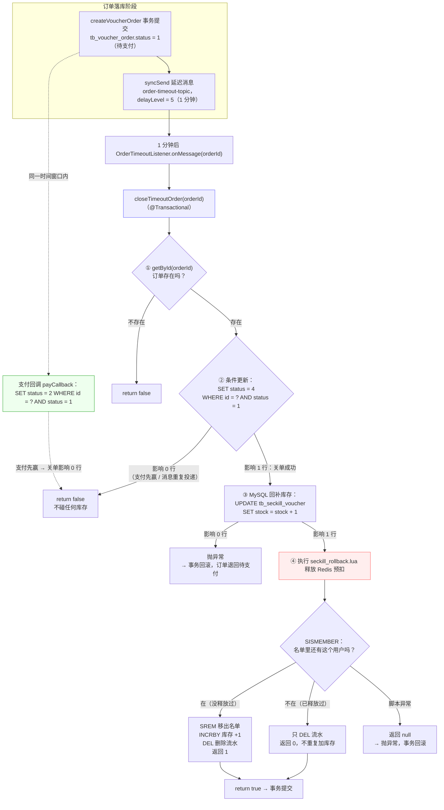

1. 订单在 `createVoucherOrder` 落库成功（status = 1）；

2. `SeckillOrderListener` 紧接着发一条**延迟消息**到 `order-timeout-topic`，`delayLevel = 5`（RocketMQ 4.9.4 的 level 5 = 1 分钟）；

3. 1 分钟后消息到期，`OrderTimeoutListener` 收到订单 ID；

4. 调 `closeTimeoutOrder`：条件更新 `WHERE id = ? AND status = 1` 改成 4；

5. 影响 0 行 → 说明支付回调已经先赢了（status 已变 2），直接返回 false，**不碰库存**；

6. 影响 1 行 → 继续：
   
   - MySQL 秒杀券库存 `stock = stock + 1`；
   
   - 执行 `seckill_rollback.lua` 释放 Redis 预扣；

7. 返回值：`true` = 本次真的关单成功，`false` = 状态已被别人改走。

**2.1 延迟消息为什么“1 分钟后”能自动执行**

“等 1 分钟”的是 Broker，不是生产者或消费者在 sleep：

```text
① 生产者：syncSend(topic, msg, 3000, 5)
   消息体上带属性 delayTimeLevel = 5，立即发到 Broker，方法立刻返回

② Broker：发现有延迟属性，先不投递
   存进内部主题 SCHEDULE_TOPIC_XXXX 对应等级的队列（level 5 → 队列 4）
   记录真实目的地 REAL_TOPIC = order-timeout-topic

③ Broker 的定时任务不断扫描延迟队列：
   到点（存储时间 + 1 分钟 <= 当前时间）→ 取出消息，恢复真实 topic
   → 重新写回 order-timeout-topic

④ 消费者正常长轮询 order-timeout-topic，消息一出现就拉到
   → OrderTimeoutListener.onMessage → closeTimeoutOrder
```

三个要点：

- 延迟期间消息**持久化在 Broker 磁盘**，重启不丢，到点照投；
- 是“至少延迟 1 分钟”：实际投递时间取决于 Broker 定时任务的扫描粒度，所以是“约 1 分钟”；
- RocketMQ 4.x 只有固定 18 档：`1s / 5s / 10s / 30s / 1m / 2m / 3m / 4m / 5m / 6m / 7m / 8m / 9m / 10m / 20m / 30m / 1h / 2h`；要任意时间要靠 5.x 定时消息（`syncSendDelayTimeSeconds`）或自建延迟方案。

### 3. 支付/关单竞争与库存只释放一次

**竞争演示**：同一订单上 50 个支付请求 + 50 个关单请求交错：

```text
支付回调：UPDATE tb_voucher_order SET status = 2 WHERE id = ? AND status = 1
延迟关单：UPDATE tb_voucher_order SET status = 4 WHERE id = ? AND status = 1
```

两个 SQL 都要求「当前还是待支付」，行锁下只有一个能成功，另一个影响 0 行。

**为什么用乐观锁，而不是「一锁二判三更新」？**

| 方案 | 做法 | 优点 | 代价 |
| --- | --- | --- | --- |
| **乐观锁（选）：状态条件更新** | 两条 UPDATE 都带 `AND status = 1`，用影响行数判断输赢 | 不加锁、天然幂等、适合小概率冲突 | 输的一方要自己处理"失败分支"（放弃 / 退款） |
| 悲观锁：「一锁二判三更新」 | 先分布式锁锁住订单 → 判状态 → 更新 → 解锁 | 逻辑直观，失败方拿不到锁 | 每单都要抢锁释放；关单是批量任务，逐单加锁性能差；还要处理锁超时 |
| version 版本号乐观锁 | 表加 version 字段，`UPDATE ... WHERE version = 旧值` | 通用做法 | 要改表结构；这里的"状态"本身就是天然版本号，不需要额外字段 |

**竞争的结果只有两种，分别怎么处理：**

```text
结果一：支付赢（1 → 2 成功），关单影响 0 行
  → 关单放弃、不回补库存（状态已不是 1，走不到库存回补那步）——业务正常，无需额外处理

结果二：关单赢（1 → 4 成功），支付回调影响 0 行
  → 状态保持已取消，不强行改回已支付（库存和资格都已经还回去了）
  → 但用户可能真的付了钱 → 业务上必须触发「原路退款」（本项目未实现，属于生产要补的流程）
```

**关键理解**：乐观锁解决的是「状态只能被改一次」，它不能替业务决定「钱怎么办」——支付赢了什么都不用做；关单赢了要走退款。这个分工想清楚，面试就不会被问倒。

**库存为什么不重复释放**（两道保险）：

1. MySQL 层面：只有状态 1→4 更新成功才去回补库存，失败的调用到不了库存那一步；
2. Redis 层面：`seckill_rollback.lua` 先 `SISMEMBER` 判断资格还在不在，重复执行第二次直接返回 0。

```lua
-- seckill_rollback.lua
-- KEYS[1]=库存  KEYS[2]=名单  KEYS[3]=流水  ARGV[1]=用户 ID
if redis.call('sismember', KEYS[2], ARGV[1]) == 1 then   -- 名单里还有这个用户 → 没释放过
    redis.call('srem', KEYS[2], ARGV[1])     -- 移出名单（资格还回去）
    redis.call('incrby', KEYS[1], 1)         -- 库存 +1
    redis.call('del', KEYS[3])               -- 删流水
    return 1                                 -- 1 = 本次真正释放
end
redis.call('del', KEYS[3])                   -- 已释放过：只清流水
return 0                                     -- 0 = 不重复加库存
```

返回值：**1 = 本次真正释放；0 = 已被释放过，什么都没加**。

### 4. 核心代码

**4.1 落库成功后发延迟消息**（`SeckillOrderListener.java` 全文）

```java
/** RocketMQ 秒杀订单消费者：事务落库成功后发送延迟关单消息。 */
@Component
@Slf4j
@ConditionalOnProperty(prefix = "seckill.consumer", name = "enabled", havingValue = "true", matchIfMissing = true)
// 消费开关：seckill.consumer.enabled=false 时不注册消费者（压测“积压恢复”时用过）
@RocketMQMessageListener(
        topic = "${seckill.rocketmq.order-topic:seckill-order-topic}",                      // 监听下单 topic
        consumerGroup = "${seckill.rocketmq.order-consumer-group:seckill-order-consumer}",  // 消费组
        consumeMode = ConsumeMode.CONCURRENTLY,    // 并发消费
        messageModel = MessageModel.CLUSTERING     // 集群模式：同组内一条消息只被一个实例消费
)
public class SeckillOrderListener implements RocketMQListener<String> {   // 实现接口 = 注册回调
    @Resource
    private IVoucherOrderService voucherOrderService;
    @Resource
    private RocketMQTemplate rocketMQTemplate;
    @Value("${seckill.rocketmq.timeout-topic:order-timeout-topic}")
    private String timeoutTopic;            // 关单 topic
    @Value("${seckill.rocketmq.timeout-delay-level:5}")
    private int timeoutDelayLevel;          // 延迟等级：5 = 1 分钟
    @Override
    public void onMessage(String message) {                      // MQ 收到消息后回调这里
        VoucherOrder order = JSONUtil.toBean(message, VoucherOrder.class);   // JSON → 订单对象
        voucherOrderService.createVoucherOrder(order);           // ① 先落库；失败就抛异常，不会发延迟消息
        rocketMQTemplate.syncSend(                               // ② 落库成功才发延迟消息
                timeoutTopic,
                MessageBuilder.withPayload(String.valueOf(order.getId())).build(),   // 消息体 = 订单 ID
                3000,                                            // 发送超时 3 秒
                timeoutDelayLevel);                              // 第 4 个参数 = 延迟等级
        log.info("RocketMQ 秒杀订单处理完成 orderId={}, voucherId={}", order.getId(), order.getVoucherId());
    }
}
```

**4.2 延迟消息消费**（`OrderTimeoutListener.java` 全文）

```java
/** RocketMQ 延迟消息消费者：未支付订单条件关单并释放一次库存。 */
@Component
@Slf4j
@ConditionalOnProperty(prefix = "seckill.consumer", name = "enabled", havingValue = "true", matchIfMissing = true)
// 消费开关：seckill.consumer.enabled=false 时不注册消费者（压测“积压恢复”时用过）
@RocketMQMessageListener(
        topic = "${seckill.rocketmq.timeout-topic:order-timeout-topic}",                      // 监听关单 topic
        consumerGroup = "${seckill.rocketmq.timeout-consumer-group:order-timeout-consumer}",  // 消费组
        consumeMode = ConsumeMode.CONCURRENTLY,    // 并发消费
        messageModel = MessageModel.CLUSTERING     // 集群模式：同组内一条消息只被一个实例消费
)
public class OrderTimeoutListener implements RocketMQListener<String> {   // 实现接口 = 注册回调

    @Resource
    private IVoucherOrderService voucherOrderService;

    @Override
    public void onMessage(String orderId) {               // 延迟消息到期后回调，消息体就是订单 ID
        boolean closed = voucherOrderService.closeTimeoutOrder(Long.valueOf(orderId));
        log.info("RocketMQ 延迟关单 orderId={}, closed={}", orderId, closed);
        // closed = true：本次真的关单并释放；false：支付已抢先或消息重复，什么都没做
        // 抛异常 → 框架回失败 → Broker 稍后重投（closeTimeoutOrder 幂等，不会重复释放）
    }
}
```

**4.3 支付回调：条件更新**（`VoucherOrderServiceImpl.java:195-201`）

```java
@Override
@Transactional(rollbackFor = Exception.class)
public boolean payCallback(Long orderId) {
    return update(new LambdaUpdateWrapper<VoucherOrder>()        // 操作的表：tb_voucher_order
            .eq(VoucherOrder::getId, orderId)                    // WHERE id = ?
            .eq(VoucherOrder::getStatus, 1)                      // AND status = 1：旧状态必须是待支付
            .set(VoucherOrder::getStatus, 2)                     // SET status = 2（已支付）
            .set(VoucherOrder::getPayTime, LocalDateTime.now()));// SET pay_time = 当前时间
    // 等价 SQL：UPDATE tb_voucher_order SET status = 2, pay_time = ? WHERE id = ? AND status = 1
    // 返回 true = 迁移成功；false = 状态已被关单改走
}
```

**4.3 补充：支付回调是被谁调用的**

这个接口在项目里**没有任何代码调用它**——它是留给人**手动模拟**的（项目没有接真实支付网关）。

本项目的手动调用方式：

```bash
curl -X POST http://127.0.0.1:8081/voucher-order/pay/callback/1758000000000000001
```

完整链路：

```text
手动请求
→ com.hmdp.controller.VoucherOrderController#payCallback      VoucherOrderController.java:34
→ com.hmdp.service.impl.VoucherOrderServiceImpl#payCallback   VoucherOrderServiceImpl.java:195
→ UPDATE tb_voucher_order SET status = 2, pay_time = ? WHERE id = ? AND status = 1
→ 影响 1 行 → Result.ok()；影响 0 行 → “支付回调处理失败或订单状态已变更”
```

注意：`com.hmdp.config.MvcConfig` 的登录拦截器（`MvcConfig.java:30-37`）只放行了 `/user/**`、`/blog/hot`、`/shop/**`、`/shop-type/**`、`/upload/**`、`/voucher/**`，**没有放行 `/voucher-order/**`**——所以手动调这个回调还得带登录 token。真实支付平台不会带用户 token，这是应该修的边界（把 `/voucher-order/pay/callback/**` 从登录拦截里排除，改走验签）。

真实项目里的调用方式：

```text
用户付款成功
→ 微信/支付宝服务器异步 POST 到你配置的 notify_url（带签名、商户订单号、平台交易号、金额）
→ 你的回调接口：验签 → 核对订单号与金额 → 把订单改成已支付（即 payCallback 的逻辑）
→ 返回约定应答（如 SUCCESS），平台才认为通知完成
→ 没有正确应答，平台按策略重试（微信约 15s/15s/30s… 多次）
```

前端的“支付完成跳回订单页”只是页面行为，不算回调；回调必须是支付平台服务器发来的。

本项目缺的部分（面试主动说）：接支付网关、回调验签、金额校验、回调幂等记录、失败重试应答、已支付但订单被关闭时的退款。

**4.4 超时关单：先赢状态，再补库存和释放**（`VoucherOrderServiceImpl.java:205-241`）

```java
@Override
@Transactional(rollbackFor = Exception.class)
public boolean closeTimeoutOrder(Long orderId) {
    VoucherOrder order = getById(orderId);           // 等价 SQL：SELECT * FROM tb_voucher_order WHERE id = ?（后面要用 voucherId / userId）
    if (order == null) {
        return false;                                // 订单不存在，没什么可关
    }
    boolean closed = update(new LambdaUpdateWrapper<VoucherOrder>()
            .eq(VoucherOrder::getId, orderId)        // WHERE id = ?
            .eq(VoucherOrder::getStatus, 1)          // AND status = 1：只有待支付能关
            .set(VoucherOrder::getStatus, 4));       // SET status = 4（已取消）
    // 等价 SQL：UPDATE tb_voucher_order SET status = 4 WHERE id = ? AND status = 1
    if (!closed) {
        return false;                            // 影响 0 行：支付已抢先，直接结束，不碰库存
    }

    boolean restored = seckillVoucherService.update(
            new LambdaUpdateWrapper<SeckillVoucher>()
                    .eq(SeckillVoucher::getVoucherId, order.getVoucherId())   // WHERE voucher_id = ?
                    .setSql("stock = stock + 1")     // SET stock = stock + 1（MySQL 回补）
    );
    // 等价 SQL：UPDATE tb_seckill_voucher SET stock = stock + 1 WHERE voucher_id = ?
    if (!restored) {
        throw new IllegalStateException("订单已关闭但库存释放失败");   // 回滚整个事务
    }

    // 数据库关单成功后同步释放 Redis 预扣资格；脚本保证重复关单不会重复回补库存。
    // KEYS = 库存 / 名单 / 流水，ARGV = 用户 ID
    Long released = stringRedisTemplate.execute(
            ROLLBACK_SCRIPT,
            Arrays.asList(
                    RedisConstants.SECKILL_STOCK_KEY + order.getVoucherId(),
                    RedisConstants.SECKILL_ORDER_KEY + order.getVoucherId(),
                    reservationKey(order.getVoucherId(), order.getUserId())
            ),
            order.getUserId().toString()
    );
    if (released == null) {
        throw new IllegalStateException("订单已关闭但 Redis 预扣释放失败");
    }
    return true;                                     // true = 本次真的关单 + 释放
}
```

### 5. 为什么延迟消息用 RocketMQ（选型对比）

| 方案                | 决定性因素                    | 判定                   |
| ----------------- | ------------------------ | -------------------- |
| `@Scheduled` 扫表   | 周期扫全表，时效受 Cron 限制，多实例要防重 | 淘汰                   |
| Redis ZSet 延迟队列   | 轮询、抢占、重试、恢复全部自研          | 淘汰                   |
| 时间轮               | 多实例协调、重启恢复复杂             | 淘汰                   |
| **RocketMQ 延迟消息** | 与订单消息共用 Broker，重试/死信现成   | 采用（4.x 是固定延迟等级，精度有限） |

### 6. 边界（面试追问）

| 追问                 | 回答                                                         |
| ------------------ | ---------------------------------------------------------- |
| 这算乐观锁吗？            | 是 CAS 式乐观并发控制思想；没有 version 字段，准确说法是「状态条件更新」                |
| 为什么要看 update 影响行数？ | 0 行说明状态已被其他线程改走，继续回补库存会重复释放                                |
| 延迟消息重复投递呢？         | 状态更新和释放脚本都幂等，第二次影响 0 行 / 返回 0                              |
| 支付成功但订单已被关闭？       | 当前不会把已取消订单改成已支付（库存已释放），生产要接退款流程                            |
| 延迟等级为什么是 5？        | RocketMQ 4.9.4 固定等级，level 5 = 1 分钟；任意精确时间需要升级 5.x 或专门的延迟服务 |

---

## 五、故障补偿与最终一致性

> **简历原文**：基于 XXL-JOB 定时扫描 Redis 预扣元数据与 MySQL 订单状态，对未落库订单使用原订单 ID 重投 RocketMQ，对已取消订单幂等释放 Redis 预扣，并对异常任务进行失败重试。

### 面试话术（四段式：背景 → 剖析 → 构思 → 复盘，可直接背）

**① 背景阐述**：前面问题一、二、四解决的是"正常流程"：Lua 预扣、消息异步落库、超时关单。但线上一定会出"异常"，比如：

- Redis 预扣成功了，消息还没发出去，程序就重启了——Redis 扣了，MQ 里却没消息；
- 消息其实发到了 MQ，但程序等确认超时、误以为失败，把预扣回滚了（假失败："没收到确认"不等于"没发到"）；
- 消费者挂了或一直报错，消息堆在 MQ 里没人处理；
- 人工误操作改了 Redis / 数据库的数据。

这些异常发生时，请求线程早就结束了，实时链路上没人能立刻处理。

**② 问题剖析**：为什么"实时补偿"救不了？先看它生效的前提——出事时"当事人"必须在场：

- 发送失败能 catch 补偿，前提是请求线程还活着；
- 消费失败能靠 MQ 重试，前提是消息已经进了 Broker、消费者能恢复；
- 数据被改能修复，前提是有人发现了不对。

而这四种异常恰恰都打破了前提：进程没了线程就没了；消息没进 Broker 就没有可重试的东西；消费者"不报错、只是没动静"，也不会触发任何告警。**所以问题的本质是两句话：出事了，既没有"在场的活人"能立即处理，也没有"事后的账本"知道这件事发生过。**

由此得出这个优化点的两个关键设计，后面所有实现都是为它们服务：

1. **预扣时的凭据**：在扣库存的那一刻就把这笔操作记下来，让每一次悬空的预扣都有据可查；
2. **独立的扫描者**：一个不依赖任何请求线程、定时运行的任务，拿着凭据去核对最终结果，对不上就修。

**③ 方案构思**：整个方案就是围绕"凭据 + 扫描者"来搭：

- **凭据**：改 Lua 预扣脚本，成功时顺手写一条预扣流水（reservation）——记录订单 ID、用户、券、预扣时间，7 天过期。它是后面所有补偿的唯一凭证；流水被删除，就意味着"这件事有定论了"；
- **扫描者**：选 XXL-JOB 做调度。选型上对比过四种：@Scheduled 单机简单，但多实例会重复执行、没有日志和重试；@Scheduled + Redisson 锁只解决"谁执行"，告警和失败重试还要自建；Quartz 是老牌调度框架，但调度表要建在业务库、每次触发抢 `QRTZ_LOCKS` 多表行锁，而且没有管理台、执行日志、失败重试——它是"调度库"不是"调度平台"；XXL-JOB 调度执行分离，自带页面、日志、失败重试和路由，运维成本最低，所以选它；
- **任务逻辑**（每分钟跑一次）：SCAN 扫描全部预扣流水（用 SCAN 不用 KEYS），拿每条流水的订单 ID 去 MySQL 对账，分三个修复分支——查不到订单：说明还没落库，用**原订单 ID** 重投 MQ（复用原 ID 才能命中消费端幂等；并且加了 30 秒等待窗口 + 60 秒重投间隔两道限频，避免每分钟重复发）；订单已取消：执行和关单共用的回滚 Lua，幂等释放；订单正常：补回一人一单名单 + 删流水结案。最后再做一次数量对账（Redis 名单人数 vs 未取消订单数），不一致只告警；
- **闭环**：任何补偿失败都汇总后抛异常，让 XXL-JOB 记失败并按配置重试——执行器不自己 sleep 重试，也不吞异常。

**④ 复盘总结**：这个优化点记住两句核心——**"预扣时留凭据，事后有独立的扫描者"**；技术上说到底是"消息 + 幂等 + 定时对账"三件套，用最终一致性替代分布式事务。三个原则：重投必须复用原订单 ID、所有补偿动作必须幂等、失败必须让调度中心看得见能重试。

**先记住最小清单**：跑通 XXL-JOB 只需要下面三组东西，细节在 2.1-2.5 逐节展开。

```text
本地代码（4 项）：
  1. Maven 依赖 xxl-job-core：提供 @XxlJob（com.xxl.job.core.handler.annotation.XxlJob）
     + XxlJobSpringExecutor（com.xxl.job.core.executor.impl.XxlJobSpringExecutor）
  2. yaml（application.yaml:41-52）：Admin 地址 + accessToken + appname + 执行器端口 + logpath
  3. com.hmdp.config.XxlJobConfig：@Bean(initMethod = "start") 的执行器 Bean
  4. @XxlJob("seckillReconcileJob") 方法（com.hmdp.listener.SeckillReconciliationTask#reconcile）：
     字符串就是与 Admin 的唯一约定

Admin 网页（2 项）：
  1. 执行器管理：建 AppName = neargo-executor 的分组（注册方式选「自动注册」，机器自动上线）
  2. 任务管理：JobHandler = seckillReconcileJob（= 注解字符串）、Cron、路由策略、
     阻塞策略、失败重试次数、超时时间

触发链（3 段）：
  1. Admin：调度线程每 5 秒扫 xxl_job_info + 抢 xxl_job_lock → 写 trigger 日志 → 选机器 POST /run
  2. 执行器：EmbedServer 收 /run → 按名字查 jobHandlerRepository → JobThread 执行 @XxlJob 方法
     （先回 accepted，受理 ≠ 执行完成）
  3. 执行器：执行完 pushTriggerCallback 回 POST /api/callback（handleCode=200/500 + 日志）
     → Admin 更新 xxl_job_log → 失败由失败监控按配置重试
```

**三个最容易踩的坑**：

1. **accessToken 两侧必须一致**（`application.yaml` vs Admin 的 `application.properties`），否则注册被拒；
2. **JobHandler 名与 `@XxlJob("...")` 字符串必须一字不差**，否则执行器报 `jobHandler not found`；
3. **`/run` 先回 `accepted`，真正结果走 callback**——"HTTP 返回成功"不等于"任务执行成功"。

**全局流程图（颜色 = 谁写的代码 / 谁在运行）**：①搭建 → ②调度 → ③执行器内部（绿色块是 `reconcile()` 的完整展开）→ 回调与重试；每一段在 2.1-2.5 逐节展开。

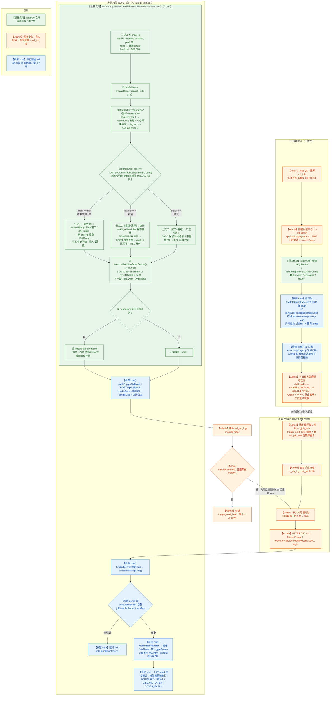

> 读法：绿色【项目代码】= NearGo 仓库里我们维护的；橙色【Admin】= 调度中心（官方服务 + 页面配置 + `xxl_job` 库）；蓝色【框架 core】= 执行器里 xxl-job-core 的自动逻辑。

### 1. 这条在说什么

实时链路（发送失败补偿 + 消费端幂等）覆盖不了这些情况：

- Redis 预扣成功后、消息发出前，应用进程挂了；
- Broker 已收到消息，但客户端超时认为失败（假失败）；
- 消息长期积压、消费者持续异常；
- 人工误操作导致数据不一致。

这些问题的共同点是：请求线程早就结束了，没人能立即处理。所以要有一条独立于实时链路的**对账任务**，靠 Redis 里保存的预扣流水（reservation）去发现「预扣了但订单没落库」的情况，并修复。

四种情况拆开看：

| 场景                      | 实时链路为什么覆盖不了                | 对账能做什么                                |
| ----------------------- | -------------------------- | ------------------------------------- |
| ① 预扣成功后进程挂了             | catch 是给活着的线程用的，进程没了没人执行补偿 | 完全修复：扫到流水、无订单、超过等待窗口 → 用原订单 ID 重投     |
| ② Broker 已收到但客户端超时（假失败） | 补偿执行了但方向错（消息其实在途），无法撤回     | 数量对账能发现并告警；自动修复有限（需消息轨迹等更强手段）         |
| ③ 消息积压 / 消费者持续异常        | 消费没发生，幂等和补偿都没有入口           | 重投保证预扣意图不丢；消费者恢复后落库；期间数量对账告警          |
| ④ 人工误操作                 | 人工操作不触发任何代码路径              | 视情况：已取消订单 → 释放；已落库缺名单 → 补回；纯数量差异 → 告警 |

**这条优化的意义**

- **系统自愈**：进程崩溃、消息丢失 / 积压、假失败、人工误操作这些「请求线程早就结束了」的缺口，由独立对账任务发现并修复；
- **让异步敢于存在**：正因为有每分钟一轮的对账兜底，「Redis 预扣 + MQ 异步落库」才敢允许失败、允许短暂不一致；
- **没有它会怎样**：预扣了但订单没落库的请求永远悬空——Redis 库存白扣、用户拿不到订单；已取消订单继续占用 Redis 资格；Redis 与 MySQL 的数量差没人发现，越积越多；
- **本质**：不做分布式事务，用「消息 + 幂等 + 定时对账」把不一致逐步收敛，属于最终一致性。

**② 里的“客户端超时”是多久？**

三处 `syncSend` 都显式传了 **3000 毫秒（3 秒）**：

```java
// 1) com.hmdp.service.impl.VoucherOrderServiceImpl#seckillVoucher（VoucherOrderServiceImpl.java:104）
rocketMQTemplate.syncSend(orderTopic, JSONUtil.toJsonStr(order), 3000);        // 下单消息
// 2) com.hmdp.listener.SeckillOrderListener#onMessage（SeckillOrderListener.java:45）
rocketMQTemplate.syncSend(timeoutTopic, message, 3000, timeoutDelayLevel);     // 延迟关单消息
// 3) com.hmdp.listener.SeckillReconciliationTask#repairReservations（SeckillReconciliationTask.java:130）
rocketMQTemplate.syncSend(orderTopic, JSONUtil.toJsonStr(retryOrder), 3000);   // 对账重投
// rocketMQTemplate = org.apache.rocketmq.spring.core.RocketMQTemplate；JSONUtil = cn.hutool.json.JSONUtil
```

`application.yaml` 里的 `rocketmq.producer.send-message-timeout: 3000` 是给不传 timeout 的重载用的默认值。

这个超时限制的是「生产者等 Broker 返回发送结果的最长时间」：3 秒内等不到结果就抛异常 → 进 catch 执行补偿。要注意两点：

- RocketMQ 同步发送默认 `retryTimesWhenSendFailed = 2`，一次调用内部可能实际发了多条，“抛异常”和“Broker 到底收到几条”并非一一对应；
- 调大超时能降低假失败概率，但会拖长接口线程阻塞时间；调小则误判更多。所以不跟超时较劲，最终仍靠消费端幂等 + 对账收敛。

对账任务本身由 XXL-JOB 调度：**「谁触发、怎么触发、失败怎么重试」在第 2 节完整展开；「触发之后扫描逻辑怎么修」在第 4 节。**

**第五问完整流程图：**

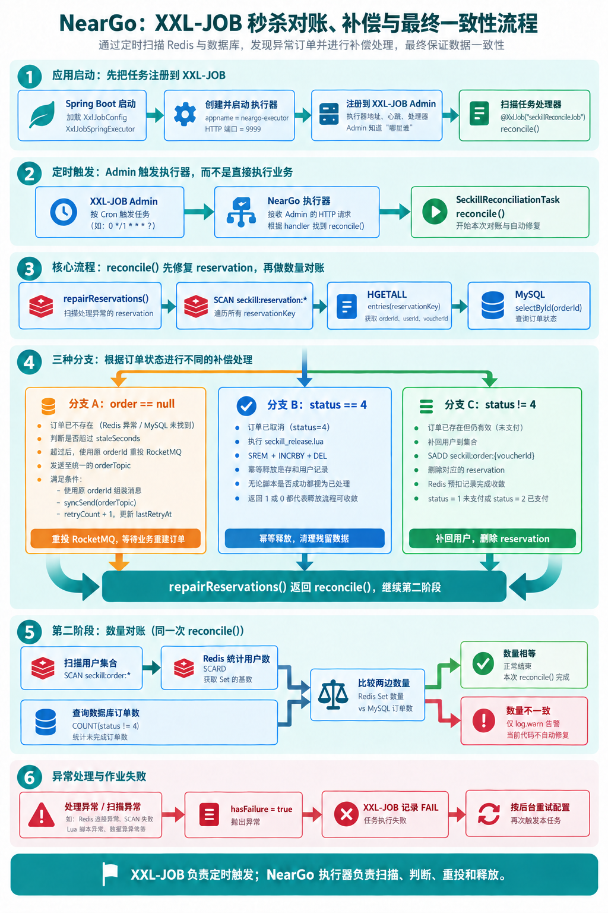

图中 `status = 4` 表示订单**已取消**。`repairReservations()` 处理预扣记录后，`reconcile()` 接着执行 `reconcileActiveOrderCounts()`；单纯数量不一致目前只输出 `log.warn`，处理异常或扫描异常才会让本轮任务失败。

### 2. XXL-JOB 完整链路：调度中心（Admin）与执行器（NearGo）

> 第 4 节的 mermaid 只画了「任务被触发之后、对账代码内部」的步骤。这里把整条链路补全：
> **谁注册、谁配任务、谁触发、谁执行、结果怎么回去、失败怎么重试**。
> 一句话类比：闹钟和铃声（Cron）都在 Admin，NearGo 只准备一段「被叫醒后能执行」的代码。

#### 2.1 两个角色，各管什么

| 角色           | 是谁            | 部署形态                                  | 职责                                                    |
| ------------ | ------------- | ------------------------------------- | ----------------------------------------------------- |
| 调度中心 Admin   | xxl-job-admin | 独立 Web 服务，默认 8080，路径 `/xxl-job-admin` | 管执行器在线列表、管任务配置（Cron / 路由 / 重试）、到点发起调度、收集执行结果与日志       |
| 执行器 Executor | NearGo 应用     | 本项目，内嵌 HTTP 服务，默认 9999                | 启动时向 Admin 注册；收到调度请求后找到 `@XxlJob` 方法执行；把结果和日志回报 Admin |

关键理解：**Cron 不在 NearGo 代码里，而在 Admin 自己的 MySQL 库里**（哪个库、哪些表、Admin 怎么连库，见 2.3 节）。NearGo 只提供一段「可被调用的代码」（JobHandler）；什么时候调、调失败怎么办，都由 Admin 说了算。

两边的约定集中在 `application.yaml:41-52`：

```yaml
xxl:
  job:
    admin:
      addresses: http://127.0.0.1:8080/xxl-job-admin   # 执行器往哪个 Admin 注册、回报
      accessToken: default_token                       # 通信令牌，两边必须一致，否则注册被拒
    executor:
      appname: neargo-executor      # 执行器身份名：Admin 建任务时按这个名字选机器
      ip: 127.0.0.1                 # 注册给 Admin 的 IP
      port: 9999                    # 内嵌 HTTP 端口：Admin 调度时调 http://ip:port/run
```

#### 2.2 启动阶段：执行器代码做了什么

`XxlJobConfig.java:41-53` 的 Bean 带 `initMethod = "start"`，Spring 启动过程中 `XxlJobSpringExecutor` 完成四件事：

```text
XxlJobSpringExecutor 随 Spring 启动（Bean 定义见 XxlJobConfig.java:41）
  ├─ ① initAdminBizList
  │     解析 xxl.job.admin.addresses，建立到 Admin 的 HTTP 客户端（注册、回调都走它）
  ├─ ② 扫描 @XxlJob 并注册本地 Map
  │     { "seckillReconcileJob" → MethodJobHandler（包装 com.hmdp.listener.SeckillReconciliationTask#reconcile） }
  │     （SeckillReconciliationTask.java:71 的注解就是在这里被发现的）
  ├─ ③ initEmbedServer
  │     启动内嵌 HTTP 服务，监听 9999，暴露 /run 接口（Admin 调度请求的入口）
  └─ ④ initRegistryThread
        后台线程每 30 秒 POST {Admin}/api/registry：
        appName = neargo-executor，address = http://127.0.0.1:9999
        Admin 把它写进注册表，页面「执行器管理」里就能看到这台在线机器
```

两个要点：

- 「执行器注册」不需要手填 IP，应用一启动就自动报到；应用关闭时还会调一次 `/api/registryRemove` 主动下线；
- Admin 侧有注册监控线程：超过 90 秒收不到某台机器的注册心跳，就把它从在线列表移除（防僵尸节点）。

#### 2.3 配置阶段：Admin 自己的 MySQL 库，以及页面上的任务配置

**Cron 存在哪个库？——Admin 自己的 MySQL 库，不是 NearGo 的业务库。**

XXL-JOB Admin 是独立服务，要单独给它建一个 MySQL 库（官方建表脚本 `tables_xxl_job.sql`，常用库名 `xxl_job`；2.4.1 官方只提供 MySQL 脚本），它和 NearGo 的业务库（本项目是 `hmdp`）是两个互不相干的库：

| Admin 侧的表          | 存什么                                                                                     |
| ------------------ | --------------------------------------------------------------------------------------- |
| `xxl_job_info`     | 任务配置：JobHandler、**Cron**（`schedule_type=CRON`、`schedule_conf=0 * * * * ?`）、路由策略、失败重试次数等 |
| `xxl_job_group`    | 执行器列表：`AppName=neargo-executor`                                                         |
| `xxl_job_registry` | 执行器注册心跳（就是 2.2 节那个每 30 秒的 `POST /api/registry` 写进来的地方）                                  |
| `xxl_job_log`      | 每次调度的记录与结果（成功 / 失败 / 重试）                                                                |
| `xxl_job_user`     | Admin 登录账号（默认 `admin / 123456`）                                                         |
| `xxl_job_lock`     | 调度锁：Admin 集群多实例时，保证同一时刻只有一个实例在触发任务                                                      |

Admin 连哪个库、用什么账号，写在 **Admin 自己的配置文件**（`xxl-job-admin` 的 `application.properties`），不是 NearGo 的 `application.yaml`：

```properties
server.port=8080
server.servlet.context-path=/xxl-job-admin
spring.datasource.url=jdbc:mysql://127.0.0.1:3306/xxl_job?useUnicode=true&characterEncoding=UTF-8&serverTimezone=Asia/Shanghai
spring.datasource.username=root
spring.datasource.password=你的密码
# 必须与 NearGo 的 xxl.job.admin.accessToken 一致（properties 文件不支持行内注释）
xxl.job.accessToken=default_token
```

从零配置的顺序（本项目用 XXL-JOB 2.4.1）：

1. MySQL 建库 `xxl_job`，执行官方 `tables_xxl_job.sql` 初始化上面这些表；
2. 启动 Admin：官方 jar（`java -jar xxl-job-admin-2.4.1.jar`）或官方 docker 镜像 `xuxueli/xxl-job-admin:2.4.1`，数据源参数用上一段配置（docker 部署时要把里面的 `127.0.0.1` 换成真实的 MySQL 地址）；
3. 浏览器打开 `http://127.0.0.1:8080/xxl-job-admin`，默认账号 `admin / 123456`；
4. 「执行器管理 → 新增」：AppName 填 `neargo-executor`，注册方式选**自动注册**（NearGo 启动后自动上线，机制见 2.2）；
5. 「任务管理 → 新增」：按下表把任务建出来，保存后立即纳入 Cron 调度。

页面「任务管理 → 新增任务」里与本项目有关的配置：

| 配置项        | 填什么                   | 作用                                                          |
| ---------- | --------------------- | ----------------------------------------------------------- |
| 执行器        | `neargo-executor`     | 决定调度请求发给哪批机器                                                |
| 运行模式       | `BEAN`                | 表示执行代码里的 `@XxlJob` 方法（不是 GLUE 脚本）                           |
| JobHandler | `seckillReconcileJob` | 必须和 `@XxlJob("seckillReconcileJob")` 完全一致，执行器靠它在本地 Map 里查方法 |
| Cron       | 如 `0 * * * * ?`（每分钟）  | 调度频率；改频率只改 Admin，不动代码、不重启应用                                 |
| 路由策略       | 故障转移（FAILOVER）        | 多台执行器时选哪台跑；执行器无响应时自动换一台，防单点                                 |
| 阻塞处理策略     | 串行策略（默认）              | 上一轮还没跑完、下一轮又到点时怎么办                                          |
| 失败重试次数     | 1                     | 执行失败后 Admin 自动再触发 1 次                                       |
| 任务超时时间     | 如 60s                 | 超时由 Admin 主动中断并记失败                                          |

`JobHandler` 这一格和 `@XxlJob` 的字符串是**跨进程的唯一约定**：Admin 只传一个名字，执行器用这个名字在本地 Map 里查方法。两边名字对不上，执行器会报 `jobHandler not found`。

职责划分一句话：**NearGo 侧只配两样（Admin 地址 + accessToken）；Cron、路由、失败重试、在线机器列表，全部在 Admin 的 MySQL 库和页面上。**

仓库里这份配置同样记录在 `docs/architecture/xxl-job-reconciliation.md`，包含 AppName / JobHandler / Cron / 路由策略 / 失败重试的完整取值。

#### 2.4 运行阶段：Admin 与执行器的完整交互（全链路时序图）

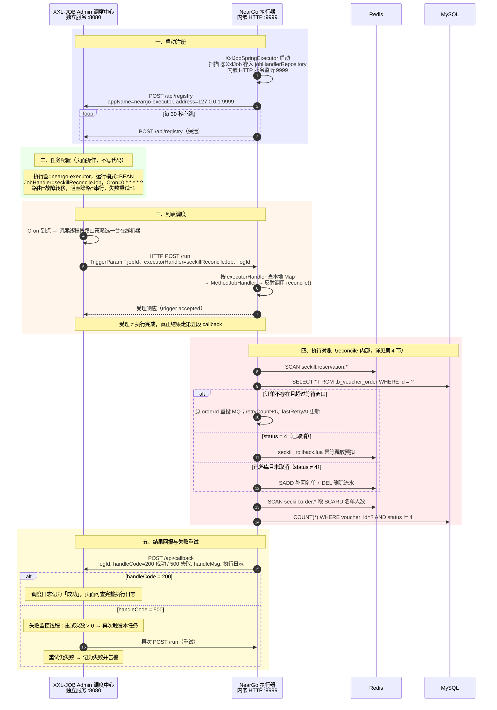

这五段就是简历「基于 XXL-JOB 定时扫描」背后的完整过程：**注册 → 配置 → 调度 → 执行 → 回报**。

#### 2.5 失败重试发生在 Admin，不在执行器里

- 执行器只负责「如实上报」：`reconcile()` 抛异常 → callback 的 `handleCode = 500`，执行器自己不重试；
- Admin 的失败监控线程扫到 500，且任务配置的「失败重试次数 > 0」→ 再次发 `/run`；
- 每次重试在页面都是一条独立的调度日志，能看出哪一次成功；
- 所以 `SeckillReconciliationTask.java:85-92` 的 catch 里「打日志后必须重新抛出」是必要动作：一旦吞掉异常，callback 会报 200，Admin 认为成功，永远不重试，预扣流水就没人修了。

### 3. 预扣流水（reservation）字段说明

Lua 预扣时写的那条流水（问题一 4.1 第 6 步），是这条链路的依据：

| 字段            | 含义           | 用途                   |
| ------------- | ------------ | -------------------- |
| `orderId`     | 本次预扣绑定的订单 ID | 重投时**必须复用它**，保证消费端幂等 |
| `userId`      | 用户 ID        | 修复名单、释放资格            |
| `voucherId`   | 券 ID         | 拼释放脚本的 Key           |
| `reservedAt`  | 预扣时间（秒）      | 判断是否超过等待窗口           |
| `retryCount`  | 已自动重投次数      | 控制重投次数               |
| `lastRetryAt` | 最近一次重投时间（秒）  | 控制重投频率               |

### 4. 对账执行步骤（reconcile 内部流程）

> 第 2 节讲的是任务「怎么被 Admin 触发到这里」；本节只看执行器收到 `/run` 之后、对账代码内部的逻辑。

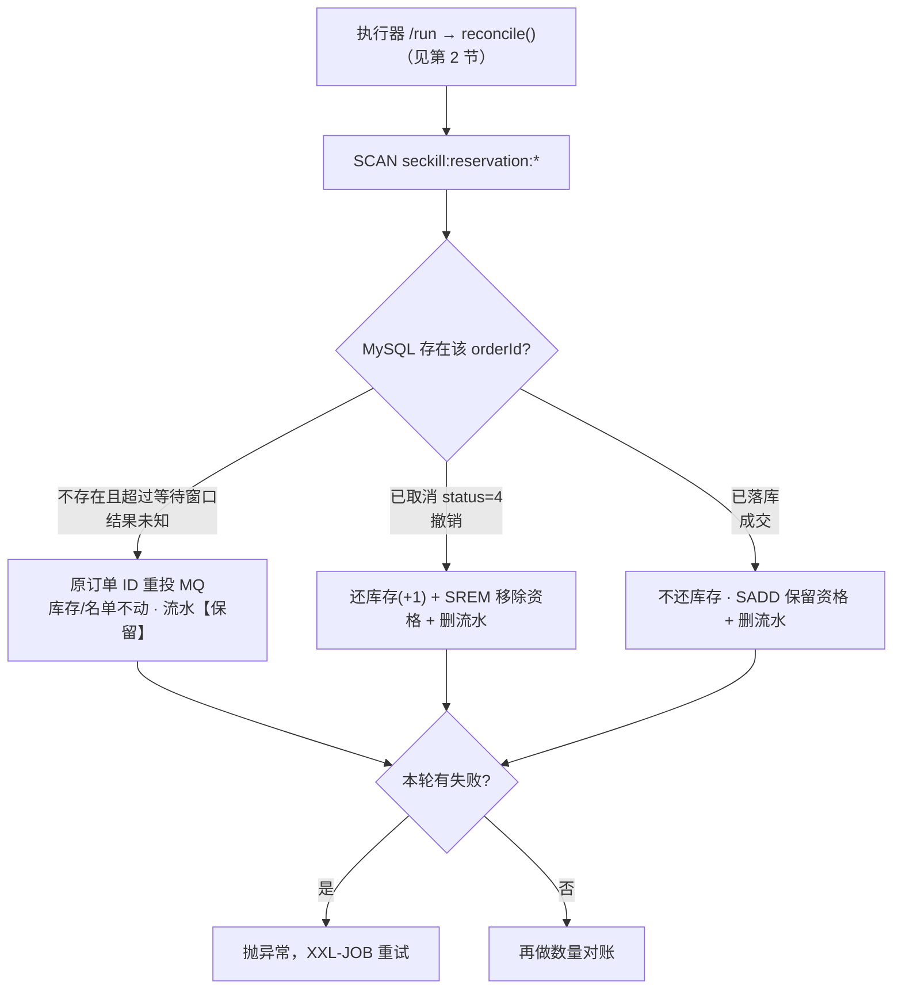

1. `SCAN seckill:reservation:*`，逐条读预扣流水；

2. 用流水里的 `orderId` 查 MySQL，按订单状态分三个分支：
   
   - **订单不存在，且预扣时间超过等待窗口**（默认 30 秒）→ 用**原订单 ID** 重投 MQ（`retryCount + 1`、`lastRetryAt = 当前时间`）；
   
   - **订单已取消（status = 4）** → 执行 `seckill_rollback.lua` 幂等释放 Redis 库存和名单；
   
   - **订单正常落库（status ≠ 4，含 1/2/3）** → 补回用户名单（`SADD`）+ 删除流水；

   **三分支的本质：三种"世界状态"**（删流水是共同点，"还不还"才是区别）

   | | 分支一：订单不存在 | 分支二：status = 4 | 分支三：正常 |
   |---|---|---|---|
   | 结果 | **未知**（等） | **撤销**（退单） | **成交**（落定） |
   | 库存 `seckill:stock` | 不动 | **+1 还回** | 保持已扣（**不还**） |
   | 资格名单 `seckill:order` | 不动 | **SREM 移除**（可重新抢） | **SADD 保留/补回**（不能重抢） |
   | 流水 `seckill:reservation` | **保留**（继续盯） | 删除（销账） | 删除（销账） |
   | 若不这么做 | 流水悬空、没人修 | 不还 → 少卖、资格被锁 | 还了 → 库存虚增、**超卖** |

   > 一句话：**分支二、三都要删流水（收尾动作相同），但"还不还库存/资格"方向相反——撤销要还，成交不还。** 这才是三分支的本质区别。

3. 本轮有任何失败 → 抛异常，让 XXL-JOB 把这次执行记为失败并按配置重试；

4. 再做一次**数量对账**：Redis 名单人数 vs MySQL 未取消订单数，不一致打警告日志。

重投限制（防止每轮 Cron 都重复发消息）：

- 预扣后至少等 `stale-seconds`（默认 30 秒）才允许重投，给正常消费者留落库时间；
- 同一个订单两次重投之间至少间隔 `retry-interval-seconds`（默认 60 秒）。

**为什么重投必须复用原订单 ID**：如果每次重投生成新 ID，消费端「订单 ID 幂等」就失效了，一次预扣可能被修复成多笔订单；复用原 ID 后，无论投多少次都指向同一条订单。

**为什么订单已落库还要 SADD 补名单？**（分支三最容易被追问）

**先说人话版（三步看懂分支三）**

**第一步｜一个关键事实**：消费端落库成功后**不会回来删 Redis 的流水**——流水是抢券那一刻 Lua 写的，消费端只往 MySQL 插订单，插完就结束，它不碰 Redis。所以流水会一直躺在 Redis 里；对账每分钟扫一次，扫到就必须处理、处理完必须删，否则下一分钟又扫到、再处理一遍。

**第二步｜三分支 = 对账拿着流水的 orderId 问 MySQL「这单后来怎么了」**，只有三种答案：

| MySQL 查到的答案   | 对账做的事                           |
| ------------- | ------------------------------- |
| 查不到订单         | 没落库 → **重投 MQ**，让它去落库           |
| 订单状态 = 4（已取消） | 被撤销了 → **还库存 + 还资格（SREM）+ 删流水** |
| 订单在、状态 ≠ 4    | 成功落库 → **删流水结案**（顺手 SADD）       |

看第三行：成功也要处理——**每条流水都得有人删**，分支三就是给已完成的记录收尾归档。

**第三步｜SADD 是顺手买的保险**：正常情况用户在抢券那一刻就被 Lua 加进名单了，这里再 SADD = **什么都没做**（往集合里重复加同一成员，集合不变）。它只在名单被意外弄丢时起作用（手删 Key、Redis 丢数据、运维误清）：那时用户能再抢一次 → 库存白扣、新流水被对账反复重投；SADD 补回名单后，再抢会命中 Lua 的 `return 2`，烂摊子就不会发生。

> 下面的表格是同一件事的逐帧拆解：先用人话版建立直觉，再看细节。

先分清「谁、在什么时候、对 Redis 做什么」——流水不是消费者删的：

| 阶段      | 执行者                      | 对 Redis 的操作                                      |
| ------- | ------------------------ | ------------------------------------------------ |
| 秒杀预扣    | Lua（请求线程）                | `SADD` 名单 + `HSET` 流水（同一次原子执行）                   |
| 落库成功    | 消费者 `createVoucherOrder` | **不碰 Redis**：不删流水、不删名单                           |
| 订单取消    | 关单 / 对账分支二               | `seckill_rollback.lua`：`SREM` + 库存 +1 + `DEL` 流水 |
| 对账发现已落库 | 分支三（本分支）                 | `SADD` 名单（正常时是空操作）+ `DEL` 流水                     |

先纠正一个容易混淆的点：**删流水 ≠ 撤销预扣。**

三个 Key 各管各的，成功和撤销是两条相反的收尾路径：

| 出路                  | 场景          | 谁执行                              | 库存         | 名单                   | 流水       |
| ------------------- | ----------- | -------------------------------- | ---------- | -------------------- | -------- |
| **成功**（订单已落库）       | 对账分支三       | 对账任务                             | 保持已扣（交易有效） | `SADD` 保持 / 补回「已抢」资格 | `DEL` 结案 |
| **撤销**（发送失败 / 订单取消） | 实时补偿、关单、分支二 | `seckill_rollback.lua`（一个脚本三处共用） | `+1` 还回    | `SREM` 移除资格          | `DEL` 结案 |

也就是说：流水是对账用的「在途凭据」，结果一旦确定（成功或撤销）就该删；但只有**撤销**才需要把库存和名单一起还回去。

**再补一层：为什么订单落库后要删流水？——流水的身份是「待办条」，不是「成功记录」：**

- 它唯一的职责是回答「这笔预扣出结果了吗」：流水存在 = 结果未知（可能没落库）、对账要盯；流水删除 = 已有定论（成功结案或已撤销）、对账不用再管。订单落库 = 结案 → 销账（消费者自己不清，由对账来删，见上表）；
- 不删的后果：对账每分钟 SCAN 都会把它重新当成「待处理」再走一遍分支三，直到 7 天 TTL——扫描集里永远混着早就结案的流水，分不清谁真需要关注；
- 成功的事实没丢：MySQL 订单 + Redis 已扣库存 + Redis 名单都在，Redis 不需要再留一份「我成功了」的副本；
- 销账的三条路 + 兜底：成功 → 分支三删除；取消 → `seckill_rollback.lua` 删除；发送失败 → 同一个 `seckill_rollback.lua` 删除；都没走到 → 7 天 TTL 自动淘汰；
- 类比：流水 = 快递「在途运单」，订单落库 = 已签收。签收后撕掉运单，但包裹（扣的库存、抢到的资格）保留——撕运单 ≠ 退货。

剩下就是 `SADD` 本身：

- 同一分支的 `SADD` 是**幂等空操作**：Set 里已经有这个 userId 时，再 `SADD` 不改变任何数据（返回 0）。正常链路里用户早在 Lua 预扣那一步就被加入名单、之后也没人移走，所以这里相当于「再确认一次」；只有异常时（Redis 名单缺失、Key 被误删、人工修复）它才真正写入；
- 不补的后果：该用户再次秒杀会通过 Lua（库存 -1、写出一条新流水），但消费端的 user+voucher 校验会直接 return，订单永远不会产生 → 这条流水被对账反复重投（60 秒一次，直到 7 天 TTL），Redis 库存也白白扣掉；
- 补上之后，再抢会命中 Lua 的 `return 2`（重复下单），不扣库存、不产生新流水。

### 5. 核心代码

**本节导航**：5 个方法 + 1 条时间线，先看谁调用谁，再看代码。

| 小节  | 方法（全限定名）                                                  | 行号       | 职责                           | 调用方                           |
| --- | --------------------------------------------------------- | -------- | ---------------------------- | ----------------------------- |
| 5.1 | `com.hmdp.listener.SeckillReconciliationTask#reconcile()` | :71-93   | XXL-JOB 入口：开关 → 编排 → 汇总成败    | XXL-JOB 反射调用                  |
| 5.2 | `#repairReservations()`                                   | :96-171  | 明细对账：三个修复分支（重投 / 释放 / 补名单）   | `#reconcile()`（:79）           |
| 5.3 | `#shouldRetry()`                                          | :200-207 | 重投限频：等待窗口 + 重投间隔             | `#repairReservations()`（:121） |
| 5.4 | `#reconcileActiveOrderCounts()`                           | :174-198 | 数量对账：SCARD 名单 vs COUNT 未取消订单 | `#reconcile()`（:80）           |
| 5.5 | `com.hmdp.config.XxlJobConfig#xxlJobExecutor()`           | :41-53   | 执行器 Bean：随 Spring 启动注册       | Spring                        |
| 5.6 | 一次完整执行的时间线                                                | —        | 把 5.1-5.4 串起来看               | —                             |

**5.1 Job 入口：失败不能吞异常**（`com.hmdp.listener.SeckillReconciliationTask#reconcile()`，`SeckillReconciliationTask.java:71-93`）

```java
71  @XxlJob("seckillReconcileJob")              // ① 注册名：与 Admin 的 executor_handler 一字不差
72  public void reconcile() {                   // ② 无参、void：返回什么都不会被 XXL-JOB 读
73      if (!enabled) {                         // ③ enabled ← seckill.reconcile.enabled（yaml:38，环境变量可覆盖）
74          return;                             // ④ 注意：正常返回 = 成功 → callback 200，"成功但什么都没干"
75      }
76
77      boolean hasFailure = false;             // ⑤ 本轮"记录级失败"的汇总标记
78      try {
79          hasFailure = repairReservations();  // ⑥ 明细对账：修流水，返回是否有修不动的
80          reconcileActiveOrderCounts();       // ⑦ 数量对账：只告警；它自己抛异常会直接跳 catch
81          if (hasFailure) {
82              // 把"记录级失败"升级成"任务级失败"
83              throw new IllegalStateException("秒杀对账存在未完成的自动补偿");
84          }
85      } catch (Exception e) {
86          log.error("秒杀对账任务执行失败", e);   // ⑧ 写执行器应用日志（不是任务日志文件，见第三节）
87          // 不能吞：吞掉 callback 会是 200，Admin 永远不重试
88          if (e instanceof RuntimeException) {
89              throw (RuntimeException) e;     // ⑨ 原样上抛：保留类型和消息（比如 83 行那句）
90          }
91          throw new IllegalStateException(e); // ⑩ 受检异常包一层，保证 XXL-JOB 收到失败
92      }
93  }
```

**逐行要点（三个最容易看漏的地方）**

1. `if (!enabled) return;`（:73-75）：对账紧急关闭时方法**正常返回 → callback 200**，页面一片绿但实际没干活，这是"停对账不报红"的刻意设计，不是 bug；
2. 79/80 行是**先跑完再算账**：即使 `repairReservations()` 已经发现失败，数量对账照样执行，一轮调度尽量收集全部问题，最后才统一决定成败；
3. 方法**无返回值（void）**：对 XXL-JOB 来说「正常返回 = 成功 / 抛异常 = 失败」，它没有走 `XxlJobHelper.handleFail()`，统一用抛异常表达失败。

**`hasFailure = true` 从哪来（`repairReservations()` 的 5 个出口）**

| 位置       | 场景                                                              |
| -------- | --------------------------------------------------------------- |
| :111-114 | 流水 Hash 缺字段（orderId / userId / voucherId / reservedAt 任一为 null） |
| :138-142 | 重投 MQ 抛异常（Broker 不可用、发送超时）                                      |
| :149-151 | 释放脚本返回 null（Redis 执行失败）                                         |
| :161-164 | 单条记录处理中任何其他异常（记失败后继续下一条）                                        |
| :166-169 | SCAN 本身失败 → `return true`（整轮直接失败）                               |

**返回 / 抛出之后，执行器内部发生了什么**（Admin 侧的触发与重试见 2.4 / 2.5）

- `MethodJobHandler.invoke`：启动时扫描 `@XxlJob` 生成的处理器，内部持有 `target`（Spring Bean `com.hmdp.listener.SeckillReconciliationTask`）和 `method`（`reconcile`），`method.invoke(target)` 反射执行；我们的方法无参、void，正常返回即成功；
- 抛异常时：JobThread 取异常消息作为 `handleMsg`（如"秒杀对账存在未完成的自动补偿"），堆栈写进**执行器本地任务日志** `{logPath}/{logId}/xxl-job.log`（`logPath` 见 `application.yaml:41-52`）；
- `pushTriggerCallback`：组装 `TriggerCallbackParam { logId, handleCode, handleMsg }`（成功 200 / 失败 500），HTTP `POST {Admin}/api/callback` → Admin 更新 `xxl_job_log`；500 由失败监控线程按任务配置重试。

**为什么 `reconcile()` 故意写得这么薄**

- **编排与执行分离**：入口只管「开关、顺序、成败」，业务在 5.2 / 5.4 两个方法里，可单独测试、单独调用；
- **失败聚合**：先修完能修的（3 条流水 2 条成功），再统一报失败，避免第一条出错就整体中断；
- **重试交给 Admin**：执行器抛异常即结束，不自己 sleep 重试，否则 JobThread 队列被占、后续调度被阻塞。

**5.2 `repairReservations()`：扫描 → 解析 → 三个修复分支**（`com.hmdp.listener.SeckillReconciliationTask#repairReservations()`，`SeckillReconciliationTask.java:96-171`；代码分两段：第一段 :96-116 扫描与解析，第二段 :117-160 三个分支）

> 先分清三个 Key 再读代码（以扫到的流水 `seckill:reservation:1001:2` 为例，其中 `voucherId=1001`、`userId=2`）：
> 
> | 代码里的变量                                       | 实际 Key                                                                     | 类型与内容                                                                     | 谁在用                                               |
> | -------------------------------------------- | -------------------------------------------------------------------------- | ------------------------------------------------------------------------- | ------------------------------------------------- |
> | `orderKey` = `SECKILL_ORDER_KEY + voucherId` | `seckill:order:1001`                                                       | Set，成员是 userId（这里是 `2`）                                                   | **分支三 `SADD` 补的就是它**；Lua 里一人一单的 `SISMEMBER` 查的也是它 |
> | `reservationKey` = SCAN 扫到的键                 | `seckill:reservation:1001:2`                                               | Hash：orderId / userId / voucherId / reservedAt / retryCount / lastRetryAt | 本次处理对象；分支三处理完 `DEL` 删掉                            |
> | 释放脚本的三个 KEYS                                 | `seckill:stock:1001` / `seckill:order:1001` / `seckill:reservation:1001:2` | String / Set / Hash                                                       | 分支二 `seckill_rollback.lua` 使用                     |
> 
> 所以分支三读作：**把 userId `2` 加回集合 `seckill:order:1001`，再删除 Hash `seckill:reservation:1001:2`**。

```java
// 文件：src/main/java/com/hmdp/listener/SeckillReconciliationTask.java
// 类：com.hmdp.listener.SeckillReconciliationTask
// 方法：private boolean repairReservations()（:96-171）
// 【第一段】扫描 + 解析（:96-116）

private boolean repairReservations() {
    boolean hasFailure = false;
    try (Cursor<String> cursor = stringRedisTemplate.scan(       // Redis SCAN：游标分批遍历，不阻塞
            ScanOptions.scanOptions()
                    .match(RedisConstants.SECKILL_RESERVATION_KEY + "*")   // 匹配 seckill:reservation:*
                    .count(100)                                            // 每批约 100 个（提示值，不保证精确）
                    .build())) {
        while (cursor.hasNext()) {                 // 本批取完自动用新游标继续 SCAN，直到游标回到 0
            String reservationKey = cursor.next(); // 一条流水，如 seckill:reservation:1001:2
            try {
                Map<Object, Object> fields = stringRedisTemplate.opsForHash()
                        .entries(reservationKey);  // HGETALL：取 orderId / userId / voucherId / reservedAt / retryCount / lastRetryAt
                Long orderId = parseLong(fields.get(ORDER_ID_FIELD));
                Long userId = parseLong(fields.get(USER_ID_FIELD));
                Long voucherId = parseLong(fields.get(VOUCHER_ID_FIELD));
                Long reservedAt = parseLong(fields.get(RESERVED_AT_FIELD));
                if (orderId == null || userId == null || voucherId == null || reservedAt == null) {
                    log.error("秒杀预扣元数据不完整 reservationKey={}, fields={}", reservationKey, fields);
                    hasFailure = true;
                    continue;                  // 字段缺失没法对账：记失败、跳过这条
                }
                // ↓↓↓ 解析出的 4 个字段交给【第二段】的三个修复分支 ↓↓↓
```

**SCAN 三条要点**：① 游标分批遍历（不是 `KEYS` 那样一次性阻塞）；② `COUNT 100` 只是“每批大概多少个”的提示值，不保证精确；③ 扫描期间 key 增删可能导致重复返回同一个 key——所以下面的三个分支全部做了幂等。

```java
// 【第二段】对账 + 三个修复分支（:117-160）

VoucherOrder order = voucherOrderMapper.selectById(orderId);            // 拿流水里的 orderId 查订单
String orderKey = RedisConstants.SECKILL_ORDER_KEY + voucherId;

if (order == null) {                                                    // 分支一：订单未落库 → 重投
    if (!shouldRetry(fields, reservedAt)) {
        continue;                                                       // 未超等待窗口 / 未到重投间隔 → 本轮跳过
    }
    VoucherOrder retryOrder = new VoucherOrder()
            .setId(orderId)                                             // 关键：复用原订单 ID，消费端幂等才不会失效
            .setUserId(userId)
            .setVoucherId(voucherId);
    rocketMQTemplate.syncSend(orderTopic, JSONUtil.toJsonStr(retryOrder), 3000);
    stringRedisTemplate.opsForHash().increment(reservationKey, RETRY_COUNT_FIELD, 1);   // retryCount +1
    stringRedisTemplate.opsForHash().put(reservationKey, LAST_RETRY_AT_FIELD,
            String.valueOf(Instant.now().getEpochSecond()));            // lastRetryAt = 当前秒
    continue;
}

if (Integer.valueOf(4).equals(order.getStatus())) {                     // 分支二：已取消 → 释放预扣
    releaseRedisReservation(order.getVoucherId(), order.getUserId());
} else {                                                                // 分支三：已落库 → 补名单 + 删流水
    stringRedisTemplate.opsForSet().add(orderKey, userId.toString());
    stringRedisTemplate.delete(reservationKey);
}
```

**代码里每个符号的归属**（看不懂某个调用时，按这张表定位源码）：

| 代码里的写法                                      | 归属（全限定类#方法 / 字段）                                                                            | 位置与说明                                                 |
| ------------------------------------------- | ------------------------------------------------------------------------------------------- | ----------------------------------------------------- |
| `voucherOrderMapper`                        | `com.hmdp.listener.SeckillReconciliationTask` 字段 :53 = `com.hmdp.mapper.VoucherOrderMapper` | 继承 MyBatis-Plus `BaseMapper`                          |
| `.selectById(orderId)`                      | `VoucherOrderMapper#selectById`                                                             | SQL：`SELECT * FROM tb_voucher_order WHERE id = ?`     |
| `shouldRetry(fields, reservedAt)`           | `SeckillReconciliationTask#shouldRetry`                                                     | 本类 :200-207（见 5.3）                                    |
| `rocketMQTemplate`                          | 本类字段 :55 = `org.apache.rocketmq.spring.core.RocketMQTemplate`                               | 重投用（3 秒超时）                                            |
| `JSONUtil.toJsonStr(...)`                   | `cn.hutool.json.JSONUtil#toJsonStr`                                                         | 订单对象 → JSON 字符串                                       |
| `stringRedisTemplate`                       | 本类字段 :51 = `org.springframework.data.redis.core.StringRedisTemplate`                        | 所有 Redis 操作的入口                                        |
| `stringRedisTemplate.scan(ScanOptions...)`  | `org.springframework.data.redis.core.StringRedisTemplate#scan`                              | 游标分批遍历匹配 key（等价 `SCAN 游标 MATCH seckill:reservation:* COUNT 100`） |
| `.opsForHash().entries(reservationKey)`     | `HashOperations#entries`                                                                    | `HGETALL`：取出流水的六个字段                                  |
| `ScanOptions` / `Cursor<String>`            | `org.springframework.data.redis.core.ScanOptions` / `...Cursor`                             | SCAN 的配置（match/count）与游标迭代器                            |
| `opsForHash().increment(...)`               | `org.springframework.data.redis.core.HashOperations#increment`                              | `HINCRBY`，retryCount +1                               |
| `opsForHash().put(...)`                     | `HashOperations#put`                                                                        | `HSET`；`Instant` = `java.time.Instant#getEpochSecond` |
| `releaseRedisReservation(...)`              | `SeckillReconciliationTask#releaseRedisReservation`                                         | 本类 :209-219 → 执行 `seckill_rollback.lua`               |
| `opsForSet().add(...)`                      | `org.springframework.data.redis.core.SetOperations#add`                                     | `SADD` 补回一人一单名单                                       |
| `.delete(reservationKey)`                   | `RedisTemplate#delete`                                                                      | `DEL` 流水结案                                            |
| `orderId / userId / voucherId / reservedAt` | `SeckillReconciliationTask#parseLong`（本类 :221-230）                                          | 前文从流水 Hash 解析得到                                       |

**5.3 `shouldRetry()`：重投限频**（`com.hmdp.listener.SeckillReconciliationTask#shouldRetry()`，`SeckillReconciliationTask.java:200-207`）

```java
// 文件：src/main/java/com/hmdp/listener/SeckillReconciliationTask.java
// 类：com.hmdp.listener.SeckillReconciliationTask
// 方法：private boolean shouldRetry(Map<Object, Object> fields, long reservedAt)（:200-207）
private boolean shouldRetry(Map<Object, Object> fields, long reservedAt) {
    long now = Instant.now().getEpochSecond();       // java.time.Instant#getEpochSecond
    if (now - reservedAt < staleSeconds) {           // staleSeconds 字段（:64-65），默认 30 秒，yaml 可配
        return false;                                // 还没超过等待窗口：正常消费者可能马上就落库了
    }
    Long lastRetryAt = parseLong(fields.get(LAST_RETRY_AT_FIELD));
    // 本类方法 #parseLong（:221-230）；LAST_RETRY_AT_FIELD 常量 = "lastRetryAt"（:39）
    return lastRetryAt == null || now - lastRetryAt >= retryIntervalSeconds;
    // retryIntervalSeconds 字段（:68-69），默认 60 秒；从未重投 或 距上次重投已超间隔 → 允许重投
}
```

**5.4 `reconcileActiveOrderCounts()`：数量对账**（`com.hmdp.listener.SeckillReconciliationTask#reconcileActiveOrderCounts()`，`SeckillReconciliationTask.java:174-198`）

```java
// 文件：src/main/java/com/hmdp/listener/SeckillReconciliationTask.java
// 类：com.hmdp.listener.SeckillReconciliationTask
// 方法：private void reconcileActiveOrderCounts()（:174-198）
// key / voucherId 来自外层 SCAN seckill:order:* 游标循环（:181-183）：
String key = cursor.next();
String voucherIdText = key.substring(RedisConstants.SECKILL_ORDER_KEY.length());
long voucherId = Long.parseLong(voucherIdText);

Long redisUsers = stringRedisTemplate.opsForSet().size(key);
// StringRedisTemplate#opsForSet() → SetOperations#size（SCARD 名单人数）
Long dbActiveOrders = voucherOrderMapper.selectCount(new LambdaQueryWrapper<VoucherOrder>()
        .eq(VoucherOrder::getVoucherId, voucherId)          // WHERE voucher_id = ?
        .ne(VoucherOrder::getStatus, 4));                   // AND status != 4：只统计未取消订单
// VoucherOrderMapper#selectCount（MyBatis-Plus BaseMapper）；LambdaQueryWrapper = com.baomidou.mybatisplus.core.conditions.query.LambdaQueryWrapper
// 等价 SQL：SELECT COUNT(*) FROM tb_voucher_order WHERE voucher_id = ? AND status != 4
if (redisUsers != null && dbActiveOrders != null
        && redisUsers.longValue() != dbActiveOrders.longValue()) {
    log.warn("秒杀对账不一致 voucherId={}, redisUsers={}, dbActiveOrders={}",
            voucherId, redisUsers, dbActiveOrders);         // 只告警：无法安全推断该加还是该减
}
```

**5.5 执行器配置与启动**（`com.hmdp.config.XxlJobConfig#xxlJobExecutor()`，`XxlJobConfig.java:41-53`）

```java
// 文件：src/main/java/com/hmdp/config/XxlJobConfig.java
// 类：com.hmdp.config.XxlJobConfig（:14-15，@Configuration）
// 方法：public XxlJobSpringExecutor xxlJobExecutor()（:41-53）
// 返回类型：com.xxl.job.core.executor.impl.XxlJobSpringExecutor
// 各 setter 参数来自本类 @Value 字段（:17-39），最终来自 application.yaml:41-52
@Bean(initMethod = "start", destroyMethod = "destroy")   // 随 Spring 启动 / 停止执行器
public XxlJobSpringExecutor xxlJobExecutor() {
    XxlJobSpringExecutor executor = new XxlJobSpringExecutor();
    executor.setAdminAddresses(adminAddresses);   // 调度中心地址（yaml：xxl.job.admin.addresses）
    executor.setAccessToken(accessToken);         // 通信令牌（yaml：xxl.job.admin.accessToken，默认 default_token）
    executor.setAppname(appName);                 // 执行器名 neargo-executor，要和 Admin 页面一致
    executor.setAddress(address);                 // 执行器地址（可选，自动推导）
    executor.setIp(ip);                           // 执行器 IP
    executor.setPort(port);                       // 执行器端口 9999
    executor.setLogPath(logPath);                 // 任务执行日志目录
    executor.setLogRetentionDays(logRetentionDays);   // 日志保留天数
    return executor;
}
```

这段代码的运行后果见 2.2 节（启动注册四步）；Admin 侧配置见 2.3 节：`AppName = neargo-executor`、`JobHandler = seckillReconcileJob`、Cron 自定（如每分钟一次）。

**5.6 一次完整执行的时间线（把 5.1-5.4 串起来）**

以 11:20:00 触发、扫到 3 条流水为例：

```text
11:20:00  Admin Cron → /run → MethodJobHandler.invoke → reconcile()

11:20:00  SCAN seckill:reservation:*（#repairReservations，:98-102）扫到 3 条：
  ① reservation:1001:2   orderId=1758…001，DB 查无此单
     reservedAt=11:18:00（超 30s 窗口）、lastRetryAt=11:19:00（距 60s）
     → 分支一：syncSend(seckill-order-topic, 原 ID 订单, 3000)
     → HINCRBY retryCount 1→2；HSET lastRetryAt=11:20:00               ✅ 修完
  ② reservation:1002:3   DB 订单 status=4（已取消）
     → 分支二：#releaseRedisReservation → seckill_rollback.lua
       SISMEMBER seckill:order:1002 3 = 1 → SREM + stock:1002 +1 + DEL 流水 → 返回 1  ✅ 修完
  ③ reservation:1003:4   DB 订单 status=1（已落库）
     → 分支三：SADD seckill:order:1003 4 + DEL 流水                     ✅ 修完

11:20:00  SCAN seckill:order:*（#reconcileActiveOrderCounts）逐个 SCARD vs COUNT(status!=4)
         全一致 → 无 log.warn
11:20:00  hasFailure=false → 正常返回 → pushTriggerCallback(handleCode=200)

—— 失败路径（假设 ② 执行时 Redis 超时）——
11:20:00  ② catch → hasFailure=true（本轮 ①③ 照样修完）
11:20:00  数量对账照跑 → 返回 true → 抛 IllegalStateException → callback 500
11:20:3x  Admin 失败监控扫到 500 → 按任务配置重试，立即重发 /run
11:20:3x  SCAN 又扫到 ②（脚本没成功、流水还在——这就是幂等的价值）
          → 再执行释放 → 成功 → callback 200
```

### 6. 为什么用 XXL-JOB（选型对比）

| 方案                        | 决定性因素                                         | 判定  |
| ------------------------- | --------------------------------------------- | --- |
| `@Scheduled`              | 单机简单，但无日志、无重试，多实例直接重复执行                       | 淘汰  |
| `@Scheduled` + Redisson 锁 | 只解决「谁执行」，重试、告警还要自建                            | 淘汰  |
| Quartz                    | 调度表建在业务库，且每次触发都抢 `QRTZ_LOCKS` 行锁，触发频繁时 DB 压力大 | 偏重  |
| **XXL-JOB**               | 调度/执行分离，自带运行日志、失败重试、路由                        | 采用  |

Redisson 锁只回答「谁执行」；XXL-JOB 还回答「何时执行、结果如何、失败后怎么办」。

**为什么淘汰 Quartz（重点展开）**

Quartz 是 Java 里最老牌的调度框架：支持 Cron、任务持久化到数据库、集群部署，功能其实不少。不选它的根本原因是——**它是「调度库」，不是「调度平台」**：

1. **调度数据落在业务库**：Quartz 集群模式必须用 JDBC JobStore，要在数据库里建 `QRTZ_*` 十几张表——调度数据和业务数据混在一个库，权限、备份、运维全部耦合；
2. **触发成本随次数线性增长**：集群模式下每次触发都要在 `QRTZ_LOCKS`、`QRTZ_TRIGGERS`、`QRTZ_FIRED_TRIGGERS` 上加行锁、读写状态，任务多、频率高时数据库先扛不住；
3. **只有触发，没有治理**：没有管理台——任务的增删改、暂停、手动执行要么改代码要么自建界面；执行日志、失败重试、告警、路由策略也统统要自己搭。而这些恰好是对账任务最需要的（谁失败了、为什么失败、重试了几次）；
4. **集群配置和排查门槛高**：实例 ID、acquisition、misfire 策略等一堆概念，出问题排查成本高。

两边能力对照：

| 能力 | Quartz | XXL-JOB |
| --- | --- | --- |
| Cron 触发 | ✅ | ✅ |
| 调度数据 | 业务库建 `QRTZ_*` 表 | 独立 `xxl_job` 库 + 独立调度中心 |
| 管理台（增删改 / 启停 / 手动执行） | ❌ 自己写 | ✅ 自带 |
| 执行日志 / 失败重试 / 告警 | ❌ 自己写 | ✅ 自带 |
| 路由 / 故障转移 / 分片广播 | 需自己实现 | ✅ 页面配置 |
| 触发锁代价 | 每次触发抢多表行锁 | 每 5 秒抢一行锁、毫秒级（见第 7 节） |

一句话：**我们要的是一套「能看、能重试、能运维」的调度平台，不是一个需要自己伺候的调度库**——这就是选 XXL-JOB 不选 Quartz 的根本原因。

### 7. 边界（面试追问）

| 追问                            | 回答                                                                                                                                                                                                                                                            |
| ----------------------------- | ------------------------------------------------------------------------------------------------------------------------------------------------------------------------------------------------------------------------------------------------------------- |
| 为什么不能只靠 MQ 消费重试？              | MQ 重试的前提是消息已进 Broker；预扣后、入 Broker 前崩溃的消息消费者看不到，只能靠 reservation 扫描发现                                                                                                                                                                                           |
| XXL-JOB Admin 挂了会怎样？          | 调度停摆、在线执行器注册信息过期，对账中断；恢复后按 Cron 继续。业务链路不受影响，执行器只注册/执行，不依赖 Admin 在线跑业务                                                                                                                                                                                         |
| 换一台执行器会重复执行吗？                 | 单次调度按路由策略只发一台；失败重试、故障转移可能换机器再跑，所以补偿动作本身必须幂等（重投用原 ID、释放用 Lua 判断）                                                                                                                                                                                               |
| xxl_job 表这么多，会像 Quartz 那样抢锁吗？ | 也会用一把 DB 锁，但只有 `xxl_job_lock` 的 `schedule_lock` 一行（`SELECT ... FOR UPDATE`），且只在每 5 秒一次的扫描事务里持有毫秒级：查到期任务 + 更新 `trigger_next_time`，提交后才丢给触发线程池，执行和 callback 不持锁。`xxl_job_log` 纯追加、`xxl_job_registry` 各执行器各写各的，不参与锁竞争。Quartz 是每次触发都在 `QRTZ_LOCKS` + 触发器表上加锁，量级不同 |
| 为什么用 SCAN 不用 KEYS？            | KEYS 会阻塞 Redis；SCAN 渐进遍历。数据量继续增长后应按时间/券分片对账                                                                                                                                                                                                                   |
| 为什么不用 Quartz？                   | 它是「调度库」不是「调度平台」：调度表建在业务库、每次触发抢 `QRTZ_*` 多表行锁，管理台 / 执行日志 / 失败重试 / 告警都要自建；完整对比见第 6 节 |
| XXL-JOB 会重复执行吗？               | 重试、故障转移都可能重复触发，所以补偿动作本身必须幂等（重投用原 ID、释放用 Lua 判断）                                                                                                                                                                                                               |
| 这是分布式事务吗？                     | 不是。允许短暂不一致，用消息、幂等、对账逐步收敛，属于最终一致性                                                                                                                                                                                                                              |
| 补偿能无限重试吗？                     | 不能。当前记录了 retryCount/lastRetryAt，但还缺最大次数、告警和人工入口                                                                                                                                                                                                               |
| 验证到什么程度？                      | 执行器注册、JobHandler、三分支补偿代码已接入并通过构建；**Admin 跨进程调度已端到端验证**（定时触发成功、callback `handleCode=200`），但**故障转移、真实数据下的补偿场景还没验证**，不能写成生产验证完成                                                                                                                                  |

---

## 六、访问流量治理

> **简历原文**：基于 Redis + Lua + AOP + 自定义注解实现滑动窗口限流，支持 IP 和用户维度，降低秒杀接口被恶意刷取和突发流量冲击的风险。

### 面试话术（四段式：背景 → 剖析 → 构思 → 复盘，可直接背）

**① 背景阐述**：这个项目需要限流的场景不止一个，我梳理了三种情况：

- 秒杀接口：开抢瞬间流量极大，需要限流保障系统的可用性（用户维度）；
- 领券类写接口：可能被脚本恶意刷券，需要按用户限流；
- 商家信息查询接口：会被爬虫高频抓取，需要按 IP 限流。

所以系统需要一个支持多维度的限流组件，把无效流量挡在业务之前。

**② 问题剖析**：要做这个组件，我先明确了几条硬性约束：

- 无侵入：不能在每个接口里手写限流判断，否则重复代码多、容易漏；
- 高性能：限流本身不能成为瓶颈；
- 多实例一致：服务是多实例部署，单机限流各限各的，总量会失控，同一个用户打到不同实例就能绕过去；
- 易用：加个注解、改几个参数就能接入。

也就是说：**要的是一个“放之各接口皆准”的限流组件，而不是给每个接口定制的限流代码。**

**③ 方案构思**：围绕这几条约束做技术映射和选型：

- 先定实现骨架：无侵入 + 易用 → AOP 切面 + 自定义注解；高性能 + 多实例一致 → Redis 做计数中心；
- 再选算法，四种我都分析过：固定窗口有临界点问题，窗口切换的瞬间能通过接近两倍的流量；漏桶强制请求按固定速率流出，完全不处理突发——秒杀恰恰是突发场景，有资源也用不上，还会大量误丢；令牌桶允许突发，但反过来会被“攒满令牌再瞬间爆发”的脉冲攻击利用，它更适合网关限速那种“限平均速率”的场景；滑动窗口记录每次请求的真实时间戳，任意时间窗口内精确计数，既平滑又能抑制脉冲攻击——选它；
- 落地成三层实现：① 自定义注解 `@RateLimiter`，参数是 key 前缀、窗口大小（秒）、窗口内允许的请求数、限流提示信息、限流维度（全局 / 用户 / IP）；② AOP 切面拦截标注了注解的方法，按维度拼出完整限流 key（用户维度取登录上下文的 userId，如 `rate:limit:user:{userId}`；IP 维度优先取 X-Forwarded-For、再取 remoteAddr；全局维度只用前缀），并把窗口、上限、当前毫秒时间戳传给 Lua；③ Lua 脚本三步原子执行——`ZREMRANGEBYSCORE` 清掉窗口外的旧记录，`ZCARD` 统计当前窗口内的请求数，没超上限就 `ZADD` 记录本次请求并返回 1 放行、超了就返回 0 拒绝；member 用“毫秒时间戳 + 随机数”保证唯一（否则同一毫秒的请求会互相覆盖、ZCARD 数不准），最后给 ZSet 设置过期时间防止冷 key 占内存；
- 实际配置：秒杀接口按用户 1 秒 5 次，店铺详情按 IP 1 秒 20 次，数字后续按压测和业务调整。

**④ 复盘总结**：这套组件做到了注解 + AOP 零侵入、Redis + Lua 多实例一致且原子、滑动窗口兼顾平滑与防脉冲。选型原则一句话——**限流算法没有优劣，只有匹配场景：防刷要的是“任意时间窗口内的次数硬上限”，滑动窗口最贴合**。它解决的是“流量多少”的问题，而业务是否正确（不超卖、不重复）由前面的 Redis + Lua 预扣和消费端幂等保证，两者分工明确。

### 1. 这条在说什么

限流和防超卖解决的不是同一个问题：Lua 库存脚本只能保证进入业务后的库存正确，拦不住大量恶意请求占用 Web 线程、Redis 连接和带宽。所以要在接口执行前再挡一道。

秒杀接口按**用户**限流（防脚本刷单），商铺查询按 **IP** 限流（防爬虫），另外支持**全局**维度。

**这条优化的意义**

- **保护资源**：接口执行前拦掉恶意和超量请求，保护 Web 线程、Redis 连接、带宽这些稀缺资源；
- **保护后方**：限流是第一道闸门——被拦下的请求根本到不了 Lua 预扣和 MQ，相当于给整条链路减压；
- **没有它会怎样**：脚本以每秒几百次刷秒杀接口，把线程池和 Redis 连接占满，正常用户请求排队超时；商铺接口被爬虫批量抓取同理；
- **和其他点的分工**：限流只解决「流量多少」（拦恶意 / 突发），不解决「业务对不对」（防超卖靠第一节的 Lua，防重复靠第二节的幂等），两者是前后道防线，不能互相替代。

### 2. 滑动窗口完整执行步骤

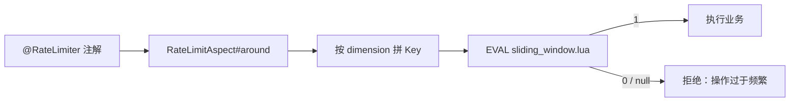

**图 1：整体调用流程（含参数与返回值分支）**

```text
HTTP POST /voucher-order/seckill/1001
        │
        ▼
┌──────────────────────────────────────────────┐
│ VoucherOrderController                       │
│ @RateLimiter(                                │
│   key = "seckill",                           │
│   windowSeconds = 1,                         │
│   count = 5,                                 │
│   dimension = "user"                         │
│ )                                            │
│ public Result seckillVoucher(Long voucherId) │
└──────────────────────────────────────────────┘
        │
        ▼
┌──────────────────────────────────────────────┐
│ RateLimitAspect.around()                     │
│                                              │
│ 1. 读取注解参数                              │
│    key = "seckill"                           │
│    windowSeconds = 1                         │
│    count = 5                                 │
│    dimension = "user"                        │
│                                              │
│ 2. buildKey() 构建 Redis Key                 │
│    dimension = "user"                        │
│    → "seckill:user:1001"                     │
│                                              │
│ 3. 执行 Lua 脚本                             │
│    EVAL sliding_window.lua 1                 │
│         seckill:user:1001 1 5 now            │
└──────────────────────────────────────────────┘
        │
        ▼
┌──────────────────────────────────────────────┐
│ Redis 执行 sliding_window.lua                │
│                                              │
│ ① zremrangebyscore 清理窗口外旧记录          │
│ ② zcard 统计窗口内请求数                     │
│ ③ if current >= limit then return 0         │
│    else                                     │
│      zadd 记录本次请求                      │
│      expire 设置 key 过期时间               │
│      return 1                               │
│    end                                      │
└──────────────────────────────────────────────┘
        │
   ┌────┴────┐
   ▼         ▼
返回 0      返回 1
   │         │
   ▼         ▼
┌──────────────┐   ┌──────────────────────────┐
│ Result.fail  │   │ joinPoint.proceed()      │
│ "操作过于频繁"│   │ 继续执行原 Controller 方法│
│ 请稍后再试"  │   │ 返回真实业务结果          │
└──────────────┘   └──────────────────────────┘
```

1. 请求进入 Controller 方法前，被切面 `RateLimitAspect` 拦截；

2. 按注解的 `dimension` 拼限流 Key——**dimension 决定「计数单位」：同一维度的实体共用一个 Key，不同实体各限各的**：
   
   | dimension | 谁共用一个 Key | 项目实际 Key（示例）                 | 效果                                            |
   | --------- | --------- | ---------------------------- | --------------------------------------------- |
   | `user`    | 一个用户一个    | `seckill:user:1001`          | 用户 1001 每秒最多 5 次；用户 1002 走自己的 Key，不占 1001 的名额 |
   | `ip`      | 一个 IP 一个  | `shop:query:ip:1.2.3.4`      | 这个 IP 每秒最多 20 次；换 IP 就换 Key                   |
   | `global`  | 所有人共用 1 个 | `rate:limit`（注解 key 原样，不加后缀） | 全站合计每秒最多 N 次                                  |
   
   拼接规则（`RateLimitAspect#buildKey`）：以注解 `key` 为前缀，`user` 加 `:user:{userId}`、`ip` 加 `:ip:{clientIp}`、`global` 不加后缀。
   
   > 注解默认前缀是 `rate:limit`（`String key() default "rate:limit"`），所以此前示意的 `rate:limit:user:1001` 是「默认前缀」版本；本项目秒杀接口用 `key="seckill"`、商铺接口用 `key="shop:query"`，真实 Key 是 `seckill:user:1001` / `shop:query:ip:1.2.3.4`。
   
   具体跑一遍（用户 1001 请求秒杀）：拼出 `seckill:user:1001` → Lua 在这个 ZSet 上数最近 1 秒的请求数 → 小于 5 记录并放行，达到 5 返回 0 拒绝；用户 1002 走 `seckill:user:1002`，完全独立。

3. 执行 `sliding_window.lua`（四步原子操作）：
   
   - `ZREMRANGEBYSCORE` 删除窗口外的旧请求记录；
   
   - `ZCARD` 统计当前窗口内的请求数；
   
   - 达到阈值 → 返回 0（拒绝）；
   
   - 未达到 → `ZADD` 记录本次请求，并给 Key 设置过期时间，返回 1；

4. 返回 1 → 执行业务方法；返回 0 或 Redis 异常 → 返回「操作过于频繁，请稍后再试」。

**为什么这四步必须放 Lua**：假设阈值 100，当前 ZSet 里有 99 条。两个应用实例同时执行：

```text
实例 A：ZCARD → 99
实例 B：ZCARD → 99
实例 A：判断可放行 → ZADD
实例 B：判断可放行 → ZADD
最终窗口内 101 条，超限
```

单条 Redis 命令原子，不代表「删除 + 统计 + 判断 + 写入」组合原子，必须用 Lua 包起来；顺带也减少了多次网络往返。

**图 3：时序图**

```text
Client          RateLimitAspect        Redis(Lua)         Controller
  │                    │                   │                   │
  │──seckill/1001─────►│                   │                   │
  │                    │                   │                   │
  │                    │──EVAL lua────────►│                   │
  │                    │  KEYS[1]          │                   │
  │                    │  ARGV[1..3]       │                   │
  │                    │                   │                   │
  │                    │◄──return 1────────│                   │
  │                    │                   │                   │
  │                    │──joinPoint.proceed()──────────────────►│
  │                    │                   │                   │
  │◄───Result──────────────────────────────────────────────────│
  │                    │                   │                   │
  │                    │                   │                   │
  │  （如果 Lua 返回 0）│                   │                   │
  │                    │◄──return 0────────│                   │
  │◄──Result.fail──────│                   │                   │
  │  "操作过于频繁"     │                   │                   │
```

一句话总结：**请求进来 → AOP 拦截 → 读注解 → 拼 Key → 执行 Lua → Lua 用 ZSet 做滑动窗口判断 → 返回 1 放行、返回 0 拒绝。** 整个过程原子、分布式、可配置。

### 3. 为什么选滑动窗口（选型对比）

| 算法               | 决定性因素                             | 判定         |
| ---------------- | --------------------------------- | ---------- |
| 固定窗口             | 窗口边界可能瞬间通过双倍流量                    | 淘汰         |
| 漏桶               | 请求按固定速率流出，不允许合理突发                 | 淘汰         |
| 令牌桶              | 允许突发，但挡不住「攒额度瞬间爆发」，无法精确限制任意时间段内次数 | 网关平均速率场景适用 |
| **滑动窗口日志（ZSet）** | 每次请求记录时间戳，任意时间窗口内精确计数             | 防刷场景采用     |
| 滑动窗口计数           | 省内存但是近似值                          | 高 QPS 优化方向 |

防刷要的是精确和均匀：黄牛可以攒着额度在某一秒集中爆发，令牌桶会全部放行；滑动窗口记录每个请求的真实时间戳才能拦住。

### 4. 核心代码

**4.1 自定义注解**（`RateLimiter.java:12-20`）

```java
@Target(ElementType.METHOD)           // 只能加在方法上
@Retention(RetentionPolicy.RUNTIME)   // 运行期保留，切面才能通过反射读到
@Documented
public @interface RateLimiter {
    String key() default "rate:limit";        // 限流 Key 前缀
    long windowSeconds() default 60;          // 窗口大小（秒）
    int count() default 10;                   // 窗口内允许的请求数
    String dimension() default "global";      // 维度：global / user / ip
}
```

**4.2 使用位置**（秒杀按用户、商铺按 IP）

```java
// VoucherOrderController.java:27-31
@PostMapping("seckill/{id}")
@RateLimiter(key = "seckill", windowSeconds = 1, count = 5, dimension = "user")
// 秒杀接口：同一个用户 1 秒内最多 5 次
public Result seckillVoucher(@PathVariable("id") Long voucherId) {
    return voucherOrderService.seckillVoucher(voucherId);
}

// ShopController.java:35-39
@GetMapping("/{id}")
@RateLimiter(key = "shop:query", windowSeconds = 1, count = 20, dimension = "ip")
// 商铺查询：同一个 IP 1 秒内最多 20 次
public Result queryShopById(@PathVariable("id") Long id) {
    return shopService.queryById(id);
}
```

**4.3 限流脚本**（`sliding_window.lua` 全文）

```lua
-- KEYS[1]: 限流 Key，如 seckill:user:1001
-- ARGV[1]: 窗口秒数    ARGV[2]: 阈值    ARGV[3]: 当前毫秒时间戳
local key = KEYS[1]
local window = tonumber(ARGV[1])
local limit = tonumber(ARGV[2])
local now = tonumber(ARGV[3])

redis.call('zremrangebyscore', key, 0, now - window * 1000)
-- 删除 score 在窗口外的成员（窗口外的旧请求不再计数）
local current = redis.call('zcard', key)                     -- 统计窗口内请求数
if current >= limit then
    return 0                                                 -- 达到阈值：拒绝
end

redis.call('zadd', key, now, now .. '-' .. math.random(100000, 999999))
-- 记录本次请求：score = 时间戳；member = 时间戳-随机数（防同毫秒覆盖）
redis.call('expire', key, window)                            -- Key 过期时间 = 窗口大小
return 1                                                     -- 放行
```

**4.3 补充：脚本逐行拆解（参数从哪来、ZSet 存什么、限流拦在哪）**

**图 2：Lua 滑动窗口内部原理**

以 `key = "seckill:user:1001"`、窗口 `1 秒`、限制 `5 次` 为例。

```text
时间轴 ─────────────────────────────────────────────────────────────►
        │                                                             │
        │  1 秒窗口                                                    │
        │                                                             │
        │  now - 1000ms                        now                    │
        │      │                                │                     │
        ▼      ▼                                ▼
   ────┬────────────────────────────────────────┬───────────────►
       │                                        │
       │  窗口内保留的请求记录                    │
       │                                        │
       ▼                                        ▼
   ZSET:  [ 旧请求1 ] [ 旧请求2 ] ... [ 旧请求5 ]  [ 本次新请求 ]
            │
            └── 如果 now - 1000ms 之前的记录，全部删除
```

滑动窗口的时间变化：

```text
第 0.0 秒：请求 A → zadd，当前窗口 [A]
第 0.2 秒：请求 B → zadd，当前窗口 [A, B]
第 0.5 秒：请求 C → zadd，当前窗口 [A, B, C]
第 0.8 秒：请求 D → zadd，当前窗口 [A, B, C, D]
第 0.9 秒：请求 E → zadd，当前窗口 [A, B, C, D, E]
第 1.0 秒：请求 F → zcard = 5 >= 5 → return 0，拒绝
第 1.1 秒：请求 G → zremrangebyscore 删除 0.1 秒之前的记录
                    A 被删除，窗口变成 [B, C, D, E]
                    zcard = 4 < 5 → 允许，zadd G
```

窗口是**滑动**的：每来一个请求，窗口左边界都跟着 `now` 前移，不会出现固定窗口那种「前一秒末尾 + 下一秒开头瞬间打满两倍额度」的突刺。

**① 参数怎么进 Lua 的：注解 → 切面 → `execute()` → EVAL → KEYS/ARGV**

```text
@RateLimiter(key="seckill", windowSeconds=1, count=5, dimension="user")
   │  a. 注解参数挂在方法上（RUNTIME 保留）
   ▼
RateLimitAspect.around()
   │  b. 反射读出注解实例
   │     signature.getMethod().getAnnotation(RateLimiter.class)
   ▼
stringRedisTemplate.execute(
    SCRIPT,
    Collections.singletonList(key),               // → KEYS[1] = seckill:user:1001
    String.valueOf(limiter.windowSeconds()),      // → ARGV[1] = "1"
    String.valueOf(limiter.count()),              // → ARGV[2] = "5"
    String.valueOf(System.currentTimeMillis())    // → ARGV[3] = "1789916936100"
);
   │  c. Spring Data Redis 拼成一条 EVAL 命令
   ▼
EVAL <脚本内容> 1 seckill:user:1001 1 5 1789916936100
                 └ KEYS 个数      └── ARGV[1..3]，按位置对应
```

规则：`execute(脚本, keys列表, 可变参数...)` —— **keys 列表进 `KEYS[]`，后面的可变参数按顺序进 `ARGV[]`**。Redis 参数都是字符串，Lua 里用 `tonumber` 转回数字。`KEYS` 和 `ARGV` 只是占位变量，Lua 文件里没有配置，值每次调用现装。

**② ZSet 里到底存了什么**

每个被限对象（一个用户 / 一个 IP / 全局）各有一个 ZSet，内容只有两栏：

| 元素部分          | 值                                  | 来源                                                   |
| ------------- | ---------------------------------- | ---------------------------------------------------- |
| **score**     | 请求时间戳（毫秒）                          | `ARGV[3]`（Java `currentTimeMillis()`）                |
| **member（值）** | `时间戳-随机数`，如 `1789916936100-483920` | Lua 现场拼接：`now .. '-' .. math.random(100000, 999999)` |

```text
seckill:user:1001 (ZSet)
member                    score
"1789916936100-483920" →  1789916936100
"1789916936250-102384" →  1789916936250
"1789916936400-999001" →  1789916936400
```

两个设计原因：

- **score 用时间戳**：`zremrangebyscore` 要按时间范围删记录，时间就是窗口的坐标轴；
- **member 拼随机数**：ZSet 的 member 必须唯一。同一毫秒来了两个请求，若 member 都用时间戳，第 2 条会**覆盖**第 1 条（ZADD 对已存在 member 是更新而不是新增）→ `zcard` 少算一个 → 超限放行。

一句话总结：**member 的内容不重要，确保唯一才重要**。它不需要被任何人读取，职责只是让每次请求各占一个独立元素，`zcard` 数出来的才等于请求数：

```text
member 固定（永远写 "1"）：每次 zadd 都只是更新同一个成员的 score → zcard 永远是 1 → 限流彻底失效
member 用裸时间戳：同一毫秒的并发请求互相覆盖 → 5 个请求只留 1 个成员 → 超限放行
member 用 时间戳-随机数：每请求一个成员 → zcard = 请求数 → 计数正确
```

（更规范的做法是应用侧生成请求唯一 ID 传进来，效果同理；这里用时间戳+随机数是为了不出 Lua 就能保证唯一。）

**③ 四行命令各干什么**

| 行   | 命令                                       | 作用                               | 解决的问题   |
| --- | ---------------------------------------- | -------------------------------- | ------- |
| 1   | `zremrangebyscore key 0 now-window*1000` | 删除 score ≤ 窗口左边界的旧请求             | 窗口「滑动」  |
| 2   | `zcard key`                              | 数窗口内请求数，`>= limit` 则 `return 0`  | 判定      |
| 3   | `zadd key now member`                    | 记录本次请求（score=now、member=now-随机数） | 写入/计数来源 |
| 4   | `expire key window`                      | TTL 续期，闲置自动回收整个 Key              | 内存清理    |

第 1 行的时间轴（window=1 秒、now=1789916936100，cutoff=1789916935100）：

```text
1789916934000 ✗ 删   1789916934900 ✗ 删 │ 1789916935200 ✓ 留   1789916935800 ✓ 留
                            cutoff ────┘ 窗口内（最近 1 秒）参与 zcard 计数
```

- 不删的后果：`zcard` 会把历史所有请求都数上，用户发满 5 次后**永远**被限——那是「一生 5 次」不是「每秒 5 次」；
- 第 4 行不写不影响计数正确性，但闲置用户的 Key 会永久留在 Redis 里；有它则「window 秒没有新请求 → 整个 Key 自动消失 → 下次从 0 开始」。

**④ 返回值 0/1 拦在哪：拦在切面，不在 Lua**

Lua 只是「裁决器」，真正拒绝请求的动作在 `around()`：

```java
Long allowed = stringRedisTemplate.execute(SCRIPT, ...);

if (allowed == null || allowed == 0L) {
    return Result.fail("操作过于频繁，请稍后再试");   // return 0：直接返回，目标方法不执行（限流发生点）
}
return joinPoint.proceed();                          // return 1：放行
```

**⑤ 把 6 个请求跑一遍（count=5）**

```text
第 1 个请求：zcard=0 → 0<5 → zadd 记一笔 → return 1 → proceed() 执行业务
...
第 5 个请求：zcard=4 → 4<5 → zadd 记一笔 → return 1 → proceed()
第 6 个请求：zcard=5 → 5>=5 → return 0 → Result.fail("操作过于频繁")   ← 被限流
1 秒后：下一次请求先 zremrangebyscore 删掉过期记录，zcard 归 0 → 又可放行 5 次
```

**4.4 切面：统一执行限流**（`RateLimitAspect.java:38-66`）

```java
private static final DefaultRedisScript<Long> SCRIPT;     // ① 声明一个静态常量，类型是 DefaultRedisScript<Long>，泛型 Long 表示 Lua 脚本返回 Long 类型；static final 表示类级别唯一且不可变，类加载时初始化。
static {                                                 // ② 静态初始化块：JVM 在类加载时执行且只执行一次，用于给 SCRIPT 赋值。
    SCRIPT = new DefaultRedisScript<>();                 // ③ 创建 DefaultRedisScript 实例，<> 是菱形语法，自动推断泛型为 Long。
    SCRIPT.setLocation(new ClassPathResource("sliding_window.lua")); // ④ 指定 Lua 脚本文件的位置：从 classpath 下读取 sliding_window.lua。
    SCRIPT.setResultType(Long.class);                    // ⑤ 设置脚本返回值的类型为 Long，这样 execute 返回的就是 Long，而不是 Object。
}

@Around("@annotation(com.hmdp.annotation.RateLimiter)")   // 拦截所有带 @RateLimiter 的方法
public Object around(ProceedingJoinPoint joinPoint) throws Throwable {
    MethodSignature signature = (MethodSignature) joinPoint.getSignature();
    RateLimiter limiter = signature.getMethod().getAnnotation(RateLimiter.class);   // 读注解参数
    String key = buildKey(limiter);                       // 按维度拼限流 Key
    Long allowed = stringRedisTemplate.execute(
            SCRIPT,                                       // sliding_window.lua
            Collections.singletonList(key),               // KEYS[1]
            String.valueOf(limiter.windowSeconds()),      // ARGV[1] 窗口秒数
            String.valueOf(limiter.count()),              // ARGV[2] 阈值
            String.valueOf(System.currentTimeMillis())    // ARGV[3] 当前毫秒时间戳
    );
    if (allowed == null || allowed == 0L) {               // 0 = 超阈值；null = Redis 异常
        return Result.fail("操作过于频繁，请稍后再试");      // Fail Closed：宁可拒绝
    }
    return joinPoint.proceed();                           // 放行，执行原业务方法
}

private String buildKey(RateLimiter limiter) {
    String base = limiter.key();
    if ("ip".equalsIgnoreCase(limiter.dimension())) {
        return base + ":ip:" + clientIp();                // 例：shop:query:ip:1.2.3.4
    }
    if ("user".equalsIgnoreCase(limiter.dimension())) {
        Long userId = UserHolder.getUser() == null ? 0L : UserHolder.getUser().getId();   // 未登录兜底 0：匿名请求共用一个桶
        return base + ":user:" + userId;                  // 例：seckill:user:1001
    }
    return base;                                          // 全局维度：只用前缀
}
```

**4.4 补充：为什么用 `@Around` 而不是 `@Before` / `@After`**

Spring AOP 有五种通知，限流这套逻辑只有 `@Around` 能完整实现：

| 通知                | 执行时机          | 能阻止目标方法执行吗            | 能改返回值吗               |
| ----------------- | ------------- | --------------------- | -------------------- |
| `@Before`         | 目标方法前         | 不能，只能**抛异常**打断        | 不能                   |
| `@AfterReturning` | 正常返回后         | 已经执行完了                | 不能，只能读结果             |
| `@AfterThrowing`  | 抛异常后          | 已经抛了                  | 不能                   |
| `@After`          | 最后（像 finally） | 不能                    | 不能                   |
| `@Around`         | 包住全过程         | **能**（不调 `proceed()`） | **能**（return 什么就是什么） |

限流的两个硬需求都只有 `@Around` 能满足：

1. **拒绝时要跳过业务方法**——`if` 分支直接 `return`，根本不做 `proceed()`；
2. **拒绝时要返回 `Result.fail` 给前端**——把切面的返回值替换掉。

如果换成 `@Before`，只能靠抛异常打断，还得再写 `@ExceptionHandler` 把异常翻译成 `Result.fail`：

```java
@Before("@annotation(com.hmdp.annotation.RateLimiter)")
public void before(JoinPoint jp) {
    Long allowed = redis.execute(...);
    if (allowed == null || allowed == 0L) {
        throw new RateLimitException("操作过于频繁");   // 唯一打断手段：抛异常
    }
}
// 能实现，但「限流判定 + 打断 + 造返回体」被拆到两个地方，链更长
```

多个通知同时存在时的执行顺序：

```text
@Around（proceed() 之前的代码）
  → @Before
    → 目标方法（Controller）
  → @AfterReturning（正常返回）或 @AfterThrowing（抛异常）
  → @After（无论成败都执行）
@Around（proceed() 之后的代码，如果没被异常打断）
```

两个补充：

- 项目里只有这一个切面（全局搜 `@Aspect` 只有 `RateLimitAspect`，一个 `@Around`）；
- `@Transactional` 底层也是 AOP 的 around 式通知（`TransactionInterceptor`）：开启事务 → proceed 执行业务 → 提交/回滚，和限流切面是同一个套路。

**4.5 `clientIp()`：IP 维度时，IP 从哪来**（`RateLimitAspect.java:68-82`）

```java
private String clientIp() {
    ServletRequestAttributes attributes =
            (ServletRequestAttributes) RequestContextHolder.getRequestAttributes();
    if (attributes == null) {
        return "unknown";
    }
    HttpServletRequest request = attributes.getRequest();
    String ip = request.getHeader("X-Forwarded-For");     // 经过代理：代理链写在头里
    if (ip == null || ip.isEmpty() || "unknown".equalsIgnoreCase(ip)) {
        ip = request.getRemoteAddr();                     // 没经过代理：直连地址
    } else {
        ip = ip.split(",")[0].trim();                     // 多级代理：第一段才是客户端 IP
    }
    return ip;
}
```

两个容易漏的点：

- `X-Forwarded-For` 是客户端可伪造的头：本实现直接信任第一段，只适合「前面有受控网关 / Nginx 重写该头」的部署；裸奔部署下爬虫改头即可绕过限流（边界表已列）；
- `buildKey` 里未登录用户兜底为 `userId = 0L`，所以**所有未登录请求共用 `seckill:user:0` 这一个桶**。秒杀接口本身会先校验登录，影响小；若要防匿名刷，应改用 IP 维度或按 token 计数。

### 5. 边界（面试追问）

| 追问                      | 回答                                                                                                            |
| ----------------------- | ------------------------------------------------------------------------------------------------------------- |
| 为什么不用 Sentinel 或只在网关限流？ | 网关做粗粒度全局保护；用户和券维度更适合业务层。生产可以两层并用                                                                              |
| 按 IP 限流有什么坑？            | `X-Forwarded-For` 可伪造、NAT 下多用户共用 IP；只能信任受控网关写入的头                                                              |
| Redis 挂了放行还是拒绝？         | 当前 Fail Closed（返回 0/异常都拒绝），偏向保护秒杀；生产可按接口分级降级                                                                  |
| ZSet 方案的代价？             | 每个请求占一个成员，高 QPS 高基数下内存和 O(logN) 成本明显，可换分桶计数 / 网关本地限流                                                          |
| member 为什么拼随机数？         | member 内容不重要、**唯一性**才重要：唯一才能让每次请求各占一个元素、`zcard` 数得准；固定 member 会让 `zcard` 永远为 1，裸时间戳会因同毫秒覆盖少计数。更稳妥是应用传入请求唯一 ID |
| 有性能数据吗？                 | 没有完整的限流前后压测数据，简历只写「降低风险」，不写提升百分比                                                                              |

---

## 七、本地缓存与两级缓存治理

> **简历原文**：使用 Caffeine 为店铺优惠券列表构建本地一级缓存，结合 Redis 二级缓存与 MySQL 回源，减少热点查询对 Redis 和数据库的访问压力

### 面试话术（四段式：背景 → 剖析 → 构思 → 复盘，可直接背）

**① 背景阐述**：秒杀优惠券是商家在后台配置的，用户端有两个典型入口——店铺的优惠券列表和秒杀券详情页。它们查的是同一类数据：更新频率极低（标题、价格、规则、时间这些字段发布后几乎不改）、访问频率极高（活动页一打开就会被反复刷新）。这种数据最适合做缓存优化。

**② 问题剖析**：这条链路之前已经接了 Redis 缓存，但还有两个问题：

- **Redis 单实例性能有上限**——热点 Key 的流量集中打在 Redis 上，QPS 一高，Redis 本身就会成为系统瓶颈；
- 就算 Redis 扛得住，每次请求还是有一趟"网络往返 + 序列化"的开销，对极热数据来说是纯浪费。

所以优化方向很明确：把"最热的那部分访问"再往前挪一层，挪到应用进程自己的内存里。

**③ 方案构思**：我用 Caffeine（进程内缓存）+ Redis 搭了二级缓存，请求流程是"三级逐级回源、逐级回填"：

1. 先查本地缓存 Caffeine（5 秒过期、上限 1000）——命中直接返回，完全不走网络；
2. 没命中再查 Redis（30 秒）——命中就把数据回填本地缓存，再返回；
3. Redis 也没命中才查 MySQL——查到后先回填 Redis、再回填本地缓存，最后返回。

最热的请求大部分被挡在各个应用实例的内存里，Redis 的压力就被分散掉了。两条链路各用一个独立的 Caffeine 实例：券列表以 shopId 为 key，秒杀详情以 voucherId 为 key，互不干扰。

本地缓存绕不开的一个问题是：服务集群部署时，每个实例内存里都有一份拷贝，数据更新要让所有节点同时失效，就得做广播（发消息、各节点监听）——实现复杂度明显上升。所以我用了更简单的方案：**给本地缓存设一个很短的 TTL（5 秒），不主动同步，只靠 TTL 自然过期、由下一次访问回源刷新**；代价是数据最多旧 5 秒，对券信息这种几乎不变的数据完全可以接受。

配套细节：

- 防穿透：秒杀详情查库为空时，往 Redis 写一个 2 秒的空值（负缓存），不存在的券 ID 不再打库；
- 库存特殊处理：不进任何缓存，每次实时读 Redis 的 `seckill:stock:{id}`——高频变化的数据不能容忍缓存延迟；
- 写路径：新增秒杀券时同时失效本地券列表缓存（invalidate）+ 删除 Redis 券列表缓存，本实例立即生效，其他实例靠 5 秒 TTL 收敛。

**④ 复盘总结**：一句话总结——当热 Key 让 Redis 压力过高、而数据本身又极少更新时，用"Caffeine 本地缓存 + Redis"搭二级缓存，把热流量分散到各应用实例的内存里；集群一致性用"短 TTL 懒刷新"替代"广播同步"，简单且够用。再把防穿透、库存实时读、写路径失效这几个细节补上，整套就完整了。

### 1. 这条在说什么

店铺优惠券列表、秒杀券详情是典型的「读远多于写」热点数据：活动页一被打开，同一店铺 / 同一张券会被反复查询。Redis 虽然快，但每次请求仍有 **TCP 往返 + JSON 序列化 + 连接池占用**的成本，所以再往应用进程里加一层更快的 L1：

```text
L1 Caffeine（进程内，5 秒，纳秒级，无网络）
  → L2 Redis（跨实例共享，30 秒，一次网络往返）
    → L3 MySQL（事实来源，最慢）
```

一条请求先查 L1，命中直接返回；未命中查 L2，命中后回填 L1；再未命中才回 MySQL，并依次回填 L2、L1。核心收益：**L1 命中完全不碰 Redis，L2 命中完全不碰 MySQL**，把极热请求挡在离用户最近的地方。

```text
示意图（假设 L1 命中率 95%）：
没有 L1：10000 QPS → 10000 次 Redis GET
有  L1：10000 QPS → 约 500 次 Redis GET，其余全在 JVM 内存里
```

**这条优化的意义**

- **降延迟**：L1 命中是进程内内存访问（纳秒级），相比 Redis 省掉网络往返 + 序列化；
- **降压力**：极热读被截在本机，Redis 只承接 L1 未命中的部分，数据库只承接两层都未命中的部分——越靠前的层挡住越多的量；
- **没有它会怎样**：
  - 只有 Redis：活动页热点读按 QPS 全量打 Redis，网络带宽、连接池、单分片都会成为瓶颈；
  - 只有 Caffeine：多实例互不共享、重启即失效、容量有限，数据一变各实例各自为政；
- **本质**：用「分层 + 短 TTL」换吞吐和延迟，接受「多实例短时间内可能读到旧值」（5 秒收敛），所以只放「变了也没关系」的字段（库存被专门排除）。

### 2. 完整执行步骤（示例：shopId = 1）

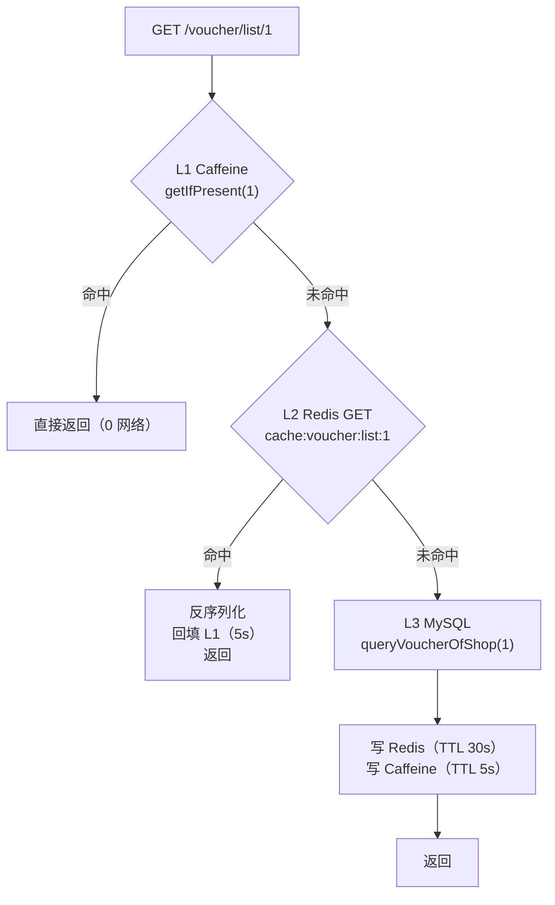

先把这条流程里的几个词变成大白话：

| 词            | 大白话                                                                       |
| ------------ | ------------------------------------------------------------------------- |
| L1 / L2 / L3 | 第 1/2/3 层缓存：L1 = Caffeine（**本应用的内存**）、L2 = Redis（独立服务）、L3 = MySQL（最底层数据库） |
| 命中 / 未命中     | 在缓存里**找到了 / 没找到**（没找到也包括「已过期」）                                            |
| 回源           | 缓存里没有，只能去最底层数据库查真数据                                                       |
| 回填           | 查到数据后写回缓存，让下次请求能直接命中                                                      |
| 序列化 / 反序列化   | Java 对象 → 字符串（存 Redis 用） / 字符串 → Java 对象（从 Redis 读出来后还原）                  |
| 0 网络         | 数据就在本机内存，不需要和 Redis、MySQL 通信                                              |

然后跟着一次真实请求走一遍（shopId=1；两层缓存都是空的，这张券只在 MySQL 里）：

1. **查 L1：翻本机内存**。`localVoucherCache.getIfPresent(1)` —— 拿 shopId=1 当钥匙，去内存里那张表翻有没有 1 号店的券列表。结果：**没翻到**，得到 `local = null`；

2. **L1 命中判断**。代码 `if (local != null) return ...` —— 如果第 1 步翻到了，这里就直接把券列表返回、方法结束，Redis 和 MySQL 一次都不会被访问。本次没命中，继续；

3. **查 L2：让 Redis 帮忙找**。`GET cache:voucher:list:1` —— Redis 里存的是**字符串**（不是 Java 对象），key 是 `cache:voucher:list:{shopId}`。结果：**没有这个 key**，`cached = null`，继续；

4. **L2 命中判断**。如果 Redis 里有：先把 JSON 字符串变回 `List<Voucher>`（**反序列化**），再把它塞回本机内存（**回填 L1**，这样下一个请求在第 1 步就能命中），然后返回。本次没命中，继续；

5. **查 L3：回源 MySQL**。`getBaseMapper().queryVoucherOfShop(1)` 执行下面的 SQL，拿到真数据 `vouchers = [券 V1]`：
   
   ```sql
   SELECT v.id, v.shop_id, v.title, v.sub_title, v.rules, v.pay_value,
          v.actual_value, v.type, sv.stock, sv.begin_time, sv.end_time
   FROM tb_voucher v
   LEFT JOIN tb_seckill_voucher sv ON v.id = sv.voucher_id
   WHERE v.shop_id = 1 AND v.status = 1
   ```

6. **把结果写回两层缓存，然后返回**（对应 4.2 补充里的 ⑩⑪）：
   
   ```java
   // 写 L2：Java 对象 → JSON 字符串，SETEX 带 30 秒过期
   stringRedisTemplate.opsForValue().set(
           "cache:voucher:list:1",
           JSONUtil.toJsonStr(vouchers),            // '[{"id":10,"title":"100元代金券",...}]'
           RedisConstants.CACHE_VOUCHER_LIST_TTL,   // 30
           TimeUnit.SECONDS);                       // Redis 实际执行：SETEX cache:voucher:list:1 30 '<json>'
   
   // 写 L1：同一个 Java 对象直接放进进程内存（不序列化），5 秒后自动过期
   localVoucherCache.put(1, vouchers);
   
   return Result.ok(vouchers);                      // Spring 序列化为 JSON 响应给前端
   ```
   
   - 写 L2 前要 `JSONUtil.toJsonStr`：Redis 只能存字符串/字节，Java 对象不能直接塞；写 L1 不用转：Caffeine 存的就是对象本身；
   
   - 这次请求到这里结束，但它把数据「热」在了两层缓存里：0~5 秒内再来的请求在第 1 步命中 L1，5~30 秒的请求在第 3 步命中 L2（下一个表给对照）。

第一次请求前后各层状态一览：

| 层                               | 执行前        | 执行后                    |
| ------------------------------- | ---------- | ---------------------- |
| L1 Caffeine                     | 无 shopId=1 | `List<Voucher>`，5 秒后过期 |
| L2 Redis `cache:voucher:list:1` | 不存在        | JSON 列表，TTL 30 秒       |
| L3 MySQL                        | 事实来源       | 不变                     |

上面那张表是怎么一步步来的（假设 1 号店有一张券，三层全未命中）：

```text
执行前
  L1 Caffeine : {}                                  （空）
  L2 Redis    : 没有 cache:voucher:list:1
  MySQL       : tb_voucher 里有 shop_id=1 的券
        │
        │  第 1 步  getIfPresent(1)             → null（L1 未命中）
        │  第 3 步  GET cache:voucher:list:1     → nil（L2 未命中）
        │  第 5 步  SELECT ...                   → [券 V1]（回源成功）
        ▼
  第 6 步  写 L2：SETEX cache:voucher:list:1 30 '<json>'
           写 L1：put(1, [券 V1])
        │
        ▼
执行后（这次请求已把结果返回给前端）
  L1 Caffeine : {1 → [券 V1]}                       5 秒内有效
  L2 Redis    : cache:voucher:list:1 = JSON 列表     TTL 30 秒
  MySQL       : 不变
```

之后再来请求的三种情况：

| 距第一次请求   | L1  | L2  | 走哪条路                   |
| -------- | --- | --- | ---------------------- |
| 0 ~ 5 秒  | 有   | 有   | 第 2 步：L1 命中，0 网络       |
| 5 ~ 30 秒 | 已过期 | 有   | 第 4 步：L2 命中，回填 L1 后返回  |
| 30 秒后    | 已过期 | 已过期 | 第 6 步：重新回源 MySQL 并回填两层 |

**失效路径**（新增秒杀券 `addSeckillVoucher`，`VoucherServiceImpl.java:143-157`）：

1. 写 MySQL：`save(voucher)`（tb_voucher）+ `seckillVoucherService.save(...)`（tb_seckill_voucher）；
2. 写 Redis：`SET seckill:stock:{id}` 预热秒杀库存（业务数据，不是缓存）；
3. `localVoucherCache.invalidate(shopId)` 删本实例 L1；
4. `DEL cache:voucher:list:{shopId}` 删 L2；
5. 下一次读取按第 1 步重新回源。

### 3. 库存为什么不进缓存（详情页的关键设计）

秒杀券详情页（`querySeckillVoucherDetail`）同样是 Caffeine 5s → Redis 30s → MySQL，但 DTO 里的字段是分级的：

| 字段                       | 是否进缓存   | 原因                        |
| ------------------------ | ------- | ------------------------- |
| 标题 / 副标题 / 规则 / 开始结束时间 等 | 进（两级都进） | 几乎不变，允许 5 秒旧值             |
| `stock`                  | **不进**  | 高频变化，秒杀本身靠库存判断，5 秒旧值会误导用户 |

每次命中缓存后都实时补库存：

```java
/** 库存不进缓存：每次从 Redis 资格库存实时读取，读不到就保留 MySQL 快照。 */
private void fillLiveStock(SeckillVoucherDetailDTO dto) {
    String liveStock = stringRedisTemplate.opsForValue().get(SECKILL_STOCK_KEY + dto.getId());
    if (liveStock != null) {
        dto.setStock(Integer.valueOf(liveStock));
    }
}
```

即：**缓存只放「变了也没关系」的字段，敏感字段每次实时读**——这是两级缓存设计里比「加一层」更重要的原则。

### 4. 核心代码

> 下面代码里的英文单词（`Voucher`、`Cache`、`getIfPresent`…）看不懂时，见文末「附录 A：代码英文 / 术语速查」。

**4.1 两个 Caffeine 缓存实例**（`VoucherServiceImpl.java:42-52`）

```java
/** 本地热点券列表缓存：key = shopId(Long)，value = 该店铺的券列表 List<Voucher>。
 *  TTL 5 秒，降低单热点 Key 对 Redis 的访问压力。 
 用户点进店铺页，展示“这家店有哪些券”。
 */
private final Cache<Long, List<Voucher>> localVoucherCache = Caffeine.newBuilder()
        .maximumSize(1000)                      // 最多缓存 1000 个店铺的列表，防内存膨胀
        .expireAfterWrite(5, TimeUnit.SECONDS)  // 每个 key 写入/覆盖后 5 秒过期
        .build();

/** 秒杀券详情页本地缓存：key = voucherId(Long)，value = 详情对象 SeckillVoucherDetailDTO。
 *  TTL 5 秒，抗“秒杀详情”这个极热 Key。 
 用户点进某张秒杀券的详情页，展示“这张券的库存、开始时间、规则”。
 */
private final Cache<Long, SeckillVoucherDetailDTO> localSeckillDetailCache = Caffeine.newBuilder()
        .maximumSize(1000)
        .expireAfterWrite(5, TimeUnit.SECONDS)
        .build();
```

**4.1 补充（一）：两个缓存里到底存的是什么**

一句话：**Caffeine 就是一个「key → value」的进程内 Map**，两个缓存的区别只有 key 和 value 的类型：

| 缓存                        | key 是什么                | value 是什么                           | 对应接口                               |
| ------------------------- | ---------------------- | ----------------------------------- | ---------------------------------- |
| `localVoucherCache`       | `Long shopId`（店铺 ID）   | `List<Voucher>`（该店铺的券列表）            | 查店铺券列表 `queryVoucherOfShop`        |
| `localSeckillDetailCache` | `Long voucherId`（券 ID） | `SeckillVoucherDetailDTO`（一张券的详情对象） | 查秒杀券详情 `querySeckillVoucherDetail` |

放进内存后实际长这样（都是 Java 对象，没有序列化）：

```text
localVoucherCache
  key(shopId)   →  value(List<Voucher>)
  1L            →  [ Voucher{ id=10, shopId=1, title="100元代金券", subTitle="周一至周日均可使用",
                              rules="全场通用...", payValue=8000, actualValue=10000,
                              type=1, status=1, stock=95,
                              beginTime=2022-10-09T00:00, endTime=2022-10-10T20:00 },
                     Voucher{ id=11, shopId=1, title="80元代金券", ... } ]
  2L            →  [ Voucher{ id=20, shopId=2, ... } ]

localSeckillDetailCache
  key(voucherId) →  value(SeckillVoucherDetailDTO)
  10L            →  SeckillVoucherDetailDTO{ id=10, shopId=1, title="100元代金券",
                                              subTitle=..., rules=..., payValue=8000, actualValue=10000,
                                              type=1, status=1, stock=95,
                                              beginTime=2022-10-09T00:00, endTime=2022-10-10T20:00 }
```

两个 value 类型从哪来：

- `List<Voucher>`：就是 `VoucherMapper.xml` 那条 SQL（`tb_voucher LEFT JOIN tb_seckill_voucher`）的查询结果，一行券对应一个 `Voucher` 对象，多张券组成 List；
- `SeckillVoucherDetailDTO`：把 `Voucher` + `SeckillVoucher` 两个实体用 `BeanUtil.copyProperties` 拼出来的详情对象（`VoucherServiceImpl.java:118-120`），专门给详情页用。

`Voucher` 对象的字段（`Voucher.java`）：

| 字段                                                                                                                              | 类型                                      | 来源                                                                                  | 说明                |
| ------------------------------------------------------------------------------------------------------------------------------- | --------------------------------------- | ----------------------------------------------------------------------------------- | ----------------- |
| `id` / `shopId` / `title` / `subTitle` / `rules` / `payValue` / `actualValue` / `type` / `status` / `createTime` / `updateTime` | Long / String / Integer / LocalDateTime | `tb_voucher` 表字段                                                                    | 券基本信息             |
| `stock` / `beginTime` / `endTime`                                                                                               | Integer / LocalDateTime                 | `tb_seckill_voucher` 表字段（`@TableField(exist = false)`：不属于 `tb_voucher` 列，由 JOIN 带出） | 秒杀信息；普通券这三列为 null |

**顺手弄清：普通券 vs 秒杀券的区别**

`tb_voucher.type`：`0 = 普通券，1 = 秒杀券`（默认 0，`hmdp.sql:250`）。分类的作用不在字段本身，而在「**多一张表、多一条链路**」：

```text
普通券（type=0）                      秒杀券（type=1）
tb_voucher 里有一行                   tb_voucher 里有一行
tb_seckill_voucher 里没有行           tb_seckill_voucher 里多一行（一对一）
                                      存 stock / begin_time / end_time
列表查询时 stock/begin/end = null     这三个字段由 LEFT JOIN 带出，有值
没有 Redis 库存 Key                   建券时写 seckill:stock:{id}
不走秒杀链路                          走秒杀链路：Lua 预扣 → MQ 异步下单 →
                                      一人一单 → 超时关单 → 对账补偿
```

代码里判断「是不是秒杀券」主要看两件事，而不是读 `type` 字段：

- `tb_seckill_voucher` 有没有对应行——详情接口没有就返回「该优惠券不是秒杀券」（`VoucherServiceImpl.java:114-117`）；
- Redis 里 `seckill:stock:{id}` 是否存在——不存在时 Lua 返回 3（库存未初始化）。

`type` 字段主要给前端区分展示（「立即抢购」还是「立即领取」用）；后端的分岔靠「建券时走的哪个接口」：`POST /voucher/seckill` → `addSeckillVoucher`（建秒杀券 + 初始化库存），`POST /voucher` → `addVoucher`（只建普通券）。

注意：本地缓存里存的是**对象引用**，`LocalDateTime` 也是对象、不是字符串；只有写进 Redis 时才通过 `JSONUtil.toJsonStr` 变成字符串。

**4.1 补充（一·续）：券和店铺是什么关系（为什么两个缓存用不同的 key）**

一张券**属于某个店铺**，不能跨店使用——这个关系由 `tb_voucher.shop_id` 记录：

```text
券 10：属于店铺 1，标题“100元代金券”
券 11：属于店铺 1，标题“50元秒杀券”
券 12：属于店铺 2，标题“200元代金券”

→ 店铺 1 的券只能在店铺 1 用；店铺 2 的券只能在店铺 2 用
```

用户的使用路径，决定了两次查询查的是两个维度：

```text
用户点进店铺 1
   │
   ▼
前端请求 GET /voucher/list/1
   │  后端查“店铺 1 有哪些券”
   ▼
返回 [券10, 券11]
   │
   ▼
列表缓存按 shopId：cache:voucher:list:1 = [券10, 券11]
                  cache:voucher:list:2 = [券12]

用户选中券 10，点秒杀
   │
   ▼
请求 POST /voucher-order/seckill/10
   │  后端扣“券 10 的库存”
   ▼
库存按 voucherId：seckill:stock:10 = "100"
                 seckill:stock:11 = "200"
```

- **列表按 shopId**：入口是店铺（用户先点店铺才看到券），查的是「一个店铺的券集合」；
- **库存按 voucherId**：入口是券（抢的是某一张具体的券），库存是券自己的属性；
- 一句话：**两个维度，对应两个场景**。

两个容易说错的点：

1. 券 → 店铺的绑定只存在 `tb_voucher.shop_id` 一处。订单表 `tb_voucher_order` 里没有 shop_id（列只有 id、user_id、voucher_id、pay_type、status、时间字段），「只能在对应店铺用」是由券自身的归属决定的，代码里并没有额外的跨店校验；
2. 本项目真正实现的「领券」只有**秒杀下单**这一条路径；普通券（type=0）没有独立的领取/核销接口。所以流程里「用户领了券 10」在代码层面 = 「对券 10 秒杀下单成功」。

**4.1 补充（二）：构建参数怎么读**

```java
Caffeine.newBuilder()                          // 拿到“配置器”
        .maximumSize(1000)                     // 最多存 1000 个 key；放第 1001 个时按 W-TinyLFU 淘汰旧 key
        .expireAfterWrite(5, TimeUnit.SECONDS) // 距“最后一次写入/覆盖”满 5 秒自动过期（读不会续命）
        .build();                              // 生成 Cache 实例（≈ 一个线程安全的 Map）
```

| 构建方法               | 含义            | 本项目取值 | 不设置的后果        |
| ------------------ | ------------- | ----- | ------------- |
| `maximumSize`      | 最多多少个 key     | 1000  | key 基数大时内存被撑爆 |
| `expireAfterWrite` | 写入后多久过期（读不续期） | 5 秒   | 多实例不一致窗口无限大   |
| `build`            | 生成 Cache 实例   | ——    | ——            |

另一个常见配置是 `expireAfterAccess`（最后一次**访问**后多久过期，读会续期）。本项目选 `expireAfterWrite`：**不管读多少次，写入后 5 秒必定刷新**，才能把多实例不一致窗口锁死在 5 秒；`expireAfterAccess` 在高频读下可能永远不刷新，不适合做一致性收敛。

**4.2 券列表读路径：三层顺序查找**（`VoucherServiceImpl.java:54-78`）

```java
@Override
public Result queryVoucherOfShop(Long shopId) {
    // L1：本进程内存
    List<Voucher> local = localVoucherCache.getIfPresent(shopId);
    if (local != null) {
        return Result.ok(local);                    // 命中直接返回，不走网络
    }

    // L2：Redis
    String redisKey = RedisConstants.CACHE_VOUCHER_LIST_KEY + shopId;   // cache:voucher:list:1
    String cached = stringRedisTemplate.opsForValue().get(redisKey);
    if (cached != null && !cached.isEmpty()) {
        List<Voucher> vouchers = JSONUtil.toList(cached, Voucher.class);
        localVoucherCache.put(shopId, vouchers);    // 回填 L1
        return Result.ok(vouchers);
    }

    // L3：MySQL，回填 L2 + L1
    List<Voucher> vouchers = getBaseMapper().queryVoucherOfShop(shopId);
    stringRedisTemplate.opsForValue().set(
            redisKey,
            JSONUtil.toJsonStr(vouchers),
            RedisConstants.CACHE_VOUCHER_LIST_TTL,  // Redis 30 秒
            TimeUnit.SECONDS
    );
    localVoucherCache.put(shopId, vouchers);        // Caffeine 5 秒
    return Result.ok(vouchers);
}
```

**4.2 补充：逐行拆解（每个 API 在干什么）**

```java
@Override
public Result queryVoucherOfShop(Long shopId) {      // ① 入参 shopId，例：1

    List<Voucher> local = localVoucherCache.getIfPresent(shopId);
    // ② getIfPresent = “存在才取”：
    //    key 在缓存且未过期 → 返回 List<Voucher>
    //    key 不在 / 已过期 / 被淘汰 → 返回 null（不报错、也不会去查库）
    //    类似 Map.get()，区别是它会正确处理“过期”和“容量淘汰”

    if (local != null) {
        return Result.ok(local);                     // ③ L1 命中：包装成统一响应体直接返回
    }

    String redisKey = RedisConstants.CACHE_VOUCHER_LIST_KEY + shopId;
    // ④ 拼 Redis Key：常量 "cache:voucher:list:" + 1 → "cache:voucher:list:1"

    String cached = stringRedisTemplate.opsForValue().get(redisKey);
    // ⑤ Redis GET：返回 JSON 字符串或 null；这就是 L2

    if (cached != null && !cached.isEmpty()) {       // ⑥ null=没缓存；空串=防御性判断（正常逻辑不会写入空串）
        List<Voucher> vouchers = JSONUtil.toList(cached, Voucher.class);
        // ⑦ JSON 数组字符串 → List<Voucher> 对象
        localVoucherCache.put(shopId, vouchers);
        // ⑧ 回填 L1：下次同实例请求在 ② 命中；put 对已存在 key 是覆盖
        return Result.ok(vouchers);
    }

    List<Voucher> vouchers = getBaseMapper().queryVoucherOfShop(shopId);
    // ⑨ L3 回源 MySQL：getBaseMapper() 是 MyBatis-Plus 提供的“当前 Service 对应的 Mapper”，
    //    这个方法名映射到 VoucherMapper.xml 里的 <select id="queryVoucherOfShop">

    stringRedisTemplate.opsForValue().set(
            redisKey,                                // cache:voucher:list:1
            JSONUtil.toJsonStr(vouchers),            // List → JSON 字符串
            RedisConstants.CACHE_VOUCHER_LIST_TTL,   // 30
            TimeUnit.SECONDS                         // 命令：SETEX cache:voucher:list:1 30 '<json>'
    );
    // ⑩ 写 L2（带 TTL 30 秒）

    localVoucherCache.put(shopId, vouchers);         // ⑪ 写 L1（5 秒后过期）
    return Result.ok(vouchers);
}
```

**API 速查表**：

| 代码                                  | 属于           | 作用                      | 返回            |
| ----------------------------------- | ------------ | ----------------------- | ------------- |
| `localVoucherCache.getIfPresent(k)` | Caffeine     | 只查不加载                   | 命中=值，未命中=null |
| `localVoucherCache.put(k, v)`       | Caffeine     | 写入/覆盖，开始计 5 秒过期         | ——            |
| `localVoucherCache.invalidate(k)`   | Caffeine     | 删本实例这一条                 | ——            |
| `opsForValue().get(k)`              | Redis        | GET                     | String 或 null |
| `opsForValue().set(k, v, t, unit)`  | Redis        | SETEX：写入并带过期时间          | ——            |
| `stringRedisTemplate.delete(k)`     | Redis        | DEL                     | Boolean       |
| `JSONUtil.toList(json, Class)`      | Hutool       | JSON 数组 → List          | List&lt;T&gt; |
| `JSONUtil.toJsonStr(obj)`           | Hutool       | 对象 → JSON 字符串           | String        |
| `getBaseMapper()`                   | MyBatis-Plus | 拿到当前 Service 对应的 Mapper | Mapper        |

两个容易混的 Caffeine API：

```java
getIfPresent(key)                 // 只查，未命中返回 null —— 本项目用这个（加载链是 Redis→MySQL 两层，手动写更清楚）
get(key, k -> 加载函数)            // 未命中就调函数加载并自动回填 —— 本项目没用
```

**4.3 写失效：先库后删**（`VoucherServiceImpl.java:143-157` 全文，①~⑤ 为实际执行顺序）

```java
@Override
@Transactional(rollbackFor = Exception.class)
public void addSeckillVoucher(Voucher voucher) {
    // ① 写 MySQL：保存券（tb_voucher）
    save(voucher);
    // ② 写 MySQL：保存秒杀信息（tb_seckill_voucher：库存、起止时间）
    SeckillVoucher seckillVoucher = new SeckillVoucher();
    seckillVoucher.setVoucherId(voucher.getId());
    seckillVoucher.setStock(voucher.getStock());
    seckillVoucher.setBeginTime(voucher.getBeginTime());
    seckillVoucher.setEndTime(voucher.getEndTime());
    seckillVoucherService.save(seckillVoucher);
    // ③ 写 Redis：预热秒杀库存（业务数据，不是缓存）
    stringRedisTemplate.opsForValue().set(SECKILL_STOCK_KEY + voucher.getId(), voucher.getStock().toString());
    // ④ 删 L1：只删本实例的 Caffeine
    localVoucherCache.invalidate(voucher.getShopId());
    // ⑤ 删 L2：删 Redis 缓存
    stringRedisTemplate.delete(RedisConstants.CACHE_VOUCHER_LIST_KEY + voucher.getShopId());
}
```

顺序：**① 写 MySQL → ② 写 MySQL → ③ 写 Redis 库存 → ④ 删 L1 → ⑤ 删 L2**；「先库后删」= 缓存删除一定发生在数据库写入之后。

**4.3 补充：五个动作分别操作哪个存储（MySQL / Redis / Caffeine）**

先认识这次操作涉及的三个存储：

| 存储       | 是什么                | 存什么                                       | 特点               |
| -------- | ------------------ | ----------------------------------------- | ---------------- |
| MySQL    | 外部关系数据库            | 券本体、秒杀信息（行 = 记录，列 = 字段）                   | 最终数据源，永久保存，有事务回滚 |
| Redis    | 外部 key-value 数据库   | 秒杀库存（String）、券列表缓存（String JSON）           | 快；**没有回滚**       |
| Caffeine | 本应用 JVM 内存里的一张 Map | 店铺券列表（key=shopId → value=List\<Voucher\>） | 最快；只在本机有效        |

然后逐行看（①~⑤）：

**① `save(voucher)` → 写 MySQL 表 `tb_voucher`**

```text
tb_voucher（一行 = 一张券）：
id | shop_id | title       | type | status | ...
10 | 1       | 100元代金券  | 1    | 1      | ...
```

**② `seckillVoucherService.save(seckillVoucher)` → 写 MySQL 表 `tb_seckill_voucher`**

```text
tb_seckill_voucher（一行 = 一张秒杀券的库存/活动时间，靠 voucher_id 与①一对一）：
voucher_id | stock | begin_time | end_time
10         | 100   | ...        | ...
```

① 和 ② 在同一个事务里（方法上有 `@Transactional`）：要么都成功，要么一起回滚。

**③ `set(SECKILL_STOCK_KEY + id, stock.toString())` → 写 Redis String**

```text
key   = "seckill:stock:" + 10 = seckill:stock:10
value = 100.toString()        = "100"
类型  = String（普通字符串，不是 Hash / Set）

写入后 Redis 里多一条：
seckill:stock:10 → "100"
```

- 大白话：把库存从 MySQL 复制一份到 Redis（预热），秒杀时直接扣 Redis、不打 MySQL；
- 这是业务数据、不是缓存；Redis 没有「数字类型」，value 存的是数字的字符串形式。

**④ `localVoucherCache.invalidate(voucher.getShopId())` → 操作 Caffeine（本机 Map）**

```text
localVoucherCache = JVM 内存里的 Map：key = shopId，value = 该店铺券列表

删之前：                  删之后：
1 → [券10, 券11]    →     （key=1 这条没了）
2 → [券12]               2 → [券12]
```

- `invalidate(1)` = 把 key=1 这条从本机 Map 里删掉；key 不存在也不会报错；
- 只影响本实例，其他机器的 Caffeine 里可能还有旧列表（靠 5 秒 TTL 自己收敛）。

**⑤ `delete(CACHE_VOUCHER_LIST_KEY + shopId)` → 写 Redis String（内容是 JSON）**

```text
key = "cache:voucher:list:" + 1 = cache:voucher:list:1

删之前 value = '[{"id":10,"title":"100元代金券"},...]'   （String，内容是 JSON）
delete 之后  = 这个 key 整个消失
```

- `delete` 不关心 value 是什么结构，直接把 key 删掉；
- 目的：下次读店铺 1 的券列表时缓存未命中 → 重新查 MySQL → 拿到包含新券的最新列表再写回缓存。

五个动作全部执行完后的「现场」：

```text
MySQL
  tb_voucher:         (id=10, shop_id=1, title="100元代金券", type=1, status=1)
  tb_seckill_voucher: (voucher_id=10, stock=100, begin_time=..., end_time=...)

Redis
  seckill:stock:10      = "100"     ← ③ 写入
  cache:voucher:list:1  = 不存在     ← ⑤ 删掉

Caffeine（本 JVM）
  key=1 → 已被 ④ 删掉
```

三个容易被追问的点（实现边界）：

1. **Redis / Caffeine 不在 MySQL 事务里**：①② 失败会一起回滚；但若 ③④⑤ 之后抛异常，③ 写进 Redis 的库存不会自动撤销，只能靠重试/补偿（MySQL 与 Redis 之间没有事务）；
2. **④⑤ 发生在 MySQL 提交之前**（它们还在 `@Transactional` 方法体内）：并发下存在「删完缓存、别人趁新券未提交把旧列表写回缓存」的小窗口；严谨的 Cache Aside 是事务提交后再删（或延迟双删）；
3. **`seckill:stock:10` 没有 TTL**：活动结束后不会自动消失，需要人工或定时任务清理。

### 5. 为什么是 Caffeine + Redis 两级（选型对比）

| 方案                   | 决定性因素                           | 判定    |
| -------------------- | ------------------------------- | ----- |
| 只用 MySQL             | 热点列表反复回源，数据库压力大                 | 淘汰    |
| 只用本地 Caffeine        | 快，但多实例不共享、容量有限、重启即失效            | 淘汰    |
| 只用 Redis             | 跨实例共享，但极热 Key 仍要每次走网络           | 留作 L2 |
| **Caffeine + Redis** | L1 抗单实例热读，L2 保跨实例共享，短 TTL 收敛不一致 | 采用    |

**本地缓存库选型：Caffeine vs Guava Cache（为什么不用 Guava）**

Guava Cache 也能做一级缓存——两者其实是"同一个作者、一前一后"的关系（Guava Cache 作者 Ben Manes 后来写了 Caffeine），API 很像、迁移成本低。但对比后选 Caffeine：

| 维度 | Caffeine（选） | Guava Cache |
| --- | --- | --- |
| 淘汰算法 | W-TinyLFU：window + 频次准入，抗扫描、命中率高 | 分段 LRU：只看最近访问，扫描型流量容易把热数据冲掉（见第 6 节） |
| 并发性能 | 无锁读 + 写缓冲 + 异步维护，读多写少吞吐更高 | 分段锁，并发升高后性能落后 |
| 内存开销 | 节点结构紧凑 + Count-Min Sketch 近似计数，同样容量更省内存 | 精确计数与结构开销更大 |
| 维护状态 | 持续活跃 | 基本冻结，Guava 官方推荐迁移到 Caffeine |
| 生态支持 | Spring Boot 原生支持，版本由 Boot 统一管理（`com.github.ben-manes.caffeine:caffeine`） | Spring Framework 5 / Boot 2 起已移除 GuavaCacheManager 自动配置 |

一句话：Guava 的短板是"算法老（LRU 不抗扫描）+ 组件停更 + 生态退出"；而我们的场景恰恰是热点集中、还叠加爬虫扫描流量，Caffeine 的 W-TinyLFU 正好打这个痛点，所以选 Caffeine。

### 6. Caffeine 的淘汰算法：W-TinyLFU（面试常问）

一句话本质：**缓存放满了要踢人时，不是问"谁最久没用"（LRU），也不是问"谁用得最少"（LFU），而是让"新来的"和"马上要被踢的"当场 PK 访问次数——谁次数多谁留下。**

**三个区 = 三种待遇：**

| 区 | 谁在里面 | 被淘汰的概率 |
| --- | --- | --- |
| window（窗口区） | 刚进来的新数据 | 最高——"试用期" |
| probation（试用区） | 从窗口 PK 赢进来的、从保护区降下来的 | 中等——正在考察 |
| protected（保护区） | 在 probation 里被再次访问过的 | 最低——确认是热数据 |

**一个 key 的完整一生：**

1. **新数据先进 window**：第一次查券 A → 回填进 window，速记本给它记上"访问 1 次"；
2. **window 满了就 PK**：把 window 里最久没用的挤出来当"候选人"，和主区 probation 里最冷的"受害者"比访问次数——候选人次数更高才准进主区，否则直接扔掉；
   - 抗扫描就发生在这里：爬虫顺序扫 10 万条数据（各访问 1 次）在 PK 里全输；真热 key（访问 100 次）赢进主区；
3. **probation 里被再次访问 → 晋升 protected**（保护区），从此基本不会被淘汰；
4. **protected 满了 → 把最久没用的降级回 probation**；再没人访问就成为下次 PK 的受害者，最终被踢出——不存在"永远赖着不走"的数据（这是它优于纯 LFU 的地方）。

**"比次数"用的速记本：Count-Min Sketch：**

- 不可能给每个 key 存精确计数器（内存扛不住），所以用一个很小的位图 + 几个哈希函数**近似**记录访问次数，允许一点误差；
- **计数会老化**：总访问量达到容量 10 倍时全体计数减半——三个月前热、现在没人用的 key 历史优势被抹平，新热 key 才进得来（解决 LFU 的"历史包袱"）。

**window 的大小还会自适应**：Caffeine 盯着命中率做"爬山试探"——调窗口大小，命中率变好就继续、变差就回调。窗口太小，新 key 没机会攒访问记录；太大，又退化成纯 LRU。

**对照记：**

| 算法 | 看什么 | 致命伤 | Caffeine 的对策 |
| --- | --- | --- | --- |
| LRU | 最近用没用 | 怕扫描（扫一遍全冲走） | window + 频次 PK：扫描数据进不了主区 |
| LFU | 用得多少 | 怕历史包袱 + 计数器费内存 | Count-Min Sketch 近似 + 计数老化减半 |
| **W-TinyLFU** | 两者都要 | —— | window（管新）+ 准入 PK（管质量）+ 老化（管变化） |

**落到项目**：`maximumSize(1000)` 决定"满了淘汰谁"（W-TinyLFU 负责）；`expireAfterWrite(5, TimeUnit.SECONDS)` 是 TTL，到期直接失效、不参与 PK——两者是两件事。

> 别背成"把 HashMap 分成三块、三个区都按命中率自适应"：存储（ConcurrentHashMap 索引）和淘汰（三条访问顺序队列）是两套结构；按命中率自适应的是 **window 区**，protected / probation 是相对固定的 SLRU 分割。

### 7. 边界（面试追问）

| 追问                    | 回答                                                                                  |
| --------------------- | ----------------------------------------------------------------------------------- |
| 多实例下 L1 不一致怎么办？       | 本实例写后主动 `invalidate` 自己；其他实例靠 5 秒 TTL 收敛，**未实现跨实例失效广播**，更严格可上 Redis Pub/Sub 或 MQ 广播 |
| 为什么 TTL 是 5 秒 + 30 秒？ | 5 秒把多实例不一致窗口压到可接受范围；30 秒兜住「删缓存失败」等异常，避免缓存长期脏                                        |
| 库存为什么不做缓存？            | 高频变化且直接影响秒杀，缓存旧库存会误导；所有返回路径都用 `fillLiveStock` 实时读 `seckill:stock:{id}`              |
| 本地缓存会不会打爆内存？          | `maximumSize(1000)` + 5 秒过期，Key 是 shopId / voucherId，量级可控；Key 基数更大时要按热 Key 评估或换分片   |
| 查不到数据会怎样？             | 返回空列表并写入两级缓存（Redis 存 `[]`，TTL 30 秒），相同 shopId 直接命中，也顺带防穿透                           |
| 新增普通券为什么没失效？          | `addVoucher` 直接 `save`，未删缓存，依赖 30 秒 TTL 自然过期；生产应把写操作统一收口到失效逻辑（实现边界，不夸大）             |
| 这是强一致吗？               | 不是。允许 5~30 秒旧值，属于最终一致；库存等强一致数据被排除在缓存之外                                              |
| 有命中率 / 性能数据吗？         | 没有独立的压测对比数据，简历只写「减少访问压力」，不写具体百分比                                                    |

---

## 附录 A：代码英文 / 术语速查

代码里的类名、方法名都是英文单词（或缩写）拼出来的，看穿它们只需要一张对照表。

**业务名词**

| 英文                     | 中文                      | 出现位置                                               |
| ---------------------- | ----------------------- | -------------------------------------------------- |
| Voucher                | 优惠券（代金券）                | Voucher、VoucherOrder、SeckillVoucher、VoucherMapper… |
| Seckill                | 秒杀（second + kill 的合成说法） | seckillVoucher、`seckill:stock:`                    |
| Shop                   | 店铺                      | ShopController、shopId                              |
| Order                  | 订单                      | VoucherOrder、orderId                               |
| Stock                  | 库存                      | stock、`seckill:stock:{id}`                         |
| Status                 | 状态                      | order.status（1 待支付 / 2 已支付 / 4 已取消…）               |
| Title / SubTitle       | 标题 / 副标题（sub = 副、次一级）   | voucher.title、subTitle                             |
| Rules                  | 规则（使用说明）                | voucher.rules                                      |
| PayValue / ActualValue | 支付金额 / 抵扣金额             | payValue=8000（付 80 元）、actualValue=10000（抵 100 元）   |
| BeginTime / EndTime    | 开始时间 / 结束时间             | 秒杀活动起止                                             |
| xxxId                  | xxx 的编号                 | shopId、userId、voucherId、orderId                    |
| Reservation            | 预扣（先占下的记录）              | `seckill:reservation:`                             |
| Reconcile              | 对账                      | SeckillReconciliationTask                          |
| Compensation           | 补偿                      | seckill_rollback.lua（发送失败补偿）                       |
| Idempotent             | 幂等（重复执行结果不变）            | 幂等消费、幂等释放                                          |
| Callback               | 回调（对方反过来通知你）            | payCallback                                        |
| Release                | 释放（还回去）                 | seckill_rollback.lua（关单/对账释放，与补偿共用）                |
| Retry                  | 重试                      | retryCount、重投                                      |
| Timeout                | 超时                      | closeTimeoutOrder                                  |

**Java 类型 / 结构**

| 英文            | 中文                                     | 例子                                     |
| ------------- | -------------------------------------- | -------------------------------------- |
| Long          | 长整型数字（项目里的 ID 都用它）                     | Long shopId = 1L                       |
| Integer       | 整数                                     | Integer stock = 95                     |
| String        | 字符串                                    | "100元代金券"                              |
| Boolean       | 布尔值                                    | true / false                           |
| List<T>       | 列表（一队同类型数据）                            | List&lt;Voucher&gt; = [券1, 券2]         |
| Cache<K,V>    | 缓存（K → V 的表）                           | Cache&lt;Long, List&lt;Voucher&gt;&gt; |
| LocalDateTime | 本地日期时间                                 | 2022-10-09T00:00                       |
| DTO           | Data Transfer Object，数据传输对象（为某用途拼的数据包） | SeckillVoucherDetailDTO                |
| Bean          | Java 对象（Spring 的习惯叫法）                  | BeanUtil                               |
| Util          | Utility，工具类                            | JSONUtil、BeanUtil                      |
| Template      | 模板（封装好常用操作的工具）                         | StringRedisTemplate                    |

**方法 / 动词**

| 英文                    | 中文                         | 例子                                     |
| --------------------- | -------------------------- | -------------------------------------- |
| get / set             | 取 / 设                      | getIfPresent、setStock                  |
| put                   | 放（写入）                      | localVoucherCache.put(1, vouchers)     |
| delete                | 删除                         | stringRedisTemplate.delete(key)        |
| invalidate            | 作废（把缓存里某条删掉）               | localVoucherCache.invalidate(shopId)   |
| query / save / update | 查询 / 保存 / 更新               | queryVoucherOfShop、save、update         |
| increment             | 自增                         | retryCount +1                          |
| copyProperties        | 复制属性（对象间拷贝字段）              | BeanUtil.copyProperties                |
| execute               | 执行                         | execute(SCRIPT, …)                     |
| build                 | 构建（生成对象）                   | Caffeine.newBuilder().build()          |
| toJsonStr             | to JSON string，转成 JSON 字符串 | JSONUtil.toJsonStr(vouchers)           |
| toList / toBean       | JSON → List / 对象           | JSONUtil.toList(cached, Voucher.class) |

**Caffeine / Redis / 性能缩写**

| 英文                | 中文                                  |
| ----------------- | ----------------------------------- |
| getIfPresent      | 缓存里「存在才取」，没有返回 null                 |
| maximumSize       | 最大容量（最多存几个 key）                     |
| expireAfterWrite  | 写入后多久过期（读不续期）                       |
| expireAfterAccess | 最后一次访问后多久过期（读会续期）                   |
| opsForValue       | Redis「字符串值」的操作入口（get / set）         |
| TTL               | Time To Live，存活时间                   |
| L1 / L2 / L3      | 第 1/2/3 层缓存                         |
| QPS               | Queries Per Second，每秒请求数            |
| AOP               | Aspect Oriented Programming，面向切面编程  |
| MQ                | Message Queue，消息队列                  |
| LRU / LFU         | 最近最少使用 / 最不经常使用（两种缓存淘汰算法）           |
| W-TinyLFU         | Caffeine 使用的淘汰算法                    |
| Lua / EVAL        | Redis 内置的脚本语言 / 执行脚本的命令             |
| NX / EX           | Redis SET 的两个选项：NX=不存在才设置；EX=多少秒后过期 |
| CRON              | 定时表达式，如 `0 * * * * ?`               |
| SQL               | 数据库查询语言                             |
| JSON              | 一种文本数据格式                            |

按这张表读一遍，例如 `private final Cache<Long, List<Voucher>> localVoucherCache` 就是：**私有、最终的、缓存<数字→优惠券列表>、本地优惠券缓存**。
